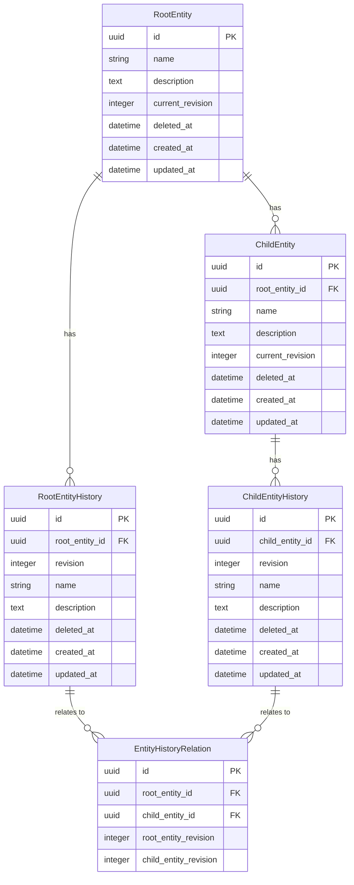
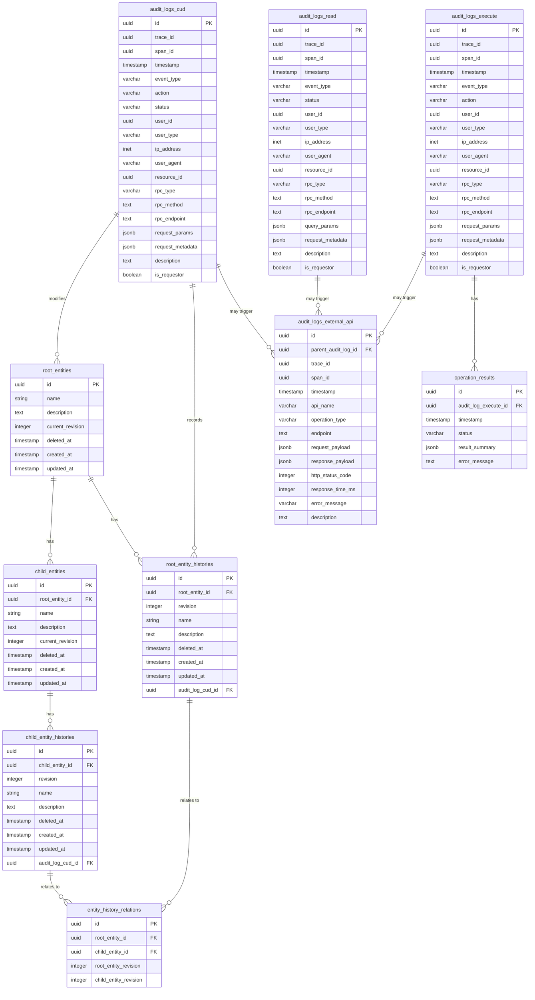

# 議事録

[議事録一覧](%E8%AD%B0%E4%BA%8B%E9%8C%B2%205deb674bdfd9417e87b19ce23a5f0816/%E8%AD%B0%E4%BA%8B%E9%8C%B2%E4%B8%80%E8%A6%A7%20fc9d706c91814712ba5a0e5c1b869c23.csv)

# 2023.10.11

作成日時: 2023年10月11日 20:10
作成者: MinenoMasashi

@ビトル 長尾 

- 開発着手するためのDB定義を策定

@MinenoMasashi 

- 訪問看護の電子レセプト作成手引きを読了

## 確認事項

- 契約と同意のフローの詳細を確認したい
    - どこまで利用者に同意を取っているか
    - 書面で利用者さんと事業所側で結んでいる
    - 同意書
        - 個人情報、加算関係
        - 全て紙面上
        - システム側で担保できるならやりたい
        - システムを使っていれば、同意をしている前提としている
    - 契約書
        - こちらも紙面上
        - 形式が事業所ごとにフォーマットが変わるので、それぞれで管理できるようにしたい
        - 基本的に電子化して、必要に応じて印刷する方向に倒したい
    - 業務側としてもPDF化していきたい
    - 優先度としてはそこまで高くない
- 電話インテークの「担当者」を誰を指すか
    - 契約を締めるまでの担当者か
    - 関係機関先
    - **電話をかけてきた（相談してきた）方を指す**
    - **入力するスタッフ = そのインテークに責任を持つスタッフ**（役席者）
- 電話インテークで性別を完全に聞くのは難しい気がするので、分けて入力したいか要求を確認
    - フォーム上の性別の初期値も考慮する必要があるかもしれない（気にする方もいる）
- 利用者の「連絡事項」の用途を確認
    - 利用者の属性
    - 書類提出に使うものか
    - 病院では患者サマリなど、要注意患者であるかを記載することがある
    - iBowのフォームにならって項目を追加している
        - 特記事項を入力する項目
        - 24時間体制
            - 看護記録Iには入力しないような利用者の特記事項
            - スタッフ同士の情報共有
            - ほっとナビではNスマでいう対応履歴とおなじ
    - 依頼元からの連絡事項（注意点）
    - 看護記録Iに反映できる
- 対応履歴
    - 情報共有はチャットの方が適切かもしれない
        - [talknote](https://talknote.com/)
        - 双方向で反映・参照できたほうがいい
- スケジュールのカテゴリを事業者毎にマスターを作ったほうがよいか
    - 1つのマスタ
    - データの数値化もしたいので、決まったものを入れるようにしたい
        - 数値化したいもの以外は自由に決めれるように
    - 本社で決めて現場に下ろす
        - 現場ではカテゴリを決めないようにする

## 議事録

- デザイン
    - クロスログ風にしたので、現状とはかなり乖離がある
    - 担当の方の意向を聞いて、今後の方向性を決める（figmaの使用など）
    - デザインに関する打ち合わせは現時点ではしてない
    - 画面の着手予定のスケジュールを作っておく
- iBowのレセプト機能
    - 電子カルテとは別のサービスになっているか？双方向になっているか？
        - 確認
- 看護記録II
    - 時系列で見れるようにしたい
    - 最新ものをトップ
    - 連絡事項も時系列で見れるようにしたい

## 今後の作業予定

@ビトル 長尾 

- DBの修正
- 画面の実装

@MinenoMasashi 

- 

## TODO・NEXT ACTION

# 2023.10.12定例

作成日時: 2023年10月9日 21:23
作成者: ビトル 長尾

@ビトル 長尾 

- 

@MinenoMasashi 

- 

## 確認事項

- 契約と同意のフローの詳細を確認したい
    - どこまで利用者に同意を取っているか
- 電話インテークの「担当者」を何を指すか
    - 契約を締めるまでが
- 電話インテークで性別を完全に聞くのは難しい気がするので、分けて入力したいか要求を確認
- 利用者の「連絡事項」の用途を確認
    - 利用者の属性
    - 書類提出に使うものか
- スケジュールのカテゴリを事業者毎にマスターを作ったほうがよいか

## 議事録

- 

## 今後の作業予定

@ビトル 長尾 

- 

@MinenoMasashi 

- 

## TODO・NEXT ACTION

# 2023.10.26定例

作成日時: 2023年10月26日 19:21
作成者: ビトル 長尾

@ビトル 長尾 

- トップ画面の実装

@MinenoMasashi 

- 訪問看護オンライン請求・資格確認　仕様書確認
- 医療機関等ONSベンダーサイト
    - [https://vendorons.service-now.com/nav_to.do?uri=%2Frequest_account](https://vendorons.service-now.com/nav_to.do?uri=%2Frequest_account)
    - 登録条件
        
        サイト（「医療機関等ONS」といいます。）は、医療機関等システムの開発ベンダー様に限定して公開しているサイトとなります。
        
        医療機関等システムの開発ベンダー様向けにオンライン資格確認等システムのシステム開発に関する仕様書等を公開しております。
        
        医療機関等ONSをご利用いただける対象者は下記の通りです。
        
        ---
        
        【医療機関等ベンダー様】
        
        ・レセプトコンピュータの開発を行っているベンダー
        
        ・レセプトコンピュータの保守を行っているベンダー
        
        ・電子カルテ/調剤システムの開発を行っているベンダー
        
        ・電子カルテ/調剤システムの保守を行っているベンダー
        
        ・医療機器システムの開発を行っているベンダー
        
        ・医療機器システムの保守を行っているベンダー
        
        ・医療機関、薬局等に対して、オンライン資格確認等の環境構築等の導入作業や導入支援を行っているベンダー
        
        【医療機関・薬局様】
        
        ・レセコン等のシステム開発を行っている医療機関・薬局等
        
        ・自機関でオンライン資格確認等の環境構築等の導入作業を行っている医療機関・薬局等
        

## 確認事項

- オンライン請求、オンライン資格確認の導入予定・方針
    - インターネット回線の確認
        - 
    - ほっとナビ
        - インターネット回線の種類の確認中
            - 方針が決まった場合は @MinenoMasashi さんに共有
            - NTTひかりとクラウドの相性が悪いため
    - iBow
    - カイポケ等他社
- オンライン資格確認で取得できる医療情報で必要なものはあるか
    - 診療情報（診療行為）
    - 処方情報
    - 特定健診情報
    
      * 全てレセプト由来なのでリアルタイム性はない（2ヶ月弱遅れた情報）
    
- レセプトの返戻で多いケース
    - 事前にシステム側で考慮しておきたいため
    - 立ち上げ支援では重要な知見になる
- スケジュール機能に関する要望など
    - スケジュールの自動設定に必要な項目
        - 距離、曜日・時間、希望の性別、疾患の内容
        - 融通が利く・利かない利用者さん
    - ZESTを参考にしたい
        - 利用者の希望の条件 + 看護士のシフト + 位置情報 = マッチング
        - 遠方から事業所に近づいていくイメージ
        - 1ヶ月分のスケジュール
    - ドタキャンに関して
        - キャンセル料をとる場所もある
        - 各事業所のポリシーにしがって対処するしかない
        - ほっとナビではキャンセル率を出している
        - キャンセルが多い原因
            - **利用者の「予約」という感覚が薄い**
        - キャンセル率の高いスタッフ
            - サービスの質が悪い可能性があるため
        - 事業所単位でのキャンセル率も可視化したい
- 将来的には医療機関・利用者とつながるようなアプリがほしい
    - 郵送でやり取りしているので、アプリ側で解決したい
    - 利用者さんで自分で積極的に話せない方でもアプリで事前にまとめて医師に見せることができる
    - ロビイングが正攻法
    - 事件発生時に緊急連絡が素早くできる手段がほしい
        - 利用者とのトラブル、交通事故など
        - 発信位置などを受けとって警察に連絡
        - システムを長時間使っていなかった場合など
- へ**ルスケアサービス社会実装事業**
    - [https://www.meti.go.jp/information/publicoffer/kobo/2022/k220208001.html](https://www.meti.go.jp/information/publicoffer/kobo/2022/k220208001.html)

## 議事録

- 9月決算終了
    - 12月が山場（賞与の時期）
    - 2~300万ほど増えた
    - 売上が徐々に回復しつつある
    - 来年の3月には単月黒字になる見込み
    - 黒字化のタイミングで開発に力をいれていきたい
- 事業再構築
    - 見積もり書の準備
    - 結果の報告が来年の10月になる予定
        - ある程度プロダクトを見せられるものが必要
        - 基本的に見られることは無いが、最低限モックレベルのものがあるといい

## 今後の作業予定

@ビトル 長尾 

- 

@MinenoMasashi 

- 

## TODO・NEXT ACTION

- [x]  レセプトで返戻が多いケースの確認 @橋本さん

# 2023.10.5定例

作成日時: 2023年10月5日 19:43
作成者: ビトル 長尾

@ビトル 長尾 

- 使用されていないNTV時代のAWSリソースの停止
- DBのスキーマの修正
    
    [https://github.com/Hot-Navi-Inc/n-sma/pull/1](https://github.com/Hot-Navi-Inc/n-sma/pull/1)
    

@MinenoMasashi 

- DBのスキーマのレビュー

## 確認事項

### 事業再構築の進捗等

- 申請
    - 手続き完了
- 予算
    - ７５００万
        - １年後に一括で振り込まれる
    - 今期で決算締めていて、業績が悪かった
        - 大量採用
        - -5000万
        - 改善していて、月次-300万ほどまでに改善
        - 銀行の融資も現在の決算でしか判断しない
    - 来期には黒字化を目指している
        - なので、開発スピードを少し落としたい
    - 一旦初期投資2000万で進めたい

### NTVの過去データの取り扱いについて

[https://n-ozh1365.slack.com/archives/C052HCXJKJQ/p1696502576375529?thread_ts=1695902092.677849&cid=C052HCXJKJQ](https://n-ozh1365.slack.com/archives/C052HCXJKJQ/p1696502576375529?thread_ts=1695902092.677849&cid=C052HCXJKJQ)

- NTVの過去データのアクセスの目的や必要性の認識を合わせたいです
    - サーバーを立ち上げずにデータを参照する方法はあるが、情報流出のリスクも高いので、参照したいデータの範囲と頻度を確認しておきたいです

### サービスのドメインの取得

- 今後Nスマのアプリや製品紹介のLPにアクセスするためのドメインを決定したく、候補としては以下のようなドメインをイメージしていますがいかがでしょうか
    - LP用ドメイン
        - n-sma.com(年間13ドル)
        - n-sma.jp(年間90ドル)
    - webアプリ用ドメイン
        - n-sma-app.com(年間13ドル)
        - n-sma-app.jp(年間90ドル)

## 議事録

- 現況調査
    - スケジュールの使いやすさについて

## 今後の作業予定

@ビトル 長尾 

- デザインから生成されたソースコードをもとに一部画面の実装
- DBスキーマの修正
- インフラの構築

@MinenoMasashi 

- 訪問看護・電子レセプトの仕様確認

## TODO・NEXT ACTION

- [ ]  過去に出力されたPDFがS3にあるか確認 @ビトル 長尾
- [ ]  必要なNTVデータの範囲を確認していただく @篤さん @橋本さん

## 次回定例日程

2023年10月11日 20:00

# 2023.11.19 今後の開発の進め方について

作成日時: 2023年11月19日 20:26
作成者: ビトル 長尾

## 前回の打ち合わせについて

- デザインとしてなんとなくやりたいことはわかるが、より深いビジョンは見えなかった
- なので、開発側からよりプロダクトの価値を上げる提案していきたい

## iBowについて

- 不便とはよく効くが、具体的にどう不便であるかが深惚れていない
    - 開発側で深掘っていく

## ペインの洗い出し

- 訪問看護としてのペイン
    - 看護師
        - スケジュール
            - クロスログのように「キャッチー」にしたい、の解像度
        - 看護記録
            - iBowでどう入れているか
            - 業務フロー図で解像度は上げられそう
                - どの帳票のどの項目の入力でペインを感じているかが見えるかもしれない
    - 訪問看護事務（医療事務）
        - レセプト作成
        - 算定漏れ
        - 返戻
- システム（iBow）のペイン
    - [エスノグラフィー](https://cross-in.jp/what-is-ethnography/)を作っていく
    - iBowを使っている方の動きをトラッキングしていく
- スケジュール
    - クロスログの8割方の完成度を目指す
    - モバイルの最適化は必要そう
    - コストかかりそうなところは専業のフロントエンドエンジニアにやってもらうようにする
        - @ビトル 長尾 @MinenoMasashi はここにそこまでコストをかけない方がいい（業務のペインの改善に集中したい）
- レセプトにかけるコスト
    - 自動算定
    - カルテ一体型
    - **コストはかける前提で開発としては設計する**
        - 開発側が訪問看護の診療報酬の算定構造を理解する
            
            → どうやって
            
            - iBowやすこやかサンで出力したUKEを確認

## 開発として何をどう提案するか

- What
    - レセプト
    - 帳票
    - システム（iBow）のペイン
- How
    - （レセプト）加算から逆算して対応できる流れをこちらから提案
        - 日々の記録をすべて入力していれば全て自動算定できるような仕組みを予め設計する
    - （帳票）
        - 定例の時間を使ってFigJamなどで業務フロー図を完成させていく
        - @ビトル 長尾 で叩きを作っておく
    - （システム（iBow）のペイン）
        - [エスノグラフィー](https://cross-in.jp/what-is-ethnography/)を作っていく
        - iBowを使っている方の動きをトラッキングしていく

## NEXT ACTION

- @ビトル 長尾
    - FigJamで業務フローの叩きを作る
    - 開発向けのエスノグラフィについて調査する
    - 課題図書を読む
        - [https://store.medica.co.jp/item/302260113](https://store.medica.co.jp/item/302260113)
- @MinenoMasashi
    - 課題図書を読む
    - FigJamで業務フローに追記

# 2023.11.1定例

作成日時: 2023年11月1日 18:08
作成者: ビトル 長尾

## 作業進捗

@ビトル 長尾 

- 引き続き進捗確認の素材をベースに画面の各部品のスタイリングの共通化を実装中

@MinenoMasashi 

- 

## 確認事項

- 

## 議事録

- 

## 今後の作業予定

@ビトル 長尾 

- 画面のデザインの実装の続き

@MinenoMasashi 

- 

## TODO・NEXT ACTION

# 2023.11.21定例

作成日時: 2023年11月21日 16:59
作成者: ビトル 長尾

## 作業進捗

@ビトル 長尾 

- 進捗確認画面のモックの実装
- [業務フロー図](https://www.figma.com/file/5HrNdxnwMhPeYh2eUVTxxX/Untitled?type=whiteboard&node-id=0%3A1&t=8MN2pH90Wg1D3rTU-1)作成

@MinenoMasashi 

- 訪問看護オンライン資格確認・調査

## 確認事項

- 画面遷移図
    - 

## 議事録

- 比較表を取り寄せて頂く予定
- 画面デザインについて
    - 他社の構成を比較・検討したものであるか
    - モバイルファースト
    - PC専用の機能は存在するか？
- ネットワーク環境について
    - 通信環境が悪い地域で利用した場合
    - オフラインでも使えるアプリケーションを実現できれば、他社との差別化を図れる
    - PWAなど
        
        [https://gmotech.jp/semlabo/webmarketing/blog/pwa/](https://gmotech.jp/semlabo/webmarketing/blog/pwa/)
        
    - 通信環境が悪い場合に備えてあえて未来日（先日付）で看護記録を登録しておくことがある
- BCP
    - 災害時（地震など）にどう運営していくか
    - ネット通信が途絶えたときの記録をどう扱うか
- iBow
    - スケジュールが使いにくい
        - ２つある
            - 利用者訪問専用と一般的なスケジュールで別れてしまっている
        - 他のスタッフ、利用者も含めた全体のスケジュールが見れない
- スマホ
    - 個人もしくは会社のスマホを使っているか
    - 基本的に事業所の貸与端末を使う前提の規約にすれば、利用側の責任になる

## 今後の作業予定

@ビトル 長尾 

- 業務フロー図
- デザイナーの方が画面の実装を見れるようにしておく

@MinenoMasashi 

- すこやかさん連携

## TODO・NEXT ACTION

- [ ]  永井さん、北村さんをnotionにゲスト招待しておく @ビトル 長尾
    - 永井さん
        - [pepechi0313@gmail.com](mailto:pepechi0313@gmail.com)
    - 北村さん
        - [kitamura.masahito@gmail.com](mailto:kitamura.masahito@gmail.com)
- [x]  iBowが2段階認証が３省２ガイドラインに準拠しているか確認 @橋本さん
- [ ]  訪問看護記録書IIの課題・ペインを挙げる @橋本さん
- [ ]  iBowの画像を共有してもらう @篤さん

# 2023.11.9定例

作成日時: 2023年11月8日 19:35
作成者: ビトル 長尾

## 作業進捗

@ビトル 長尾 

- 進捗確認画面の実装

@MinenoMasashi 

- 返戻理由の確認
- クロスログ・操作確認

## 確認事項

- 以下のような画面遷移図はあるのか
    - [https://boardmix.com/jp/skills/create-screen-transition-diagrams/](https://boardmix.com/jp/skills/create-screen-transition-diagrams/)
    - プラグイン・ツールの候補
        - [https://note.com/dorisukeone/n/n52f66be0d823](https://note.com/dorisukeone/n/n52f66be0d823)
        - [https://www.tam-tam.co.jp/tipsnote/tool/post17911.html](https://www.tam-tam.co.jp/tipsnote/tool/post17911.html)
    - XDからでは各ボタンを直接押下すれば画面の遷移はチェックできるが、画面の遷移の流れを全体的に確認できる資料があるとありがたいです
- XDで画面の更新履歴を確認する方法はあるか
    - 更新時に差分をコメントに書いていただく
- オンライン資格確認の回線について
    - IPsec,IKEが接続方式が対応できない

## 議事録

- 事業再構築
    - 書類に不備（審査に大きく影響が出るものではない）
    - 再審査中
    - 来年の2月頃に金額の目処が立つ予定
    - 電子カルテの開発費用・収益の予測を取るために協力してほしい
- レセコン連携
    - すこやかさん
        - クラウド
    - 訪看鳥
        - クラウド
        - 無料だが、機能面で劣る
- デザイン
    - クロスログ風にデザインを変更中
    - スケジュールの使いやすさに関する現況調査中
        - 方針が固まりつつある
    - 帳票の作成の速さなどが数値化できると現場に伝えやすい

## 今後の作業予定

@ビトル 長尾 

- 引き続き画面の実装（進捗確認画面）

@MinenoMasashi 

- レセプト
    - すこやかサンでの連携の調査

## TODO・NEXT ACTION

# 2023.12.26 定例

作成日時: 2023年12月26日 20:03
作成者: ビトル 長尾

## 作業進捗

@ビトル 長尾 

- 業務フローの整理、ペイン洗い出し
    - https://www.figma.com/file/Wo0mUTl2pGv2fvhaCUVPKe/%E5%90%84%E7%A8%AE%E6%A5%AD%E5%8B%99%E3%83%95%E3%83%AD%E3%83%BC?type=whiteboard&node-id=0-1&t=78hkV3hs9vqE2Q4I-0

@MinenoMasashi 

- 冬季休暇および体調不良のため進捗なし

## 確認事項

- オンライン資格確認
    - IPsec方式で接続
    - iBow → リコーと提携（ほっとナビも提携を検討中）
    - HPKIカード
        - [https://www.jmaca.med.or.jp/hpki/](https://www.jmaca.med.or.jp/hpki/)
        - 電子処方箋を受ける際にマイナンバーカードの代わり

## 議事録

- 事業再構築
    - 来年１月に結果が出る予定
- 銀行の融資
    - 融資の交渉は継続中
    - 来年３，４月にキャッシュフローが変わるので、そのタイミングで開発に力を入れられる見込み
- 初回のお問い合わせ
    - 今までは病院・福祉施設中心で始まる
    - 今後は営業ツールに寄せていくようにしていきたい
- 電話インテーク
    - 項目を種類（一般、精神、介護）によって変えたほうがよい
    - 契約成立時に看護記録Iに転機したい
- スケジュール
    - 篤さんと一緒にに現場の声を聞きつつクロスログ風に
    - レイアウトが似ている場合は問題ないか？
        - 創意工夫や特許性が無ければ問題ない
    - スケジュールのユースケースと各情報との依存性を洗い出す必要がある
        - 勤務形態を優先して対応していきたい
- 機能追加の方針
    - 大まかに以下の３つのフェーズに別れる
        1. スケジュール機能を実現するために必要な機能
        2. Nスマとしてサービスを提供するために最低限必要な機能
        3. Nスマとしての付加価値につながる機能
- スケジュール機能洗い出しのMTGに関して
    - ヒアリングの録画を見ながら進めていく
    - 一旦所長レベルの方にまずヒアリングする予定
- 訪問看護の稼働について
    - 基本的に土日祝日休みの場所が多い
    - 土曜稼働、365日体制の場所もある
    - オンコールの場所がある

- オンコール
    - オンコールをサポートする体制が必要か（組織づくりも含めNスマはどうしていくか）
        - 対応できなかった場合の保証など（返金）
    - iBowはオンコールをサポートしているか
        - 「24時間体制」という機能を提供している

## 次回の定例

- 1/16 20:30~ (この日にスケジュールに関するMTGの詳細についてはなす)

## 今後の作業予定

@ビトル 長尾 

- 業務上のペイン洗い出しの資料整理
    - すでに洗い出したペインの解決策や対応の優先順位付けなど
- デザイナーの方が開発環境を動かせるための手順書の作成

@MinenoMasashi 

- 

## TODO・NEXT ACTION

- [ ]  以下の内容を確認 @篤さん
- [ ]  
- [ ]

# 2023.12.7 定例

作成日時: 2023年12月7日 19:44
作成者: ビトル 長尾

## 作業進捗

@ビトル 長尾 

- TOP画面のモック一部実装
- デザイナーの方が画面の実装を見れるようにしておくための準備
    - 本業の都合で時間とれず
- 全体の流れを把握する目的として業務フロー図の作成
    - [https://www.figma.com/file/5HrNdxnwMhPeYh2eUVTxxX/訪問看護-業務フロー図?type=whiteboard&node-id=1-2&t=s6k0d8PrUrEwbNVc-4](https://www.figma.com/file/5HrNdxnwMhPeYh2eUVTxxX/%E8%A8%AA%E5%95%8F%E7%9C%8B%E8%AD%B7-%E6%A5%AD%E5%8B%99%E3%83%95%E3%83%AD%E3%83%BC%E5%9B%B3?type=whiteboard&node-id=1-2&t=s6k0d8PrUrEwbNVc-4)
- 登場人物の関係性や帳票のやりとりの流れを明確にするため関係図作成
    - [https://www.figma.com/file/5HrNdxnwMhPeYh2eUVTxxX/訪問看護-業務フロー図?type=whiteboard&node-id=24-949&t=pRaxbYHcbfcvGDam-4](https://www.figma.com/file/5HrNdxnwMhPeYh2eUVTxxX/%E8%A8%AA%E5%95%8F%E7%9C%8B%E8%AD%B7-%E6%A5%AD%E5%8B%99%E3%83%95%E3%83%AD%E3%83%BC%E5%9B%B3?type=whiteboard&node-id=24-949&t=pRaxbYHcbfcvGDam-4)

@MinenoMasashi 

- 訪問看護・診療報酬、介護報酬の習熟

## 確認事項

- 全体のフローの中で各業務に対するペインがあれば追記していきたいと思っています。

### フロー図内の業務に関して

- 自立支援管理表とは何か（限度額認定証に近いもの？）
    - 自立支援医療（一部負担金）
    - 精神科に関する
    - 精神科への通院 + 精神科の薬代 + 訪問看護 に対する政府による女性
    - 1割負担
    - 所得に応じて上限が設定される
    - 参考
        - [https://kurumi.makecare.co.jp/service/](https://kurumi.makecare.co.jp/service/)
    - 精神科でも地方公費はある
- 縟瘡計画書の作成は初回訪問時に必ず作成されるものか？
    - 一旦評価はしないといけないため記載している
    - アセスメントに関するペインは特になし
- 看護サマリーの作成のタイミングについて
    - 入院先の看護師向けに医療情報を提供する目的
    - iBowは看護記録Iを入力していないと看護サマリーは作成できない
        - ペイン: 文書同士の依存があると業務としては不便
        - 看護サマリーは規定の様式がない
    - 利用者の再入院時に作成？
        - 再入院
    - 渡す相手は？（利用者もしくは家族？またはケアマネ？）
        - 入院先の看護師
- サービス担当者会議録での「サービス担当者」は福祉施設などの担当者を示している？
    - 介護保険でのサービス担当者会議
    - ケアマネ主催の会議
- 訪問看護請求書は初回訪問時のみに渡しているのか？
    - 自己負担金が発生している利用者に対して翌月（レセプト提出期以降）に渡している

## 議事録

- 事業再構築
    - **来週には結果が出る予定**
    - 結果が出れば1月スタート
- CareTEX大阪
    - ewellさんの方と面談して営業や採用についてアドバイスをしてもらった
    - 現状はカイポケ・iBowの２強の印象
    - ほっとナビのFCのオーナーさんにiBowからカイポケに移行してもらった
        - カイポケの使い方も把握できる
    - ewellでもスケジュール機能を開発予定
    - AIで計画書の作成を効率化を目指している
        - OpenAIを利用するのであればAzureが最適
    - 音声入力システム
- 助成金
    - まだ結果ができていない
    - そのため大きな投資はしばらく控えている
- AIに関して
    - 活用するためにもそれなりの組織の規模・資金が必要なので、ewellの規模ではそれが実現できているとは言い難い
- 日本クレアス税理士法人
    
    [https://j-creas.com/](https://j-creas.com/)
    
    - 医療と福祉系のクライアントが多い
    - 開業に関するセミナーの協業の話があった
- シェア
    - ewell : 4000
    - カイポケ: 2000
    - ２社合わせて半分程度のシェアを取っている
- 戦略
    - スケジュール + 電子カルテ + レセコン + カイポケより安い
    - 後発だからこそ高くいく
        - 製品のコンテンツで補う
    - 医療の電子カルテ
        - 既存製品の値段が高すぎるからこそ安さを戦略として取ることができる
- iBowが2段階認証が３省２ガイドラインに準拠しているか？
    - 今まではIDとPWの設定で、それに追加で所有情報（メールアドレス）が追加になっています。
    - 現状でもログインの際にメールアドレスにコードが飛ぶような形で二段階認証になっている
- 山間地・過疎地（ネットワークの課題）
    - 医科では内閣府のプロジェクトが今年発足している
        - 民間では利益が上がらず参入がないという背景がある

## 今後の作業予定

@ビトル 長尾 

- 

@MinenoMasashi 

- 

## TODO・NEXT ACTION

- [ ]  フロー図上の帳票系が判別しやすくなるように番号を振っておく @ビトル 長尾
- [ ]  スケジュール機能のMVP（Minimum Viable Product）の要求仕様の作成 @ほっとナビ
- [ ]  業務上のペインの洗い出し @MinenoMasashi @ビトル 長尾 @橋本さん
- [ ]  会議の洗い出し  @MinenoMasashi @ビトル 長尾 @橋本さん
- [ ]  管理者（経営者）側のペインの洗い出し @阪本さん

# 2023.5.24 定例

作成日時: 2023年5月24日 20:33
作成者: MinenoMasashi

### 助成金

- **5,000万円の助成を目指す**
    - 返金のリスクも考慮するとあまり現実的ではない
- 要件
    - 内製は可能？
        - CTO + 他エンジニアに外注というスキームだと請負になるので厳しい
    - 全額支払い済み
    - 14ヶ月での完成
    - 相見積もり
- **スケジュール**
    - 8ヶ月〜１年位はNTVくらいのプロダクトを

### 体制

- ブランディングエンジニア
    - COO 川端氏が顧問
    - 時給が高そう
        - 20%はとっているかもしれない
    - 紹介手数料が50~100%

### 今回の定例を踏まえた今後の進め方

- 1,800万円でどこまで出来るか
    - 最低限そこですすめるにはどうするか
- まずは内製できるかどうかを阪本さんに確認していただく
    - だめだった場合に請負いでどう進めるか確認する
- 理想の概算で見積もる
    - どれくらいの人数でどれくらいの期間をどれくらいのコストをかけるか

### NTV

- AWSが3月から 502 Bad Gateway で接続できない
    - → 後ほど阪本篤さんにアカウントを共有していただく

### 経理

- 15日締め、25日払い
- 申告制

### 競合

- カイポケ / SMS
    - ユーザー : 4,000
    - [https://ads.kaipoke.biz/](https://ads.kaipoke.biz/)
    - 事業所単位でID
    - 25,000円
    - そもそも看護ステーション版ではないので使いづらい
- iBow / eWell
    - ユーザー : 2,000
    - [https://ewellibow.jp/](https://ewellibow.jp/)
    - 事業所単位でID
    - 18,000円 + 1件100円
        - 平均200 ~ 250件
    - レセプト請求総額の数%
    - ほっとナビは5年縛りで2年残り
- こころ
- Will Cloud
- ゼスト/ クロスログ
    - [https://zest.jp/](https://zest.jp/)
    - スケジュールをつけると iBow くらい金額になりそう

### 機能

- スケジュール
    - 他社ではあまり重視されていない

### 特許

- 株式会社eWellが以下の特許を持っているので、それを考慮して仕様を考慮する必要がある
    - [https://jglobal.jst.go.jp/detail?JGLOBAL_ID=202203006920521378](https://jglobal.jst.go.jp/detail?JGLOBAL_ID=202203006920521378)
    

### 訪問看護形態

- 事業所
    - 医療保険番号、介護保険番号は出ない
    - 看護師2.5人の施設基準がある
- サテライト
    - 事業所に紐づくので1人でも出来る

# 2023.5.27 開発体制について

作成日時: 2023年5月27日 20:56
作成者: ビトル 長尾

## 開発メンバー（ミニマム）

**予算1800万に抑えるという想定**

- 要件定義
    - ビトル、嶺野さん
- インフラ
    - ビトル
- フロント
    - ビトル and 副業で1人
- バックエンド
    - ビトル and 副業で1人

- 予算内でどこまで出来るかを出す

## 開発メンバー（理想）

助成金が降りた場合の想定

- 要件定義
    - ビトル、嶺野さん
- インフラ
    - ビトル
- フロント
    - ビトル or フルタイム外注1人
- バックエンド
    - ビトル and フルタイム外注1人

## 技術選定

- クラウド
    - AWS（基本的に無料枠を利用する前提）
        - サーバ
            - EC2 t2.micro
        - DB
            - RDS PostgreSQL t3.micro
- バックエンド
    - Rails
    - 帳票系（PDF）
- フロントエンド
    - Hotwire
- 認証周り
    - firebase authentication

## 議論のメモ等

- ミニマムの体制でやるのであればフルスタックのエンジニアをフルタイムでもう1名確保したほうがベスト
    - or 副業2人
- ビトルの稼働（現時点）
    - 月40h x 4,000 = 160,000 = 176,000（税込）
    - 14ヶ月 x 160,000 = 2,240,000 = 2,464,000
- ビトルの稼働（本格稼働の場合）
    - 月80h x 5,000 = 400,000 = 440,000（税込）
    - 14ヶ月 x 440,000 = 6,160,000
- **3省２ガイドラインのための非機能要件**
- **監査用の出力内容**
    - 訪問看護で必要になってくる提出書類を阪本さん・橋本さんに挙げていただく
- 各データベースの設計
- 帳票系（PDF出力系など）も考慮する
- スケジュール
- [ビトルが後々稼働を増やす](2023%205%2027%20%E9%96%8B%E7%99%BA%E4%BD%93%E5%88%B6%E3%81%AB%E3%81%A4%E3%81%84%E3%81%A6%204d079085ac9b417c89fda8f00e9ce2c0.md)として、もう１人雇える余裕がある（1200万円分ほど）
    - 4000~5000円80hのリファラル2名ほどの予算が余る

### 見積もりの単位

- 管理方法 : google スプレッドシート
    - [https://docs.google.com/spreadsheets/d/1pPT10TtaW8I1oegFr7XvTM51JnNvEqne-o09XVxsGG4/edit#gid=1115838130](https://docs.google.com/spreadsheets/d/1pPT10TtaW8I1oegFr7XvTM51JnNvEqne-o09XVxsGG4/edit?usp=sharing)
- 要件定義
    - 非機能
        - 3省２ガイドラインの対応含む
            - TODO : @MinenoMasashi
    - 文書・帳票
        - TODO : 種類を全て阪本さん、橋本さんに挙げていただく
    - データベース（モデル）

- 設計
    - 非機能
    - 画面
        - 画面毎に難易度から係数をかけて見積もり
    - アプリケーション・インフラ構成

- 実装
    - アプリケーション基礎
    - インフラ構築
    

## NEXT ACTION

- 本日議論した内容を元に詳細な見積もりを作成
- 監査系の文書の種類の調査
- リファラルで副業のエンジニアを２名を探す

# 2023.5.30 定例

作成日時: 2023年5月30日 20:33
作成者: MinenoMasashi

### 事業再構築助成金

- [Passione](https://la-passione.co.jp/)
    - 会計士と一緒に事業再構築をだしている
    - COOの方と 2023年6月8日 に打ち合わせをして、やり方を含め相談する予定
        - 自分たちとチームを組めるかも判断する
        - 提出資料のヒアリング
    - 手数料会計士7%、Passione15%（受託があれば7~8%）
        - 受託の場合はエンジニアリングは自社の社員？
        - 単価3,000円 ~ 5,000円
- 提出資料
    - 見積書
    - ガントチャート
    - 仕様書
        - 受託側の仕様書で良ければ、阪本さんが作成した仕様書をベースにする
    - RFP（提案依頼書）？
        - 必要かどうか要確認
- ブランディングエンジニア カワバタさん
    - zoomでお会いして、開発の概要の説明
    - 技術選定
        - Ruby on Rails
        - SESで入ってもらう場合に、開発で使用する言語を統一しておく必要がある
- ewellさんで使用している技術
    - nginx
    - java、PHP
- 16拠点に導入していきたい
    - i-bow2年縛りが残っている（バレないようにしたい）
    - 少しずつデータをNスマに移行しながら
    - 監査のためのデータを全て抽出できる
    - レセプト
        - すこやかさんをNTVと連携していた
- NTV
    - 開発期間
        - 8ヶ月間？
    - 中野事務所にエンジニアが1名張り付き
    - 支払い
        - マイルストーン払いで累計1,800万円
        - 開発が一通り完了したあとに月60万の契約で継続予定だったが、監査の出力周りの難易度的に継続を断念
- Will Cloud
    - [https://wyl.co.jp/info-cat/ウィルクラウド/](https://wyl.co.jp/info-cat/%E3%82%A6%E3%82%A3%E3%83%AB%E3%82%AF%E3%83%A9%E3%82%A6%E3%83%89/)
    - 使いにくい
    - オマハシステム
        - 看護師が迷わずに計画書が書ける
        - [https://www.wyl.co.jp/media/nursing/岩本さんインタビュー#:~:text=オマハシステムとは&text=オマハシステムは20年,の蓄積も可能です。](https://www.wyl.co.jp/media/nursing/%E5%B2%A9%E6%9C%AC%E3%81%95%E3%82%93%E3%82%A4%E3%83%B3%E3%82%BF%E3%83%93%E3%83%A5%E3%83%BC#:~:text=%E3%82%AA%E3%83%9E%E3%83%8F%E3%82%B7%E3%82%B9%E3%83%86%E3%83%A0%E3%81%A8%E3%81%AF&text=%E3%82%AA%E3%83%9E%E3%83%8F%E3%82%B7%E3%82%B9%E3%83%86%E3%83%A0%E3%81%AF20%E5%B9%B4,%E3%81%AE%E8%93%84%E7%A9%8D%E3%82%82%E5%8F%AF%E8%83%BD%E3%81%A7%E3%81%99%E3%80%82)
- NHK特集
    - 「看護記録にメス]
        - [https://www3.nhk.or.jp/news/html/20210625/k10013100491000.html](https://www3.nhk.or.jp/news/html/20210625/k10013100491000.html)
- スケジュール機能
    - 月初めに計画書・報告書の作成があるが、これが一番時間がかかっている
    - zestさんの機能を参考にしながら一番ベストなものを検討したい
    - zestとかいぽけが連携できる（i-bowは連携できない）
- NTVの開発途中の資料や議事録などがあれば共有していただく
- （事業計画の作成があるので）経費や販管費がどれくらいかかるか含めて見積もりを出したい
    - 内部に向けたものは最低限の予算
- NTVでは帳票の出力は対応していなかった
- 看護で個別指導が入る項目を調べていただく
- 電子署名・原本化
    - 沖縄マール電子カルテではそういったものができている
    - e-文書法、電子帳簿保存法
    - PDF出力したものを原本として扱えるか

# 2023.6.1 明大前事業所訪問

作成日時: 2023年6月1日 18:36
作成者: ビトル 長尾

## ibowの使いづらさ

ibowのスケジュールを使わずgarooを使っている
システムが変わった
多職種連携でカレンダー共有できなかった
現状のシステムで慣れてしまっていて、かつ
他のスタッフとのスケジュールを共有できない

## システムを通した業務の流れ

1. 個人のログイン
2. 事業所ごとのログイン
3. garooのスケジュールで自分の訪問予定を確認する（ibowとは特にシステム連携していない）
4. 確認後ibow側で利用者名を検索
5. 利用者宅に到着時、訪問開始ボタンを押す（このタイミングでタイマーが開始する、この部分は特許が取られている可能性あり）
6. 途中でアプリでバイタルなどを記入（利用者にあわせて観察項目なども記入）
7. 訪問が終了したときに終了ボタンを押下
8. 訪問終了後、看護記録（看護記録書II）を提出

## 看護記録

訪問看護計画書

フォーマットに必要な項目はシステム・実地調査両方ともすべて必要

指示書が来る流れ

1. 主治医が看護ステーションに対して指示書を発行
2. ibowで出力したものを主治医に渡す
3. 指示書に対して、主治医の印鑑を押して貰う

## 指示書の更新頻度

- 最低１ヶ月
- 最長６ヶ月

## 指示書の管理

ibow上で利用者に紐づいている

## 指示書の期間

発行から最長６ヶ月

終了日に記載がなければ１ヶ月

期間切れであれば訪問はできない（実地調査でもひっかかる）

**指示期間切れを知らせるもの**（ポップアップなど）があると良い

## 写真を撮る必要があるもの

- レセプト関係で必要
    - 保険証
    - 褥瘡関連

## 月次で必要な書類

- 月次報告書
    - 月１回主治医に報告（月末終わり、月初めに記載）
- 看護計画書
    - 毎月に月初初回の訪問までに必要
    - こちらも主治医への提出が必要
    - NTV時代では出力時の字の小ささが主治医からのクレームにつながった
    - 訪問に関わっていない看護師は原則書けない（准看護師も書けない）
- 情報提供書

加算が取れるものはシステム側でフォローしていきたい

## 業務効率化したい部分

スケジュール

月次報告書

看護計画書

## 要望

- 通知周り
    - 利用者・スタッフは情報のリアルタイム性を求めるため
- バックオフィス支援
- 看護師が直行直帰できるシステムづくり
- 契約にならない利用者の情報を別で管理したい
    - 訪問前 → 訪問みたいなステータス管理
- 利用者のカレンダー

レセプト連携の外部IFの標準フォーマットは無さそう

# 2023.6.16 打ち合わせ

作成日時: 2023年6月16日 20:03
作成者: ビトル 長尾

# passioneキタムラさん

## 事業再構築

- 成長枠の2/3を狙う
- 大規模賃金引上促進枠
    - 最高１億３５００万の事業計画を作れば狙える
    - 人員・店舗が増えるような事業計画を作る
- 2パターン
    - 計画に忠実に動く
    - 内輪で見積もりや請求書をやり取りをして申請額
- 銀行の確認書
    - 貸すかどうかは別として、記入はしてくれる可能性は高い
- 半年前に遡ってやった内容を元に申請できるかもしれない
    - 計画の中の一部
- 5000万で一旦申請して、後から金額を減らすことは可能
- 1  フロント、 3 バックエンド

# クロスログ

- スマート予定作成
    - 訪問予定の利用者を全てを選ぶと一番最適なルートを提案する

# 2023.6.22

作成日時: 2023年6月22日 20:06
作成者: ビトル 長尾

## AIに利用について

- 看護記録、報告書の記載に時間がかかってしまう
- うつ病患者などが状態が悪い場合の内容を記載する必要がある
    - フォーマットが決まっていないため、慣れていない看護師もしくは初回の患者だと記載にどうしても時間がかかる
    - 過去の事例や報告書のデータをもとに報告内容のサジェストを今後できればやっていきたい
- 看護師さんは起承転結を書くのが苦手な方が多い
    - 教育・研修に時間がかかる
    - その時にAIによる事例のサジェストが業務効率化につながる可能性が高い

## i-bowサジェスト

- 課題AI検索
    - あまり実業務では使われていない

## 今後のサービスの品質を高めていくためには

- どこの事業でも共通した業務フローを作る
- 各事業所で業務・サービス知識が深い専任の方を設ける
- 新機能リリースの周知
    - 業務フロー表を参照

## その他

- movacalとzestが連携している
    - [https://movacal.net/](https://movacal.net/)

- オマハシステム
    - 4つの大項目からなる選択肢を選んでいき、それをもとに報告書を作成できる

## NEXT ACTION

NTV

- スケジュールが動かせる状態にしたい @ビトル 長尾
- 本番の利用者のデータを参照している可能性があるので、開発用のDBに接続先を切り替える @ビトル 長尾

開発スケジュール

- 2000万の予算内でどういったスケジュール感で進めていくか次回の定例までアジェンダをまとめておく @ビトル 長尾

# 2023.6.24 開発MTG

作成日時: 2023年6月24日 14:03
作成者: MinenoMasashi

- ブランディングエンジニア　カワバタさんと会話
    - [https://b-engineer.co.jp/](https://b-engineer.co.jp/)
    - [https://ja.wikipedia.org/wiki/河端保志](https://ja.wikipedia.org/wiki/%E6%B2%B3%E7%AB%AF%E4%BF%9D%E5%BF%97)
    - エンジェル投資家として入っている
    - 早めに予算を取って開発を開始したい
- 事業再構築の温度感について
    - １億円を無理して取るよりかは
- NTVのDBをもとに再設計して、Nスマの画面デザインをベースに作成
- 開発スケジュールのイメージ全体感を出して、チームビルディングをどう実施してどこでアクセルを踏むか
    - 進め方の合意
        - NTVレベルのものを急ぐか
        - こだわりたい部分（スケジュールなど）をじっくり時間かけて作るか
    - 開発のスピードを上げるのであれば、技術力が高いrubyエンジニアを @MinenoMasashi のリファラルで10月以降に呼ぶ

[Nスマ開発スケジュール](2023%206%2024%20%E9%96%8B%E7%99%BAMTG%20c252e2d1595149a28124cc7043f5b4ae/N%E3%82%B9%E3%83%9E%E9%96%8B%E7%99%BA%E3%82%B9%E3%82%B1%E3%82%B7%E3%82%99%E3%83%A5%E3%83%BC%E3%83%AB%200e89b6d9d4e64588a86871cbd78aa06b.csv)

[予算シミュレーション](2023%206%2024%20%E9%96%8B%E7%99%BAMTG%20c252e2d1595149a28124cc7043f5b4ae/%E4%BA%88%E7%AE%97%E3%82%B7%E3%83%9F%E3%83%A5%E3%83%AC%E3%83%BC%E3%82%B7%E3%83%A7%E3%83%B3%20c7264317164a4303b81dc31bbdab28f6.csv)

# 1. プランニング・設計フェーズ

想定予算: ￥80,000
日付: 2023年7月4日 → 2023年7月31日

## 目標

- Nスマの開発のために必要な情報や予算などを収集し、ドキュメントとして残す

## 主な作業内容

- ソースコード、DBスキーマ解析を元に必要な機能・画面のリストアップ
    - すでにある画面仕様との差分などを明記
- DB設計
- インフラ構成図の作成
- インフラのコスト予想
- 3省2ガイドラインの対応方針決め
- **↑の作業の結果によって、それ以降のフェーズの想定している期間や予算を調整していく**

[プランニングフェーズ予算](1%20%E3%83%95%E3%82%9A%E3%83%A9%E3%83%B3%E3%83%8B%E3%83%B3%E3%82%AF%E3%82%99%E3%83%BB%E8%A8%AD%E8%A8%88%E3%83%95%E3%82%A7%E3%83%BC%E3%82%B9%E3%82%99%207b5d9d844c904a43ae7eed451ef67aa6/%E3%83%95%E3%82%9A%E3%83%A9%E3%83%B3%E3%83%8B%E3%83%B3%E3%82%AF%E3%82%99%E3%83%95%E3%82%A7%E3%83%BC%E3%82%B9%E3%82%99%E4%BA%88%E7%AE%97%201e9b58d9ed4747efb7132aba916c1822.csv)

# ビトル稼働（4000 x 20）

費用: ￥80,000

# 無題

# 無題

# 2. 開発環境セットアップフェーズ

想定予算: ￥80,000
日付: 2023年7月16日 → 2023年8月31日

## 目標

- 自分自身や後からくるメンバーが来てもすぐにNスマの開発に取り掛かれる環境を作る

## 主な作業内容

- ローカル開発環境整備
    - githubリポジトリ作成
        - Nスマアプリ
        - クラウド側のIaC
- AWS上のstagingや本番環境整備
-

# 3. ベース機能実装フェーズ

想定予算: ￥2,040,000
日付: 2023年8月1日 → 2023年11月1日

## 目標

- NTVと同等以上のレベルのwebアプリケーションの開発を目指す

## 作業内容

- 各画面・機能の実装
    - 利用者
    - 看護師
    - 医療機関
    - 関係機関
    - 帳票出力
    - すこやかサン

## 確認事項

- ベース機能の実装を急ぐか？（阪本さんに要相談）
    - yes → ビトルの稼働を40h/月から80h/月に増やす & 副業のエンジニアを1名増員
        - 機能改善フェーズにいてもらうことを考慮すると、増員エンジニアの単価を考慮する必要がある
    - no → ビトルの稼働を40h/月から60h/月に増やす
    

[ベース機能実装フェーズ予算](3%20%E3%83%98%E3%82%99%E3%83%BC%E3%82%B9%E6%A9%9F%E8%83%BD%E5%AE%9F%E8%A3%85%E3%83%95%E3%82%A7%E3%83%BC%E3%82%B9%E3%82%99%20716b877721e948f3a63635951c21d8a4/%E3%83%98%E3%82%99%E3%83%BC%E3%82%B9%E6%A9%9F%E8%83%BD%E5%AE%9F%E8%A3%85%E3%83%95%E3%82%A7%E3%83%BC%E3%82%B9%E3%82%99%E4%BA%88%E7%AE%97%206ffdefd7fbc04c20a283ee7986e2e5ee.csv)

# ビトル稼働分

予算（1ヶ月分）: 480000
予算（3ヶ月分）: 1440000
単価: 6000
数量: 80

# 増員エンジニア稼働分

予算（1ヶ月分）: 250000
予算（3ヶ月分）: 750000
単価: 5000
数量: 50

# 無題

予算（1ヶ月分）: 0
予算（3ヶ月分）: 0

# 4. 機能改善フェーズ

想定予算: ￥5,110,000
日付: 2023年11月1日 → 2024年6月1日

## 目標

- Nスマとして他社製品と差別化・特化したい部分や機能を中心に開発する
    - スケジュール
    - レセプト
    - 看護記録の文章レコメンド等
    

[機能改善フェーズ予算](4%20%E6%A9%9F%E8%83%BD%E6%94%B9%E5%96%84%E3%83%95%E3%82%A7%E3%83%BC%E3%82%B9%E3%82%99%202c4bbd53ca2e44568b58d1d114401cd5/%E6%A9%9F%E8%83%BD%E6%94%B9%E5%96%84%E3%83%95%E3%82%A7%E3%83%BC%E3%82%B9%E3%82%99%E4%BA%88%E7%AE%97%20f5a9c107b5ce44b8a1a124ba1ac3946d.csv)

# ビトル稼働分

予算（1ヶ月）: 480000
予算（7ヶ月）: 3360000
単価: 6000
数量: 80

# 増員エンジニア稼働分

予算（1ヶ月）: 250000
予算（7ヶ月）: 1750000
単価: 5000
数量: 50

# 無題

Nスマ開発スケジュール: 1. プランニング・設計フェーズ (../N%E3%82%B9%E3%83%9E%E9%96%8B%E7%99%BA%E3%82%B9%E3%82%B1%E3%82%B7%E3%82%99%E3%83%A5%E3%83%BC%E3%83%AB%200e89b6d9d4e64588a86871cbd78aa06b/1%20%E3%83%95%E3%82%9A%E3%83%A9%E3%83%B3%E3%83%8B%E3%83%B3%E3%82%AF%E3%82%99%E3%83%BB%E8%A8%AD%E8%A8%88%E3%83%95%E3%82%A7%E3%83%BC%E3%82%B9%E3%82%99%207b5d9d844c904a43ae7eed451ef67aa6.md), 2. 開発環境セットアップフェーズ (../N%E3%82%B9%E3%83%9E%E9%96%8B%E7%99%BA%E3%82%B9%E3%82%B1%E3%82%B7%E3%82%99%E3%83%A5%E3%83%BC%E3%83%AB%200e89b6d9d4e64588a86871cbd78aa06b/2%20%E9%96%8B%E7%99%BA%E7%92%B0%E5%A2%83%E3%82%BB%E3%83%83%E3%83%88%E3%82%A2%E3%83%83%E3%83%95%E3%82%9A%E3%83%95%E3%82%A7%E3%83%BC%E3%82%B9%E3%82%99%20794fd60a39e84a24aab76a3f719be971.md), 3. ベース機能実装フェーズ (../N%E3%82%B9%E3%83%9E%E9%96%8B%E7%99%BA%E3%82%B9%E3%82%B1%E3%82%B7%E3%82%99%E3%83%A5%E3%83%BC%E3%83%AB%200e89b6d9d4e64588a86871cbd78aa06b/3%20%E3%83%98%E3%82%99%E3%83%BC%E3%82%B9%E6%A9%9F%E8%83%BD%E5%AE%9F%E8%A3%85%E3%83%95%E3%82%A7%E3%83%BC%E3%82%B9%E3%82%99%20716b877721e948f3a63635951c21d8a4.md), 4. 機能改善フェーズ (../N%E3%82%B9%E3%83%9E%E9%96%8B%E7%99%BA%E3%82%B9%E3%82%B1%E3%82%B7%E3%82%99%E3%83%A5%E3%83%BC%E3%83%AB%200e89b6d9d4e64588a86871cbd78aa06b/4%20%E6%A9%9F%E8%83%BD%E6%94%B9%E5%96%84%E3%83%95%E3%82%A7%E3%83%BC%E3%82%B9%E3%82%99%202c4bbd53ca2e44568b58d1d114401cd5.md)
ロールアップ: 7310000
残り予算: 12690000

# 2023.6.3 開発の進め方について

作成日時: 2023年6月3日 16:05
作成者: MinenoMasashi

- 全体像の洗い出し
    - スプレッドシートにツリー状に項目を作成していく
        - スプシURL: [https://docs.google.com/spreadsheets/d/1pPT10TtaW8I1oegFr7XvTM51JnNvEqne-o09XVxsGG4/edit#gid=1115838130](https://docs.google.com/spreadsheets/d/1pPT10TtaW8I1oegFr7XvTM51JnNvEqne-o09XVxsGG4/edit#gid=1115838130)
    - ネストの深さ、粒度は最初は気にせず項目を出す
        - 後で整理する
- 項目の認識合わせ
- 項目毎の工数見積もり

# 2023.6.8 定例

作成日時: 2023年6月8日 20:03
作成者: MinenoMasashi

### NTV

- インスタンスをコピーしてソースコードを取得
- 文書（PDF出力）
    - 計画書
    - 報告書

### 事業再構築補助金

- 6/8で終了(10回目)
- 7/1(11回目）
- 5000万を狙いたい
- 分割は難しい
- 返金に関しては相談しながら
- 最初の振込は一括でできないので、やり方を考える必要がある

### パッショーネさん

- 見積もりを書いてもらえる
- 何人かエンジニア紹介してもらえる
- キタムラCOO
    - 開発はできるので、zoomつないで相談も可能
    - コンサルもやっているので、Nスマの事業に関しても個人的に興味を持たれている
    - **@ビトル 長尾 @MinenoMasashi で一度話して一緒に開発を進められるか判断をしたい**
    - お互いがどの部分でどれくらい進めていくか確認していきたい
- 成功報酬として開発も含めて紹介手数料5000万の7%

### 開発体制に関して

- １億円で行くのであればパッショーネさんに入ってもらうほうがいい
    - 14ヶ月の制約があるのでチームビルディングを急ぐ必要がある
- 2000万ベースですでにある程度進められるような資金のイメージを出したい
    - すでに**@ビトル 長尾 @MinenoMasashi で進め始めている**

### 競合

crosslog

- 従業員ごとに予定が一覧画面で確認できる
- 従業員の空き時間がわかる
- 設定で10分・30分・1時間刻みで表示できる
- 同行訪問も表示でわかる
- スマート予定作成
    - 地図上からスケジュール登録
- 予定確認から地図上のルートを確認できる
- NGスケジュール

zest

- 作業提供パターン
    - 特定の利用者の期間や属性を元に予定をまとめてスタッフのシフトを元に自動でスケジュールに反映する
- 移動時間を加味して次の訪問に間に合わない場合はバリデーションを表示

garoon

- 以下の機能が重宝されているのもあり、しばらくは共存することになる
    - メッセージのやり取り
    - 掲示板
    - ファイル
    - メモ
    - ワークフロー
        - 稟議
- Nスマとgaroonでスケジュール重複して入力することにならないか
    - 全ての職種のスタッフの予定を横断的にみれるようにしたい
- 費用
    - 1人につき1000円/月
    - 100人=10万
- システム連携はあるので、garoonを使う前提での設計も考え方としてはある
    - まずはスケジュールが入れることができて、計画書が出力できるところを最低ラインとしたい

## next action

- 看護師さんの業務フローをまとめていただく
    - 詳細ではなく大枠で良い
- 定例の録画を確認 @ビトル 長尾 @MinenoMasashi
- キタムラさんとの打ち合わせの設定
    - 2023年6月15日 20:00 ~ 21:00

# 2023.7.13 定例

作成日時: 2023年7月13日 19:37
作成者: ビトル 長尾

## 作業状況

@ビトル 長尾 

- 嶺野さんに調査してもらうために実データを抽出してマスキング
- NTVの既存のデータなどを元にDB設計中
    - [DB設計](https://www.notion.so/DB-22c14049db9a4b81bcc1525f386ceff8?pvs=21)
    - まずはNTVのデータ構造を元に作り、そこからNスマの仕様や画面に合わせた設計に直していく予定

@MinenoMasashi 

- 実データの確認・全テーブルの精査
    - app_codeの分析
        - [システム区分値(app_code)](https://www.notion.so/app_code-9185ab5c7d2041b2bf837f42f2bac449?pvs=21)

## 確認事項

- NTVでの「関係機関」というのは紹介元の病院を指している？（もしくは事業所自体？）
    - **支援者の機関を指している**
    - app_codeにkankeikikan_typeの設定がありました。
        - 病院クリニック
        - 障害者支援
        - 介護支援
        - 通所施設
        - 自社訪看
        - 他社訪看
        - その他

## 今後の作業予定

@ビトル 長尾 

- DB設計の続き
    - 途中で嶺野さんにレビューをしてもらう
- インフラ構成図の作成

@MinenoMasashi 

- 残りのテーブルのデータの精査
    - 43テーブル

## 議事録

- メドレー永井さん
    - 営業・経営面でのアドバイスしていただく
- 関係機関について
    - NTVでは医療機関**以外**を関係機関
        - 紹介されたときに集計先として設定している？
    - iBow
        - 関連機関として明記している
        - 依頼元としての中項目として設定できる
    - 支援者が繋がっている
    - グループホーム
    - 機関相談支援センター
    - ヘルパーステーション
        - 利用者に関わる全ての機関

- 事業再構築補助金
    - 北村さんに手続きを進めてもらっている
    - 7,500万円の申請で、5,000万円の助成を目標
        - 減らすことはできるが、maxを増やすことはできない
        - 返金はなし
    - 2,500万を予算として出す
    - 全体の予算としては7,500万
        - これをベースに開発スケジュールを見直していく必要がある
        - レセプトの開発までを目指す
            - オンライン資格確認も対応が必須になっていく
    - 宣伝費用も開発会社持ち？

- Nスマの商標登録が完了
    
    
- iBowの契約について
    - 残月分は請求される可能性は高い
    - 今後一切使わないのであれば交渉の余地あり
    - 使える分は使う予定
    
- 電子カルテとレセプトの開発難易度
    - 観点による
    - 電子カルテ
        - 紙をシステムに置き換える
            - なので、自由度が高い分やることによって難易度が変わっていく
    - レセプト
        - 診療報酬の請求に合わせる
        - ユーザ側はほとんど何もしないほうが理想
            - 手修正などが必要ない
        - リスクが高い
            - 返戻についてユーザに詰められる
        - ewellさんだとおそらくリリースまで２年ほどかかっている
            - 体制が整えばそれほどかからない想定
    
- 今後の営業方針
    - 現況調査しつつ、小さい事業所をメインで営業していく
    - iBowを導入済みの事業所はZestの営業を断っている
        - スケジュールが改善できれば、その層を狙える
    - Zestの経営ボード（ZEST BOARD）
        - スケジュールから売上データを出力
            - 訪問件数、訪問時間
            - 本来は電カル側でやるべき
            - 訪問の最適ルートを出せばよいのでは？
        - 評判は良い
        - 主に人件費(移動距離)などを分析
        - 事業所ごとにカスタマイズできる
    - 営業利益がどれくらい伸びるかポイント
    - ペインごとに改善をして、どれくらい効果があったかを計測する必要がある
        - そういった情報が売るときに無いと使いづらいと感じられる可能性は高い
    - 経営者にアピールできる部分に注力していきたい
    - 看護記録の文章サジェスト
        - 実験的な部分として進める
        - GPT-4が公開されるので、実現性
        - 投資家にアピールするものとしては良いが、実用性は保証できない
    
- クロスログ
    - 訪問診療をメインでやっている医師の間では評判良い

- 現況調査
    - 薬の置き忘れなどのヒヤリハット
        - システムとしてどういう安全対策ができるか

- 進捗確認
    - NTVの月間進捗
        - 月間の訪問件数など
    - Nスマの進捗状況
        - 看護師の業務の進捗情報
    
- iBowは帳票のレパートリーの豊富さが評判だった
    - 大中規模の事業所だと経営面での要望が高い
    
- 用語集を作成
    
    [用語集](https://www.notion.so/0c1cc35599094add9b2187b67987df73?pvs=21) 
    

## TODO

- 利用者に関係機関が紐づいているかを確認する @MinenoMasashi
- 嶺野さんにNTVのDBに接続してもらえるようにする @ビトル 長尾

# 2023.7.19 定例

作成日時: 2023年7月19日 19:44
作成者: ビトル 長尾

## 作業状況

@ビトル 長尾 

- 引き続きNTVの既存のデータなどを元にDB設計中
    - [DB設計](https://www.notion.so/DB-22c14049db9a4b81bcc1525f386ceff8?pvs=21)
    - 利用者関連のテーブルを中心に設計

@MinenoMasashi 

- テーブル調査
    - [Tables](https://www.notion.so/Tables-043262a227874de280ea4611a5fca6c2?pvs=21)

## 確認事項

- Nスマの服薬管理画面で入力する医薬品は独自マスタを定義したものでしょうか？それとも厚労省の医薬品マスタを使うイメージでしょうか？
    - **まだ薬のマスタの管理のイメージができていない**
    - **薬の登録に10分。長い人だと30分**
    - **マスタは厚労省のもの基本的に使う方向で進める**
    - 厚労省が定義している医薬品のCSVがある
    - NTVはそれを特に利用していなかった
    - 薬の登録
        - 写真を取ってアップロード
        - 特にマスタ

- Nスマの電話インテーク画面で入力される情報は利用者の情報としてそのまま保存するイメージで合っていますか？（仮登録のイメージ？）

- 訪問看護では診察券番号は重要視されない？
    - **重要視はしない**
    - 番号は振られている
    - 医科は運用上本登録されるまでは振りたくない
    - その番号を前提に訪問人数に直接繋げなければ得に意味をもたせる必要はない
    - 訪問看護は番号での検索はほぼない
        - 基本的には名前で検索する

- Nスマの看護記録書Ⅱ_作成・入力画面で「加算項目」という名称のタブがありますが、これは自動算定の文脈で言う加算項目という認識で合っていますか？
    - iBowに入っているタブ
        - 算定項目であるが、基本的には手入力になっている
    - **Nスマとしてバリューが出せる領域**

## 議事録

### 服薬管理・ヒヤリハット

- 薬のセットし忘れ。順番違いが多い。
- 精神科の場合は薬が多い
    - 薬がどう渡されているか
    - 服薬のタイミングごと？すべてまとめて？
    - 自己管理ができない方の場合は一旦預かる
        - システム側で服薬情報（頓服含め）が見れるようにしたい
        - 処方箋を見てからセット
        - 薬入れがあればそこからセット
- 予め薬のセットを用意
- 独自のルールによるダブルチェック
    - 他の訪問中の看護師に電話で確認など
- 入力項目が多いと時間が取られてしまう
- 薬の写真を取ってそこから情報を抽出したい
    - アプリに薬の画像を登録する
- オーダーの流れ
    - 利用者が通院の場合
        - 一番多いケース
        - 医師に受信後に、薬局で自分で受け取る
        - 医薬品がどのようにまとまっているかは薬局次第
        - 看護師が訪問時に薬をセット
        - 管理が難しい場合は医師に一包化の提案をする
- 薬入れ
    - 利用者が用意されているものを使うことが多い
    - 薬カレンダーを壁にかけて入れる（[イメージ](https://www.monotaro.com/p/2046/8543/?cq_net=x&utm_medium=cpc&utm_source=google&utm_campaign=246-833-4061_17669658146_shopping&utm_content=&utm_term=pm&gclid=Cj0KCQjwk96lBhDHARIsAEKO4xYJEG00I3g-ra8c-djrM9IkXxYdYWqmXaskZu-GqKpGR3mh-LAcHeEaAoqsEALw_wcB)）
        - ホットナビで支給
    - 薬カレンダーに入り切らない分は専用のケース
        - 利用者に購入してもらう
- 精神科以外（内科等）もかかっている場合
    - 内科の薬をセットする場合もある
    - 利用者に直接確認する必要がある
    - 高齢者の場合
        - ケアマネから他科の薬をセットすることもある
    - ケアマネが利用者のお薬手帳から確認する
    - 訪問看護は精神が入っていると他は入れない
- お薬手帳
    - 精神の場合は使っていないケースが多い
- 薬の紛失
- マイナポータルの活用
    - オンライン資格確認
    - **保険が効くものしか情報が取得できない**
        - 精神科は保険外のものは基本的にセット・管理していない
        - 精神科以外だと浣腸など
    - 薬局に行った・行かなかったまではわかる
- 作業時間
    - 通常10分くらいかかる
    - 長い人だとそれとバイタルで終わる
- 薬カレンダーの中身の正当性が確認されていない
- インシデントを防げた事例
- オンライン資格確認で取得できた情報の自動入力

### 電話インテーク

- 現状手書きなどフォーマットがバラバラ
- 特定のメンバーしか持っていない情報があったりする
- すべてがつながるというわけではない
- このタイミングで聞き出せた情報を看護記録Iで入力できるようにしたい

### 訪問看護の電子化

- サービスによってはfaxで送信もある
- 処方箋はドクターがどこに出すかまでは指定できない
    - あくまで患者・利用者の自由意志

### カイポケ

- シェア4000件
- 訪問看護も対応
- 25000円/月

### ZEST

- 訪問時間ベースで課金させる
- 訪問4500件 * 30分 = 135000分 = 2250時間
    - 165000円ほど

### 戦略

- 看護師が使える時間が増える

### システムのイメージ

- NTV + iBow + クロスログのいいところを取る？
    - 現場の抱えている課題を確実に解消できるシステム
- 予算内におさまるかどうか？
    - 2000万
        - ホットナビの16拠点で移行して使えるか
        - 業務が楽になるというアピールができるものが必要
        - 薬セット、看護記録・報告書の記入で一番時間かかっている
    - 既存の業務を効率化できるか
    - 他の拠点でも試用で使ってもらえるか
- LINEでのコミュニケーション
    - 個人情報は伏せ字で共有している
    - システム側でメッセージのやりとりができることが理想
    - 通知がリアルタイムで来るので、それが重要
    - iBowでもチャットはあるが、あまり使われていない
    - 使い勝手はいいが、使おうとしていない
    - LINEはガイドラインという観点ではあまり好ましくない
    - サービス利用側と事業所を兼ねるので、ガイドラインに沿っているようにしたい

## 今後の作業予定

@ビトル 長尾 

- DB設計の続き
    - 途中で嶺野さんにレビューをしてもらう
- インフラ構成図の作成

@MinenoMasashi 

- 訪問看護の加算項目をマスターから挙げる
- 訪問看護の指示書・オーダーがデータ化されているかを調査する
    - データ化されているサービス
    - 標準化されているか

## TODO・NEXT ACTION

- 服薬管理でのインシデントを防げた事例を現場からヒアリング
- 新機能依頼があった場合の共有
- 現場が使っているiBowの機能の中で、無くてはならないものの調査
    - 薬セット
    - スケジュール
    - 看護記録など
- 看護記録で改善点・便利になりそうな点などより具体的に言語化された情報
- Nスマのデザインに関して現場とのすり合わせ

# 2023.7.26 定例

作成日時: 2023年7月26日 19:51
作成者: ビトル 長尾

@ビトル 長尾 

- 

@MinenoMasashi 

- 

## 確認事項

- 

## 議事録

- 

## 今後の作業予定

@ビトル 長尾 

- 

@MinenoMasashi 

- 

## TODO・NEXT ACTION

- [ ]  

@ビトル 長尾 

- 

@MinenoMasashi 

- 

## 確認事項

- 

## 議事録

- 

## 今後の作業予定

@ビトル 長尾 

- 

@MinenoMasashi 

- 

## TODO・NEXT ACTION

- [ ]  

## 作業状況

@ビトル 長尾 

- DB設計
    - [DB設計](https://www.notion.so/DB-22c14049db9a4b81bcc1525f386ceff8?pvs=21)
    - 現在利用者関連のテーブルを8割程度完了

@MinenoMasashi 

- テーブル解析・残り26テーブル
- マスターから加算の一覧を作成
    - [加算一覧](https://www.notion.so/2b23332440874ca39bd2bae4e1641c64?pvs=21)
- 訪問看護指示書の電子化・データ化の調査
    - HPKIカードを使い電子化は可能
        - [https://www.jmedj.co.jp/premium/izumoblog/data/10006/](https://www.jmedj.co.jp/premium/izumoblog/data/10006/)
        - [https://www.mhlw.go.jp/file/05-Shingikai-12404000-Hokenkyoku-Iryouka/0000092093.pdf#page=22](https://www.mhlw.go.jp/file/05-Shingikai-12404000-Hokenkyoku-Iryouka/0000092093.pdf#page=22)
    - 訪問看護指示書は医師が記載するので、医師法の範疇になる

## 確認事項

- 利用者の家族構成に関する情報は看護記録Iの作成の度に入力するものでしょうか？
    - 日々の記録で家族構成を更新することはない
    - 看護記録Iで入力したものが看護記録IIで見れるようにできるとありがたい
    - 普段の業務の流れで入力することが自然なのか
    - 家族構成が変わればその

- 値の入った帳票の用意
    
    必須
    
    - 訪問看護計画書
    - 訪問看護報告書（主治医への報告書）
    - 看護記録書２
    - 利用料等請求書・領収書の控え
    - 事故・ひやりはっとに関する記録
    
    対応検討
    
    - 実施状況報告書（年次の統計）
    - サービス提供票・別表
    - 訪問看護指示書
    - 看護記録書１
    - 情報提供書
    - 看護サマリー
    - 褥瘡対策に関する看護計画書
    - 業務日誌

## 議事録

- 実施状況報告書
    - NTVではなかった帳票
    - 総務はぜひ入れてほしいもの
- 退院時共同指導加算
    - 退院時カンファレンスをした場合に初回の訪問で算定できる
    - 退院時カンファレンスの書類は残すことが必須
    - ↑これが正しくできることによってどれくらい算定漏れが防げるか定量的に測れる可能性は高い
    - そもそも算定出来ないのではないかと現場と総務で認識齟齬が発生している可能性がある
    - iBow上ではチェック時しか退院時カンファレンスをしたというデータがシステムに残らない
    - 退院時カンファレンスの書類
        - 様式は決まっていない
        - 決まれば業務の短縮につながりそう
- 各種記録の様式について
    - 看護士は基本的に書き方についてのトレーニングを積んでいない方が多い
    - なので書き方をAIなどでサジェストできると業務効率化につながる

- 電話インテーク
    - 病院・クリニックに告知
    - そこから相談・依頼は来て、電話インテークを受け付ける
    - まずは相談者（医療機関）病名・年代の情報をもらう
    - 電話取りながら項目を書くことが効率悪い（また書いたメモを失くす可能性もある）
    - iBowは電話インテークは無い
    - なるべく二重登録・入力を無くしたい
    - 聞く項目
        - 患者によるか
        - 最低限は決まっている
        - 医療機関の入力（自由記入か、）
        - 受け入れできるかどうかの情報
        - ジェノグラム
- 事業再構築
    - 11期に向けて提出する
        - 年内開始？

## 今後の作業予定

@ビトル 長尾 

- 各種マスタ（関係機関、看護内容、公費）などの設計
- インフラ構成図作成

@MinenoMasashi 

- テーブル解析残り

## TODO・NEXT ACTION

- [ ]  用語の統一（社内の共通の認識かつ一般の名称に近いもの）
    - [ ]  傷病名など（橋本さんに調べていただく）
- [ ]  各種帳票のサンプル（iBowで使われているもの、Nスマに出てくるもの）
    - [ ]  それぞれの優先順位付け
    - [ ]  サンプルの送付（橋本さん）
- [ ]  [加算一覧](https://www.notion.so/2b23332440874ca39bd2bae4e1641c64?pvs=21)
    - [ ]  Nスマで必要になるもののチェック
- [ ]  退院時共同指導加算
    - [ ]  iBowでチェックを入れる作業が現場で実施出来ているかヒアリング
    - [ ]  もしくは算定漏れ・過剰請求になっていか調査
    - [ ]  退院時カンファレンスの書類の提出がどこでされているか
- [ ]  電話インテークに最低限必要な項目のヒアリング

# 2023.7.3 開発MTG

作成日時: 2023年7月3日 19:00
作成者: ビトル 長尾

- 各作業の内容によってフェーズを分ける
- プランニング・設計フェーズでその後のフェーズの期間や予算の想定をより正確調整していく
- マネタイズの目処がつくかどうかで機能改善フェーズに予算を投入できるかを判断する必要がある
- チームビルディングをどうしていくか
    - スピード重視
    - 品質・長期間重視か  → @ビトル 長尾 的にはこちら

[無題](2023%207%203%20%E9%96%8B%E7%99%BAMTG%20fb85461f576b450d8fed69c2d59daa79/%E7%84%A1%E9%A1%8C%204c38cd46d9894c1794756e986ef648c4.csv)

[無題](2023%207%203%20%E9%96%8B%E7%99%BAMTG%20fb85461f576b450d8fed69c2d59daa79/%E7%84%A1%E9%A1%8C%20d61134d592a04580be5ae02225ebc54f.csv)

# 2023.7.4 定例

作成日時: 2023年7月4日 19:31
作成者: ビトル 長尾

## Nスマの開発スケジュールについて

- 開発スケジュールについて大きく4つのフェーズに分けました
- プランニング・設計フェーズである程度開発の規模感を出し、残りのフェーズの期間や予算をより詳細なものに調整していく予定です
- 現時点での各メンバーの作業中や今後の作業内容
    - @ビトル 長尾
        - 開発プランの作成
        - 既存DB確認用のテストデータの作成（本番のものをマスキングした状態で扱います）
    - @MinenoMasashi
        - 既存DB内の関数やデータ投入処理の内容を解析

[無題](2023%207%204%20%E5%AE%9A%E4%BE%8B%207ee196c3c3294a0a9f2679cf20bf2e63/%E7%84%A1%E9%A1%8C%20489f1d56da4a489ba22ff255e333f3bc.csv)

## 阪本さんにお願いしたいこと

- ベース機能実装フェーズに差し掛かる直前のタイミングでもいいので、開発の内容に関してご判断いただきたいです
    - 2年間で完全移行を目指すのであれば、それに合わせてスケジュールを考慮する必要がある
    - NTVと同等の機能（UIはNスマ版）のものをなるべく早く実装したい（スピード重視）✅
        - 一連の業務が回るような形 = NTVと同等
            - 介護保険は対応
            - すこやかサンを利用したレセプト出力に関してヒアリング
            - 訪問看護レセプトのオンライン請求に関してすこやかサンが対応するか確認
        - 一般と精神の差分
            - 電子カルテとして
            - レセプトとして
                - 加算
                - 一般は基本的に介護保険を使っている
    - こだわりたい機能も同時に並行して実装したい（時間をかけて品質を重視）
    - iBowの5年契約縛りもある
        - あまりiBowを使っていない事業所から導入するか
        - iBow（eWell）に動きを悟られたくない
        - 4001件以降だと1件/100円
- まだ確保はできていないですが、増員のエンジニアにジョインしてもらった場合に今後も長期間開発してほしいかどうかもご判断いただきたいです
    - 単価4,000 ~ 5,000円クラスのエンジニアが月50h稼働できればビトルがマネジメントしながら保守できる見込み
    - 本格的にチームビルディングしていきたい ✅（10月から1名確保予定）
        - 副業で入ってきて、後からフルジョインしてもらえそうな方
    - 会社のブランディング面としても考えていきたい
- ビトルの単価
    - 8月,9月(10月から6000円/80h)
        - 40h → そのままか数時間増やす
        - 4000円 → 5000円
- notionのプランのアップグレードのご検討もお願いいたします
    - 現在のメンバー数であればおよそ8,600円/月になります（阪本さん、橋本さん、篤さんは共通のアカウントに統合）

[無題](2023%207%204%20%E5%AE%9A%E4%BE%8B%207ee196c3c3294a0a9f2679cf20bf2e63/%E7%84%A1%E9%A1%8C%20d6a788e58ad64a928795624918fbc5ed.csv)

# 2023.8.15 DB設計レビュー

作成日時: 2023年8月15日 19:34
作成者: ビトル 長尾

### 命名について

- 利用者　→　riyosha
- 退院時カンファレンス　→　taiinji_conference
- 初回面談　→　shokai_mendan
- 利用者家族（家族構成）　→　riyosha_families
- 医療保険　→　iryo_hoken
- 保険者番号　→　hokenja_bango
- 保険証記号　→　kigo
- 保険証番号　→　bango
- 保険証枝番　→　edaban
- 負担割合　→　futan_wariai
- 本人・家族　→　honnin_kazoku
- 介護保険　→　kaigo_hoken

### 設計の見直しが必要な項目について

- 利用者とスタッフのリレーション
    - 中間テーブルを作ったほうがよさそう
    - 「法人」の利用者という見方をするか
    - 複数事業所・営業所をまたがって
    - 期間をもたせる
        - その担当期間だけサービスにアクセスするようにしたほうがよさそう
    - 法人　→　ほっとナビ
        - 事業所
            - 営業所
    - riyosha_staffs?
- 退院時カンファレンステーブルの作成
    - riyosha_taiinji_conferences?
- 見読性の担保
    - https://github.com/paper-trail-gem/paper_trail を使えばversionテーブル的なのが作成される？
        - テーブル名毎にversionsテーブルを作れるようにできるので、あとで対応したい
    - 対象はどれになるか？
        - ~~利用者~~更新するものすべて
- 疾患名マスタ
    - 選択肢としてのマスターを用意
    - 事業所ごとに用意するか？
        - [病名](https://www.notion.so/19576abfe3e8437183a337d1cee8c80e?pvs=21)
        - 現状のバリエーション的にはあまり必要なさそう
        - 一般が入ってくると認知症のみなので、そういうフィルタリングはあってもいいかも
        - レセプト対応する時は、場合によって病名の扱いが変わってくる、そのタイミング対応方法を考える
    - 症状
    - データビジネスとして今後扱っていくのであれば、疾患・症状関連のコード体系をしっかりしたほうがよさそう
- 保険証の写真について
    - 紙の保険証の廃止があるので不要なる可能性が高い
        - 訪問看護等におけるオンライン資格確認の仕組み案
            
            
            
- スケジュール
    - 終了の管理
        - スケジュールの参加者が参加したかどうかがわかるように設計する必要がある
    - 終日フラグの追加
- 利用者対応履歴
    - コメントの装飾
        - ライブラリなどの構造をそのまま入れるか？
        - スマホで利用した場合のUXはあまり良く無さそうだからいらないかもしれない？
- 帳票まわり
    - 看護計画に作成者１・２のカラムを入れる
    - 看護計画の問題点などの専用の定型文マスタを入れたほうがいいかもしれない
        - 特定の問題があった患者だけ専用の定型文が出るようにしたらgood
    - 看護記録
        - Iのみテーブルしかないので、IIの分のテーブルを作成する
    - 帳票全般
        - スナップショットとして扱うか、二次利用するか

### @ビトル 長尾 が確認したいこと

- 法人というのは事業所以外のものを示す？

- サービスの特性上、戸籍上の性別を取り扱えば良い？
    - 基本的に両方取り扱う
    - 訪問時には戸籍上の性別に考慮できていることが重要

### 定例でヒアリングしたいこと

- 利用者が複数の事業所、営業所をまたぐ可能性について
- 利用ステータスに対する期間の管理の必要性
    - 2022年4月1日~2023年7月31日まで利用など
- 依頼元に関する情報をどこに持たせるか
    - 利用者か、電話インテークか
- 訪問看護で利用する公費を確認する
- 限度額適用認定証
- 対応履歴
    - リアクションの絵文字を誰がつけたかを見れるようにしたいか
    - 文字の装飾をどこまでリッチにしたい
- 帳票類をスナップショットとして扱うか
- 看護計画の短期・長期目標の差の確認
- 看護計画の衛生材料に記載する内容のマスター化の需要の確認
    - 訪問時に必要な材料としてリマインドしたり、在庫管理も可能になる
- 営業所・事業所の階層やログイン時のUXに関する確認
    - 権限のもたせ方など
- [mst_shojo（症状マスター）](https://www.notion.so/mst_shojo-3b7fc696425a481da6b6e18bf90fd80f?pvs=21) の分類のルールについて確認
- 保険証廃止について
    - 訪問介護のオンライン資格確認の現場対応をどうしていく
    - 訪問時に利用者に暗証番号を入力　→　事業所に戻り端末で入力
- 帳票の事業所によるフォーマットのカスタマイズが必要か
- 行政区域の
- 関係機関・医療機関を分ける必要性があるか

# 2023.8.17 定例

作成日時: 2023年8月17日 20:12
作成者: ビトル 長尾

### 作業内容

@ビトル 長尾 

- インフラ構成説明資料作成
    - [https://docs.google.com/presentation/d/16O4FbIOwzpdBWpNaNvG6q8Hhkq0nDQ48gMdRvs5bibE/edit#slide=id.p](https://docs.google.com/presentation/d/16O4FbIOwzpdBWpNaNvG6q8Hhkq0nDQ48gMdRvs5bibE/edit#slide=id.p)
- インフラ構成図作成
    - [https://app.diagrams.net/#G1qkCSJMgPHSkPgg6lY01GWh-A1okhEM3y](https://app.diagrams.net/#G1qkCSJMgPHSkPgg6lY01GWh-A1okhEM3y)
- インフラ概算見積もり作成
    - [https://docs.google.com/spreadsheets/d/1NiH1Xkl-9w1NYFmwbDX3h_b6-NKlt2dX8lS0r_1ZLk0/edit#gid=0](https://docs.google.com/spreadsheets/d/1NiH1Xkl-9w1NYFmwbDX3h_b6-NKlt2dX8lS0r_1ZLk0/edit#gid=0)

@MinenoMasashi 

- DB定義レビュー
    - ステップ1完了

## 確認事項

### 利用者関連

- 利用者が複数の事業所、営業所をまたぐ可能性について
    - **利用者さんに紐づく事業所は変わらない**
    - 担当するケースはある
    - 1事業所1スタッフ
    - 同じスタッフを別々の事業所・営業所に登録
    - 行政登録
        - 1事業所2.5人スタッフが必要
            - ここを満たしているかを勤怠表で管理している
            - 人員移動があった場合にこのラインを切らないか事前に確認している
        - 事業所ごとの登録
            - 営業所（サテライト）がそこに紐づく
                - 行政によっては登録の可否も変わる
    - 課金モデルは事業所単位で統一が必要
    - 行政からみて同一法人でも別事業所として扱う
    - 人員が足りない場合に1人のスタッフが複数事業所回る場合に、行政に届け出る
- 利用ステータスに対する期間の管理の必要性
    - 2022年4月1日~2023年7月31日まで利用など
    - 利用期間は保持したい
    - 途中で入院したケース
        - 病状が悪化　→　入院　→　訪問看護に戻る
        - ほっとナビとしては継続
    - 一時中断
        - 他の訪問看護が回る場合
    - 支援者が無理に入れる場合も多い
    - 利用者が行方不明・逮捕
    - 訪問できない状態が確認できれば一旦「一時中断」ステータスに切り替える業務フローになっている
    - 終了・中止した場合の理由も必要
    - iBowでは「中断」「終了」「死亡」
        - 死亡の場合、死亡場所の記載が必要
- 関係機関に関する情報をどこに持たせるか
    - 関係機関、担当者で統一
        - 医療機関、法人、行政
    - 利用者か、電話インテークか
    - ほっとナビでは1,2ヶ月前からは支援者
    - 地域包括ケアでも支援者と呼んでいる
    - 看護記録Iで支援者名
        - 関係機関
    - 電話インテーク　→　ヒアリングできた情報をとりあえず利用者情報として一次保存　→　詳細を聞く際に利用者を埋めて本登録

### 公費等

- 訪問看護で利用する公費を確認したい
    - 生活保護以外のものが利用されるケースがあるか
    - 自立支援医療
        - ほっとナビでは一番
    - 乳児医療証
    - 障害者医療
    - 難病医療
    - 地方公費の利用は無さそう
- 限度額適用認定証
    - 多数該当のケースがあるか
    - そもそも使うことが無い

### 対応履歴

- リアクションの絵文字を誰がつけたかを見れるようにしたいか
- 文字の装飾をどこまでリッチにしたい

### 帳票類

- 帳票類作成時のデータはその作成時点の内容を保存すればいいか
    - **その時点での情報を保存したい**
- 帳票のフォーマットの揺れに関して
    - 厚労省が定めている部分がまだ確認されていない
    - 看護計画書の短期・長期目標
    - iBowに確認
- 看護計画の衛生材料に記載する内容のマスター化の需要はあるか
    - マスター化をすれば、訪問時に必要な材料としてリマインドしたり、在庫管理も可能になる
    - 一般ではあるが、精神の場合はあまり無い
    - ほっとナビでは消耗品の管理はあまり無い
    - 特定器材に当たるものはレセプトに載せないといけない
        - 医薬品とは分ける必要がある

### 営業所・事業所

- 営業所・事業所の階層やログイン時のUXに関する確認
    - カイポケでは事業所単位でIDを付与
    - 営業所毎の売上を管理したい
        - その観点であれば、システム上ではアカウントは1つで複数事業所・営業所に紐付けられるようにしたほうがいい
    - 権限のもたせ方など
        - スタッフ、管理者のみ？
    - 法人同士の合併を考慮
- 売上
    - 予測がわかるようにしたい
    - 加算も含めて計算ができると精度が高いものが抽出可能
- 帳票の事業所によるフォーマットのカスタマイズが必要か

### マスタ

- [mst_shojo（症状マスター）](https://www.notion.so/mst_shojo-3b7fc696425a481da6b6e18bf90fd80f?pvs=21) の分類のルールについて確認
    - 看護記録で記載しやすくなるような観点として分類
    - 実際は使われていなかった（自由記載）
    - **機能としては不要**
    - 記載の短縮になるという観点で新たに機能を設計

### 保険証

- 保険証廃止について
    - 訪問介護のオンライン資格確認の現場対応をどうしていくか
    - おおまかな流れ
        - 訪問時に利用者に暗証番号を入力　→　事業所に戻り端末で入力
        - 暗証番号が入力できなかった場合
            - 仮の保険者番号を一旦入れる
    - 現場での考慮はまだ進んでいない

### その他

- 関係機関・医療機関を分ける必要性があるか
    - 法人、行政、医療機関

- 各帳票の正式名称
    - カイポケ、iBowで正式名称を使用しているはず

## 議事録

- iBow
    - ewellとしてはサービスにそこまで力を入れていかないらしい
    - セッション有効期限はあるので、自動ログアウトされている
    - iPhoneの認証を使っている
        - 会社支給
        - ewellからはセットアップされていない
        - クライアント証明書
- 訪問看護の創業数の増加
    - 年間1,500件、廃業700件
- 事業再構築
    - 公募が8月にずれこむ
- 依頼元 →　支援者
    - 相談内容などをすべてスプレッドシートに記載している
        - どの病院のどの担当者に会って、どういう相談内容があったか
        - 営業活動
- 多要素認証
    - 知識情報
    パスワードなど記憶に頼るような認証
    - 所持情報
    スマホやICカードなど物理の媒体を使う認証
    - 生体情報
    指紋や虹彩など生体情報を認証

## 今後の作業予定

@ビトル 長尾 

- DB設計レビュー指摘箇所対応
- 開発基盤作成

@MinenoMasashi 

- すこやかさん連携仕様の確認

## TODO・NEXT ACTION

- [x]  AWS Activateに申請する @篤さん
申請いたしました。
- [x]  クライアント証明書の対応を確認 @ビトル 長尾
    
    可能: [https://qiita.com/unitia0323/items/76882184c7359854ade8](https://qiita.com/unitia0323/items/76882184c7359854ade8)
    
- [ ]  iBowで表示されている公費を確認 @ビトル 長尾
- [ ]  iBow側で帳票のフォーマットの確認 @橋本さん
- [x]  売上データの共有 @篤さん
スラックにてファイルを添付いたしました。
- [ ]  iBowにオンライン資格確認・保険証に関する対応方針を確認 @橋本さん
- [ ]  カイポケでの関係機関の分類について確認 [篤さん](2023%208%2017%20%E5%AE%9A%E4%BE%8B%20bdfe453419164027affece49d3502874/%E7%AF%A4%E3%81%95%E3%82%93%20a7b325a6f0bc4310bc161f10e2a1a70f.md)
- [ ]  内容の記載サンプルがある帳票の共有 [橋本さん](2023%208%2017%20%E5%AE%9A%E4%BE%8B%20bdfe453419164027affece49d3502874/%E6%A9%8B%E6%9C%AC%E3%81%95%E3%82%93%20b92ff895334247a589725e5cfbd27fb0.md)
- [x]  カイポケ、iBowで正式名称を使用しているかどうかの確認 @篤さん
厚生労働省に確認した所、明確な正式名称はないとのことです。
ですので、カイポケ、ibow共に基本タイトル（訪問看護記録Ⅱ）[精神科（医療）](2023%208%2017%20%E5%AE%9A%E4%BE%8B%20bdfe453419164027affece49d3502874/%E7%B2%BE%E7%A5%9E%E7%A7%91%EF%BC%88%E5%8C%BB%E7%99%82%EF%BC%89%2015b0d9bf455f4e919d266efdc63a89c6.md) 
等を追加で入力しているような形となります。
基本は誰がみてもわかるタイトルであれば大丈夫とのこと。
スラックに画像を添付しております。

# 橋本さん

# 篤さん

# 精神科（医療）

# 2023.8.3 定例

作成日時: 2023年8月3日 19:56
作成者: ビトル 長尾

## 作業状況

@ビトル 長尾 

- [DB設計](https://www.notion.so/DB-22c14049db9a4b81bcc1525f386ceff8?pvs=21)
    - 概ね完了
        - 各種マスタ、電話インテーク、帳票関連テーブルは日々の定例で仕様を詰めながら修正していく流れにする
    - NTVに存在していた既存のマスタからは、実際にNスマで使えそうなものを中心にピックアップ
        - 行政区域
        - 病名
        - 症状
        - 保険者
        - 公費

@MinenoMasashi 

- NTVテーブル解析
    - trn_hihokenshasho_kaigo まで完了
    - 残り21テーブル

## 確認事項

- 看護報告書に関して
    - GAF（ギャフ）評価点は何を元に出しているか
        - 看護記録書IIの評価が元になっている？
        - これは訪問時に出している点数か？
- 訪問看護記録書Iに関して
    - ADL状況の項目として以下があるが、それぞれどういう意味か
        - Dケア/作業所の状況
            - デイケアもしくは作業所に行けているか
        - Nsとのコミュニケーション
            - Nurse
        - 介助程度
            - 看護師がどこまで介助しているかの内容を記載
                - 洗髪してあげている等
    - 寝たきり度に関して[厚労省のフォーマット](https://www.mhlw.go.jp/content/12400000/000613544.pdf)では以下の尺度になっているが、現在の業務内での記録する際の内容と相違はないか
        - J1（自立）、J2、A1、A2、B1、B2、C1、C2（寝たきり）
        - 精神科の特性としてはほとんど寝たきりの人はいない
    - 認知症の状況に関して[厚労省のフォーマット](https://www.mhlw.go.jp/content/12400000/000613544.pdf)では以下の尺度になっているが、現在の業務内で記録する際の内容と相違はないか
        - Ⅰ、Ⅱa、Ⅱb、Ⅲa、Ⅲb、Ⅳ、M
        - 尺度の内容
            - [https://www.mhlw.go.jp/file/06-Seisakujouhou-12300000-Roukenkyoku/0000077382.pdf](https://www.mhlw.go.jp/file/06-Seisakujouhou-12300000-Roukenkyoku/0000077382.pdf)
        - 看護師が判定する
- 訪問看護記録書IIに関して
    - 一般、介護、精神、予防介護それぞれフォーマットが存在するがどういった違いがあるか？
        - 提供時間の記載の有無？
    - 指示書に紐づく
        - 精神科のものであればその記録書II
        - フォーマットが厚生労働省から定められている
        - 報告書も連動している
- 介護保険はどの程度管理するか？
    - 登録は53件
    - ケアマネから送られるサービス提供票に記載の支給限度額の項目があるが未使用

## 議事録

### 電話インテーク

- 電話インテークに必要な項目
    - 相談日
    - 依頼者
    - 依頼元
    - かな
    - 氏名
    - 生年月日
    - 年齢
    - 性別
    - 住所（訪問を回れる地域かの確認をしたい）
    - 連絡先
    - 通院先
    - 主たる傷病名
    - 保険
    - 公費（自立支援）
    - 訪問看護依頼に至った経緯（入院に至った経緯・入院中の経過観察など）
        - 項目はカスタマイズできるようにしたい
    - 訪問看護の目的（要望や希望など。）→訪問予定回数（週に1回、男女OKなど）、訪問希望時間帯など
    - 今後の利用者様との面談の連絡方法（支援者を通すのか、直接でいいのか）
    - 主治医が訪問看護を了承しているかの確認
    - 退院前カンファレンスの有無
    - 利用者様との初回面談予定日（顔合わせ）
    - 進捗状況（訪問検討中、訪問了承済み、など）
- 訪問看護記録Iに経緯などが記録できるようにしたい
- 削除権限を絞りたい
    - 基本的に論理削除
- 受付日時の追加が必要
- 電話
    - 医療機関
    - 相談支援センターの相談員
    - クリニックの相談員・医師からの直接依頼
    - 行政の職員
    - ご本人
- ご本人から相談が来た場合のフローの設計を考えないといけない
    - 現状医師に指示書を書いてもらうところまでスタッフが全てやっているケースもある
    - 看護師の負担も軽くなるような動機づけが必要
    - 事故・収益での観点

### GAF

- 令和２年から存在する制度
- 訪問する前に計画書で点数を出さないといけない
    - 精神科の訪問看護専用の制度
- 当月の初回訪問
    - 看護記録書IIの初回訪問日に記載
    - 看護報告書にも反映される
- 患者の精神状態によって出す点数が決まっている
- 看護師によっては評価のつけかたにズレがある？
    - 評価のスケールをシステムで出している
    - 前月の評価点などが参照できるようにしたい
- 点数は月次ごと
    - 月末締め、月初めに用意しないといけない
- 初回訪問日の評価点が報告書に記載される
    - 0~100点
- あまり訪問しない利用者（月１~２回程度）などがいる場合、月末までぎりぎり待ってまとめて月初に報告書を作成してしまっている
    - あまり訪問しないとわかっているのであれば、できればすぐに終了して報告書を作成していきたい
- 点数をつける時間は大体5~10分
    - 慣れてない人でも１０分
- 報告書は５分くらい
- GAFの点数をつける経験が無い看護師でもスケールさえシステム上に表示されていれば点数はつけられる
- 看護記録が記載されていれば補助するようなAIがあると便利かも
- スケールの各点数に該当する内容をもう少し要約できないか
    - AIでできそう（スケールの文章と看護記録書の記載内容を比較していけば実現可能性は高い）
- １ヶ月で平均２０~２５人分の利用者の報告書を記載する必要がある
    - １人分につき１０~１５分はかかる
- 実は初回訪問時に点数がつけられていない？
    - 業務上は記載がルール付けられている

### 寝たきり度、認知症の状況

- 利用者の属性としては参照できるようにしたい

### 指示書

- 最長６ヶ月

### 介護保険

- サービス提供表に記載するのが手間なので、システム上で利用していた
    - 事業者側の分を出力するため
- 一旦外して、サービスとしてどれくらい必要かを確認していく
- NTV
    - レセプトで使っていた
- 介護→医療保険に変更して訪問看護するケースもある
    - ほっとナビで実績がある
- 精神疾患（認知症以外）の訪問
    - →医療
- 認知症の場合
    - 介護保険で入って訪問
        - その分点数が低い
        - 要介護度によって点数が変わる
    - 介護を使いたくない場合、一旦他の精神疾患と診断してもらって医療で訪問看護
        - その前提ではなく、結果的にそうなる
- １６事業所内の使用割合
    - １割もない
- レセプトの請求ルールも大きく変わったり、要求仕様の整理にかなり時間がかかる
- 移行時は介護のレセプトを一切やっていない事業所から始める
- ほっとナビでは医療保険７００人、介護保険２０人
- 介護の利用者さまはiBowを使用する
- 介護保険は分配式

### AI生成文章

- サンプル１

O（Objective）：客観的所見

体格検査は正常でしたが、患者は明らかに疲労しており、視線は落ち着かず、躁状態の徴候は見られませんでした。患者のBeck不安インベントリスコアは28（重度の不安）、Beck抑うつインベントリスコアは32（重度の抑うつ）でした。このスコアは2週間前に取得したスコアよりも悪化している。

A（Assessment）：評価

この患者の不安と抑うつの症状は、現在の治療法による改善が見られないため、重度の一般性不安障害（GAD）と重度の大うつ病性障害（MDD）の診断が続いています。彼の症状が悪化していることから、現行の治療法を再評価し、可能ならば変更することを考慮する必要があります。

↑橋本さんであれば高得点を出す

- サンプル２

41-50: 重度の症状（例えば、自殺念慮、重度の不安）または重度の機能障害がある。例えば、社会的、職業的な活動が著しく制限されている人。
患者は重度の不安と重度の抑うつの症状を示しており、これらの症状は2週間前の評価よりも悪化しています。体格検査は正常で、躁状態の徴候はないものの、疲労感と視線の落ち着かなさなどの不安の徴候があります。

しかし、GAFスコアは全体的な機能を評価するための一般的なガイドであり、専門家が患者の個別の状況と対話を行った上で判断するべきものです。この評価は患者の具体的な社会的、職業的機能の情報なしでは完全ではないため、正確なスコアを得るにはさらなる評価が必要でしょう。

- 看護師の負荷分散にもつながりそう

## 今後の作業予定

@ビトル 長尾 

- インフラ構成図作成
- インフラ概算見積もり作成
- DB設計フィードバック対応

@MinenoMasashi 

- DB設計レビュー

## TODO・NEXT ACTION

- [x]  各事業所での介護保険使用割合を確認
- [ ]  訪問看護依頼に至った経緯（入院に至った経緯・入院中の経過観察など）の項目のカスタマイズ単位について（事業所ごと、全体共通）

# 2023.8.31 定例

作成日時: 2023年8月30日 22:35
作成者: ビトル 長尾

## 作業内容

@ビトル 長尾 

- 一部DB設計の修正

@MinenoMasashi 

- 文書・帳票類の整理
    - [帳票](https://www.notion.so/f7418422b8744b1daab828d2b1708d3c?pvs=21)

## 確認事項

## 議事録

### 事業再構築

- 北村さんが手続き中
- 提出日を後ほどご連絡いただく

### 文書・帳票

- 正式な名称はiBowを基準に命名
- フォーマットが自由なもの
- 記入の際に文章をどう入れ込むか
    - 電子カルテユーザ側としては入力し易いほうがいい
    - 今後のターゲットを考えて、なるべく早く記入できる方針でシステムを設計する
    - 出力内容の正確性が担保できれば紙との突き合わせは必要なくなる
    - 比較はiBowで出力したものと比較できるので紙よりはスピードが出る

### 署名について

- 利用者さんのサインの必要性
    - 同意を取ったという証拠として残るかどうか
    - それぞれの行政に確認するのが確実
- QRコードを利用者さん宅の壁に貼って、それを署名代わりにする？
    - システムでの実現は可能
- オンライン資格確認を代替手段としても利用可能
- 位置情報を利用して訪問の記録とするか
- 署名の必要性・立証をどうするかという観点で考慮する必要がある
    - 精神科の特性上、利用者さんによっては訪問した・していないの押し問答になる可能性が高い
    - 立証方法を行政に確認する
- iBow内での同意に関する機能
    - 個人情報に関する同意書の機能は無い
- 契約書をNスマのシステム内に組み込んで、それに同意してもらう流れにする？

### アカウント認証・権限

- iBow
    - 本社職員、事業所所長、事務員、一般職員
- Nスマの想定
    - 管理職、本社職員、事業所所長、事務員、一般職員
    - iBowのものと統一
- ログイン
    - 事業所兼務でのアカウントログイン
    - 主となる方を選択するか、ログイン画面で事業所を選択できるようにするか

### オンライン資格確認

- 訪問看護に関してはiBowではまだ方針が決まっていない
- 当面では患者さんによって

## 今後の作業予定

@ビトル 長尾 

- DB設計レビュー指摘箇所対応
- 開発基盤作成

@MinenoMasashi 

- すこやかサン

## TODO・NEXT ACTION

- [ ]  [帳票](https://www.notion.so/f7418422b8744b1daab828d2b1708d3c?pvs=21) の内容の記載
    - [x]  検討の優先度を記載
    - [ ]  [**訪問看護ステーション独自形式**](https://www.notion.so/ca83676c5fbb45fcbcdd8c500127d043?pvs=21) に該当する文書を追加（以下の３つの分類で分けたい）
        - 行政によるフォーマット
        - 独自ではあるが共通して使える
        - それぞれ独自のフォーマットでしか使えない
- [x]  訪問に関する立証方法を行政に確認する @橋本さん

○大阪府大阪市　福祉局 高齢者施策部 介護保険課　指定・指導グループ　電話: 06-6241-6321 

なかがわ様に確認。

•立証方法について実地指導上では、実施された看護記録が残っていること。

現時点での指定基準では、利用者様宅にQRコード設置して訪問員が訪問したかの確認は必須ではない。

○東京都　福祉保健局　指導監査部　指導第三課介護機関指導担当　電話:03-5320-4284

さとう様に確認。

•立証方法は看護記録の時間で確認。

QRコードは聞いた事がない。

# 2023.9.13定例

作成日時: 2023年9月13日 19:41
作成者: ビトル 長尾

@ビトル 長尾 

- 

@MinenoMasashi 

- 

## 確認事項

## 議事録

**事業再構築**

- 10月16日に提出
- 採択後に見積り
    - 12月に見積りを提出
- 

## 今後の作業予定

@ビトル 長尾 

- 

@MinenoMasashi 

- 

## TODO・NEXT ACTION

# 2023.9.27定例

作成日時: 2023年9月27日 16:57
作成者: ビトル 長尾

### 作業進捗

@ビトル 長尾 

- DBの設計をアプリケーション側に反映中
    
    [https://github.com/Hot-Navi-Inc/n-sma/pull/1](https://github.com/Hot-Navi-Inc/n-sma/pull/1)
    

@MinenoMasashi 

- 訪問看護レセプトの調査・見積りを開始
    - [https://shinryohoshu.mhlw.go.jp/shinryohoshu/html/rece_nursing_menu.jsp](https://shinryohoshu.mhlw.go.jp/shinryohoshu/html/rece_nursing_menu.jsp)
        
        iBow契約の短縮が難しいことをうけ、すこやかさんを使わない方向を検討しています。
        
    - レセコンの開発見積もりを進める予定
    

## 確認事項

### デザインに関して

- ソースコードは生成済みで、すでにgoogle drive上にアップロードされているが、 @ビトル 長尾 では確認できなかった
    - 生成したものは1ページ分
    - 残りを担当の方に生成していただく
- ２年のスパンで考えるとデザインに関する方針を立てる必要がある
    - レセコンの機能開発も決まったので、そのデザインも必要
    - Nスマ専用のホームページも必要
    - ヘンリーも含めヘルステックのスタートアップでもデザイナーを確保するのに苦戦している
    - キタムラさんの会社にデザイナーとフロントエンドエンジニアがいるので、もしかしたらお願いするかもしれない
        - 予算感も相談したい

### 事業再構築に関する進捗

### AWS activateの申請状況

[https://n-ozh1365.slack.com/archives/C052HCXJKJQ/p1694501400928929?thread_ts=1694399650.104199&cid=C052HCXJKJQ](https://n-ozh1365.slack.com/archives/C052HCXJKJQ/p1694501400928929?thread_ts=1694399650.104199&cid=C052HCXJKJQ)

- 先日メールでの連絡あり
    - アカウント発行されたとのこと
    - 篤さんに後ほどアカウントIDとパスワードを送っていただく
    - AWSから別の連絡も来ているので、メール転送もしていただく

### 訪問に関する立証方法

- 福祉局に確認中
- 立証方法
    - **看護記録の記載**
    - QRコードは確認されていない
    - 電子カルテが３省２ガイドラインに準拠しているか

### 訪問看護のビジネスモデル

- 直接訪問して確認したい (キタムラさん)
- BtoBなので、広告・宣伝費ではなくシステムの質に左右される

### スケジュール

- iBowに入力しているもの
    - スケジュールは利用していない、全てGaroonに入力している
- CrossLogを参考にしたいもの
    - 参考にしたいもの
        - その日程で空いている特定の属性のスタッフを検索して自動的に割り当てる
        - 各スタッフのスケジュールをカンバン方式で確認できる
        - ドラッグ&ドロップできる
- Garoon
    - 参考にしたいもの
    - 現在入力しているもの
    - 繰り返し予定
    - 使いづらい点
        - 他のスタッフのスケジュール共有しづらい
- Nスマのデザインに乗っているもの
    - 各スタッフのスケジュールをカンバン方式で確認できる
    - ドラッグ&ドロップできる
    - 空いている時間を赤枠でハイライト
- スケジュール入力の流れ
    - ホワイトボードに記入し、それを撮影して参照している営業所もある
    - ほっとナビ
        - Garoonにスケジュールを入力
            - スケジュールの内容を朝に確認
- NTV
    - スマホでのドラッグ&ドロップで操作できていた
- スケジュールの種類
    - 訪問看護
        - 利用者の名称

## 議事録

- 事業再構築
    - 10月6日に提出
    - 銀行の融資が厳しくなりそうな見通し
- 導入に関して
    - （リハビリも含めて）使える電子カルテがほしい
    - iBowを並行して導入して、レセコンは答え合わせをする
    - 売上が立つ形で進めていきたい
    - iBowの事業所のアカウントが移行できるのであれば、導入先の事業所でほっとナビのアカウントをレセコンの答え合わせに使える可能性がある
        - 難しそう
        - ほっとナビ内であれば、精神に限り答え合わせができる
    - 給管帳クラウドも選択肢の一つ
        - [https://www.orcamo.co.jp/products/qkn/](https://www.orcamo.co.jp/products/qkn/)

## 今後の作業予定

@ビトル 長尾 

- 

@MinenoMasashi 

- 

## TODO・NEXT ACTION

- [x]  AWS activateの申請状況を確認する @ビトル 長尾
- [ ]  AWSのメールの内容を確認する @ビトル 長尾
- [x]  Garoonに登録しているスケジュールの種類を挙げる @篤さん

# 2023.9.6定例

作成日時: 2023年9月6日 19:38
作成者: ビトル 長尾

@ビトル 長尾 

- DB設計のすり合わせ
- DB設計修正
- 開発環境整備
    - githubリポジトリ: [https://github.com/Hot-Navi-Inc/n-sma](https://github.com/Hot-Navi-Inc/n-sma)
    - ご確認されたい場合はgithubアカウントを共有いただければ招待いたします
    - ID：　sakamoto-hotnavi　　となります。

@MinenoMasashi 

- すこやかさん連携仕様書の確認
    - 内容をざっと読んだだけで成果物はなし
- 事業再構築案の検討

## 確認事項

### 緊急連絡先/利用者家族

- 利用者「家族」という定義について確認したい
    - 親族として捉えている（要現場確認）
- 直接の親族ではないケースもあり得るのでは
- 緊急連絡先のデータを利用者家族から参照したほうがいいのではないか
    - 緊急連絡先ではその利用者家族の連絡情報に対する優先度をつけるような形にする
- キーパーソン
    - 何かあった場合の連絡先
    - 後継人が無い方の場合
    - キーパーソンの中での分類の中で「家族」として管理するほうがシステムとして扱いやすい
    - 身寄りが無い方の場合
        - 行政機関の福祉担当職員など
    - **利用者が判断できない場合、治療方針の決定権を持つ人物（受諾者）**
- 支援者
    - ほっとナビのローカルワード？
    - 対象者
        - 関係機関先内の担当者
            
            スコープ
            
            - 医師
            - 看護師
            - 福祉士
            - ヘルパー
    - 所属
        - 個人を登録する場合、必ず機関やロールを意識する
    - 支援者の輪
        - 別名: [エコマップ](https://www.tottori-wel.or.jp/system/site/upload/live/383/atc_1462190306.pdf)
        - [ジェノグラム](https://www.mhlw.go.jp/sisetu/musashino/22/syakai/sodatenote-betu.pdf)
            - システム上自動的に入ると嬉しい
        - 連携の手段のチェックリスト
            - 関係機関と連携しやすいための項目
        - それぞれの関係機関で輪を広げることのインセンティブがあるか
            - ほっとナビ側は加算など
            - 福祉機関　→　医療連携加算
                - 数割を看護ステーションにキックバック
            - 医療機関
                - 指示書加算 300点
            - グループホーム
                - 刑務所出所の方受け入れ時に加算
            - 関係線
                - 利用者に出向くか利用者が移動するか
        
        
        
    - [MCS](https://about.medical-care.net/html/)とiBowが連携取れない
        - MCS導入は医療機関関係者（医師など）が多い
        - メリット
            - 看護記録などの情報共有のやりとりが減らせる
    - マルチテナントでの前提
        - 地域によって関係機関一覧をある程度参照できるようにしておきたい
            - 地理情報（半径Xkm内の付近の関係機関）
                - 医療機関は16km以内しか往診ができない（厚労省基準）
                - **ステーションの有効範囲を決めていきたい**
                - 利用者のスケジュールに住所を選択してGoogleマップを開けるようにしたい
    - 関係機関の定義を深掘りしていく

### 医療保険

- NTV、Nスマで示されている「医療保険」は、民間の保険も含まれているか
    - 厚労省の「医療保険」の定義を示す
- 医療の場合は自賠責がある

### スケジュール

- スケジュールを登録するユースケースを洗い出したい
- 訪問看護
- 初回面談（顔合わせ）
- 退院時カンファレンス
- 研修
- 関係機関とのやりとり
- garoon
    - タイトルが自由入力
    - 内容を定型文で選択
- 看護士
    - 訪問の予定枠
- **利用者が入院中**
- **診察のため訪問キャンセル**
- MTG
    - 社内
    - 会議
- 架電
- 職種
    - 精神福祉士
    - 総務
        - 勤怠管理、締め日
- ロール（職位）
- カイポケ
    - **訪問看護の実績が看護記録IIの入力によって追加される**
- サービス品質の向上キャンセル理由を統計
- 振替え
- 服薬管理のスケジュール
    - iBow同日・同時刻の複数の入力ができない
- 利用者（服薬管理のスケジュール）
    - いつ受信
    - 薬がいつくるか
    - 処方機関
    - いつから薬をセット

### NTV時代のマスタの用途について

- 保険者と行政区域に関するマスタがあったが、これの用途は何か

### その他・相談事項

- ファイル共有をgoogle driveに移せますでしょうか。
    - Slackは無償版なので3ヶ月間しか表示できません。

## 議事録

### 事業再構築

- 嶺野さんの会社に見積もり依頼して、資料を埋めていくところをご協力願いたい
- 書類作成注中
- 後ほど相談
    - 事業のチームの組み方
    - お金の振り込み方
    - 嶺野さんの名前を出してもいいかどうか
    - デザイナーに依頼できるか
- 5000万調達目標
    - レセプト開発までを目指したい

## 今後の作業予定

@ビトル 長尾 

- 

@MinenoMasashi 

- 

## TODO・NEXT ACTION

- [x]  Nスマ共有githubアカウントの作成 @篤さん
- [x]  上記アカウントの管理者権限の付与 @ビトル 長尾
- [ ]  「支援者」の定義の深掘り @橋本さん
- [ ]  訪問看護で労災・自賠責のユースケース @橋本さん

# 2024.06.01 小貫&嶺野

作成日時: 2024年6月1日 22:04
作成者: 小貫陽介

figjam

https://www.figma.com/board/QcJIYJXaihHxs7ye4VckIU/%E5%B1%A5%E6%AD%B4%E3%83%AC%E3%82%B3%E3%83%BC%E3%83%89%26%E7%9B%A3%E6%9F%BB%E3%83%AD%E3%82%B0?node-id=0-1&t=Ih4Qd4etKj5BaFNA-0

- 操作の型
    - C(R)UD
        - READだけテーブルわけたほうがいいのはありそう
        - (CQRSの観点でログテーブルの視点や考え方見てみるのはありそう)
    - PUT/POST/PATCH/DELETE
- UA
- APIのURL、エンドポイント
- 単一のrequestで串刺し、トランザクション的な取得
    - spanId
    - traceId
- Railsとの相性も考えてみる
    - thread、非同期の戦略
    - ライブラリ
    - 更新については同期、単一transaction
- FHIRとの相性も考えてみる
    
    FHIR v4
    
    [Provenance - FHIR v4.0.1](https://hl7.org/fhir/R4/provenance.html)
    
    [AuditEvent - FHIR v4.0.1](https://hl7.org/fhir/R4/auditevent.html)
    
- 陳腐化ではダメか？？
- 論理削除オンリー

# 2024.08.20定例

作成日時: 2024年8月20日 20:11
作成者: 小貫陽介

## 共有事項

- 事業再構築
    - 問合せ後進捗変化なし、先方の返答待ちの状態

## 作業進捗

@ビトル 長尾 

- 

@MinenoMasashi 

- 職員画面設計書の作成

@小貫陽介 

- 画面仕様書の作成
- データ構造の可視化の管理方針の検討

@馬場 祥雅 

- 法人管理画面仕様書の作成

## 確認事項

- 事業再構築
    - 進展なし（おそらく夏季休暇の影響？）
- Nスマのログイン画面
    - URL .. [https://dev.n-sma-app.com/login](https://dev.n-sma-app.com/login)
    - ID .. [nagao@hotnavi.co.jp](mailto:nagao@hotnavi.co.jp)
    - パスワード .. developmentTestPassword123@
- ケアメーカーの所感とスケジュールの要望
    - https://n-ozh1365.slack.com/archives/C0721V03N8H/p1723706580282529
        
        20240815＠打ち合わせ議事録
        事業所ごとの縦割りをどうするか
        →社長：スケジュールの機能と電子カルテの機能を合わせて「Nスマ」としてパッケージ化したい
        電子カルテはiBow、スケジュールはNスマ、と他社と組み合わせて使うこともできる？
        （うちのほうが使いやすいから、と導入してもらいやすいかも）
        何故事業所単位にしないといけないのか？全員分見れないものなのか？
        →篤：データがどこに格納されるのかに依存すると思う
        →社長：全員分を作ってグループ分けするのか、事業所ごとにして共有するスタイルなのか
        （ガルーンスタイルなのか、iBowスタイルなのか）
        ★まずは便利、欲しいという視点で提案する
        他所のシステムで不便に感じているなら改善するシステムにする
        橋本Mgr：ステーションが違ってもスケジュールを確認できないと現場として難しいと感じる
        社長：レセプト、経営数値などは事業所ごとで良いと思う、スケジュールは共有したい
        IDを切り替えたりは×　奈良同士に共有するイメージ
        スケジュールくらいは全員共有しても良いと思う、利用者さんの詳細情報を見に行くのはNGで
        ガルーンのように表示・非表示の機能をつけて絞込や範囲拡大を出来るようにする
        社長：ケアメイカーは左からカレンダーが出る
        →言葉の選び方もZESTに似ている
        社長：全員のスケジュールはそんな詳細な画面じゃなくてもいいのではないか
        ガルーンのようなテキストスタイルで良いのでは？
        （週表示のブロック表示）
        大阪なら大阪全域で協力し合えるようなイメージにしていきたい
        人がいないときに横展開が出来たらうれしい、困ったときに共有したい
        →共有の場合は受け持ったステーションの管理者が登録する
        橋本Mgr：看護師としては必要な情報だけを表示して欲しい
        クロスログのシステムが良いと思っている、スタッフに紐づけた管理が◎
        ただ割り当てが出来ないのでエンジニアに要相談
        社長：基本のカレンダーはガルーンのブロック表示で良いと思う
        デイリーはクロスログ風の画面の方が見やすい
        →篤：クロスログ風はウィークリーの表示
        ※全体スケジュールの俯瞰は手動でスケジュールを設定しているからかも？
        慣れとかもある、実際のオペレーションで時間短縮できるか
        なんとなくやっている部分をきちんとルール化する、記憶に依存した方法を改善する
        橋本Mgr：自動で割り当て出来ますよとポップアップが上がるのも良いかも
        （他のステーション間でも出来たら嬉しい）
        ★次回Mtg：スケジュール画面について打ち合わせ
        今現在のやり方を言語化して、次からの動きも摺り合わせしていきたい
        
- 
    - https://n-ozh1365.slack.com/archives/C0721V03N8H/p1723705765130639
    - ログインの単位
        - 他社（iBow、Zest、ケアメーカー）は事業所単位でのログインとなる
            - 拠点間の連携が考慮されていない
                - そうなっている背景までは把握できていない
                - レセプトの文脈？
                - ガイドライン、監査的な文脈もあるか？
            - 一度でも顔合せしているスタッフが多くいると、調整しやすくなる
                - 大規模の法人でより顕著
                    - スケールメリット
                - 最初は大阪1拠点で、遠方の利用者は、高速に乗ってでも回っていた
        - 事業所をまたいだ管理をしたい
            - 例えば、新宿に職員が多くいるとシフトの融通は効くが、遠方へ訪問するのが課題となる
            - 運用の基準としては、ほっとナビとしては移動時間30分を上限にしている
            - 利用者単位（顔合わせをしているなど）で、他事業所の情報を見れると交代可
                - 現在では↑が難しく、「遠くて/スタッフがいなくて今後はまわれません」と、訪問を手放すような場合も多い
                - ケアメーカーには、「利用者全員を見えるようにすればいいのではないですか」と言われたが、どのスタッフからも無条件に全利用者が見えるのはやりすぎで、使いづらさが勝る
                    - コンプラ的にも問題ありそう
            - 拠点間の連携や融通が困難なままだと、看護師の採用・人員確保も難しくなっていくなか、拠点の閉鎖のリスクも高まるし、事業継続が難しくなっていく
                - 奈良は営業所が作れないので、事業所３拠点で持ち回りで対応している
                - スケジュールも大和高田と大和郡山の管理者2人で協力しながらつくっていく、というかたちになる
            - 法制面等の問題も含め、どのようにすれば実現できるのか（実現可能性）を探っていきたい
            - 掛け持ちする場合のスタッフの行政登録
                - スタッフは両方の事業所勤務として行政登録
                    - 精神の訪問看護に限る
                        - 精神科訪問看護基本療養費
                            - 届出書類に要件が記載されている
                    - 精神科の訪問に行政登録が必要
                        - 管轄厚生局によってローカルルールがある
                            - 近畿はゆるい(当日でもOK)、東京は厳しい(翌月1日～)
                            - 行政登録と事業所への在籍は別
                            - 登録の取下げもするか？
                                - 橋本さんは大阪ではずして東京で届出する
                                    - 管理者だからいちいち取下げと届出をする
                                    - スタッフのときは、どっちも登録した状態にしていることもある
                                    - 管理者登録と精神科の登録は別。手続き上いっぺんにやっていたからこうなっていそう
                    - Q. 精神科訪問看護以外でこういった制約があるかまたご教示いただきたい
                        - 加算や職員の技能系でありそう
                        - https://kouseikyoku.mhlw.go.jp/kinki/gyomu/gyomu/hoken_kikan/kango/r04_kijyun_00001.html#niban
                        - 3-5以降のものは、24時間対応体制加算をとらないととれない
                - 管理者も最近(6月～)、管理業務に支障がなければOKになった
            - 利用者との契約は、事業所と利用者間で結ぶ
                - 新たに契約書を結びなおすということはしていない
                    - この場合の応援は、ヘルプを受ける側の事業所のスタッフとして訪問する
                    - 売上や成績の管理という点では、見かたを考える必要がありそう
                        - 実績の付替みたいなことをする法人もあるかもしれない
                - 利用者の管轄事業所じたいをうつすということもあり、その場合は結びなおす
                    - 事業所番号をひとつの法人みたいに見なす感覚があり、この場合は指示書も契約書もとりなおす
                    - 行政としては、複数の事業所でまわるべきではないという考えかた
                        - 主治医の指示書を複数事業所では受けられない
                        - 週3回の訪問看護を受けたい利用者が、週2回しかリソースがない事業所と契約した場合、のこりの1回分を別の事業所から受ける、ということはできない
            - 営業所から事業所にしたい理由
                - 監査などで、事業所が行政処分などで事業とめられてしまった場合、サテライト含めサービスの提供ができなくなるので、リスクがあるかもしれない
                    - 他の事業所は(一緒に処分されていなければ)引き続き稼動できる
                - リスクヘッジ
            - 権限ごとに、他の事業所や利用者をのぞける範囲、編集できる範囲を決める必要がありそう
                - どこまでみえるべきなのか、編集できるべきなのか？制約のかけかたの例：
                - 管理者であれば、他事業所のスケジュールも見えるべきか
                - スタッフであれば、行政登録されている事業所や、エリアだけ見える、など
- 組織構造と職員について
    
    
    
    - [Q] 特定の組織・事業所に入らない職員の扱い

## 議事録

- 

## 今後の作業予定

@ビトル 長尾 

- 

@MinenoMasashi 

- 

@小貫陽介 

- 

@馬場 祥雅 

- 

## TODO・NEXT ACTION

- [ ]  
- [ ]  
- [ ]

# 2024.08.27定例

作成日時: 2024年8月27日 20:03
作成者: MinenoMasashi

## 共有事項

- 事業再構築
    - 連絡待ち
- ステーションのシステム打ち合わせ
    - スケジュールをメインに確認

- ケアメーカーの社長と橋本さんがちょうど今日お話した
- 打合せの進み具合としては、電子カルテをおろそかにしてしまっている印象

### ケアメーカー橋本さんの所感

- 変更の履歴が記録されるところはよい
- スタッフのスケジュール(シフト)に利用者のスケジュールをあてはめていく段取り
    - 距離が自動的に計算される
        - 訪問が連続する利用者間の距離、所要時間
    - スケジュール画面上でも、カーソルホバーで距離や所要時間が表示されるのも便利
        - 電車には対応できていない(Googleが提供しているAPIの都合か)
        - 東京だと電車も使うので、あるとありがたい
        - 実際の訪問では、電車、バス、自転車なんでもありうる(レンタカー、LUUP、、、)タクシー以外ならだいたい利用し得る
- 自動割り当て
    - 「スタッフの条件 x 利用者の条件」のマッチングでシステムが実装されている
        - 条件を自分達でカスタマイズさせられるといい
            - e.g.) 40歳、という条件
                - プログラム的なマッチング判定ではなく、文字列的一致によるマッチング。タグ付けしてタグ同士の一致を見る実装
            - マッチしない場合の動きはどうなるのか？
        - 一括の設定や操作機能
            - 「40歳」という条件を複数の利用者や職員にいっぺんに設定する、といった操作ケース

- ケアメーカーの悪い部分
    - 職員が自分のスケジュールを見る時にスマホ対応が不十分
    - その点はクロスログなど他社製品のほうが優れている
    - 利用者の顔合わせを管理する機能が未実装（予定）
        - 同行訪問での顔合わせ

- ケアメーカー補足
    - 一般的なスケジュール管理も管理可能
    - 分析機能
        - 「振替」の定義 .. 時間変更または日付変更があったもの
        - ZESTはキャンセル理由まで入力を求められるので、よい
            - 一方、キャンセルすると「キャンセル枠」に入ってしまうので、キャンセル前はいつに予定が入っていたかがわからなくなるのが悪いところ
        - 振替やキャンセルの方法について

- プライシング
    - 利用者単価x利用者数がベース
    - 利用者単価がオプションの範囲によってかわってくる：
        - スケジュールのみ : 300円
        - 営業管理ツール : +100円
        - 分析ツール : +100円
    - 1事業所だけでも4～5万円くらいになるが、割高感はある
    - ZESTは訪問時間による課金
    - iBowは「基本料金＋訪問数x100円」

- 利用料を抑えるため、利用者の削除をしたくなる
- クラウドアプリケーションだと、データ量と比例してコストが増減する傾向

- プライシングにあたってのオプションの考えかた
    - AIのような完全に+αの機能については、オプションによる有効/無効で制御するでもシステム的な影響は小さいが、通常機能でのオプション設定はよく考える必要がある(システム設計に影響し、ユーザーの体験としてもオプションであるがための不自然な分断がプロダクト上生じてしまう可能性はある)
- cf)医科の往診の料金体系
    - 固定が多いイメージ？

- 薬剤師との連携や連絡は、訪問看護業務上あるか？
    - いまのところはない
    - 精神でない一般のほうではあるイメージはあるが…
- MCS https://about.medical-care.net/html/ との連携は必要
    - 連携先
        - 医師
            - 主治医（訪問看護指示医）
        - ソーシャルワーカー
        - ケアマネージャー
    - 医療機関がMCSで情報連携したくて「MCSを入れてほしい」という依頼が来る、という起点
        - (連携は有料になっていそう)

## 作業進捗

@ビトル 長尾 

- ログインのレビュー反映

@MinenoMasashi 

- 成果物レビュー

@小貫陽介 

- ビトルさんの環境構築作業のレビュー
- 画面仕様書レビュー対応、論点整理
- マスター関連のモデル図

@馬場 祥雅 

- 法人管理画面設計書

## 確認事項

- 成果物はどう確認していくか
    - 実際に動作するもの
    - NTVのときは、できあがるまでどういうものがつくられているのか把握できなかった
- 今後のすすめかた？
    - 必要に応じて、ブラウザ上で動くモックを操作してみていただく機会を用意する
        - ダッシュボード（ホーム）
        - スケジュール
        - 訪問
- (はじまった当初のコンセプトが、「看護師のうごきかたに沿うプロダクト」といったものになっている)

- 移動費用のポリシー
    - 利益率をいくらに置くかによる

## 議事録

- iBowの設定画面はどれくらい操作するか？
    - 職員に関しては入退社の都度なので、月に4～5回程度
    - ほかは権限の付与でさわるくらい、という感覚
- ユーザー数
    - カイポケ、iBowの順でユーザーが多い
    - 一般には「iBowのほうがカイポケよりも使いやすい」と認識されている。でもiBowの方が高いのでしょうがなくカイポケを使っている、というケースは見られる
    - 

## 今後の作業予定

@ビトル 長尾 

- 

@MinenoMasashi 

- 

@小貫陽介 

- 

@馬場 祥雅 

- 

## TODO・NEXT ACTION

- [ ]  
- [ ]  
- [ ]

# 2024.1.16 定例

作成日時: 2024年1月16日 18:55
作成者: ビトル 長尾

## 作業進捗

@ビトル 長尾 

- 本業と家族の体調の都合で作業できず

@MinenoMasashi 

- 訪問看護における診療報酬、介護報酬周りのインプット

## 確認事項

- スケジュール機能洗い出し
    - もし現場とのやりとりやヒアリングなど進捗があれば
- 業務フロー洗い出し
    - 訪問看護の詳細なフローの洗い出しのためのMTGを設定したいので、橋本さんの都合のよい日程を確認
- 業務の理解を深めるために参考図書を探しているのですが、現場の方が参考にしているものがあれば
    - [概要を把握するために参考にしたもの](https://www.amazon.co.jp/%E8%A8%AA%E5%95%8F%E7%9C%8B%E8%AD%B7%E5%B8%AB%E3%81%AE%E3%81%9F%E3%82%81%E3%81%AE%E8%A8%BA%E7%99%82%E5%A0%B1%E9%85%AC-%E4%BB%8B%E8%AD%B7%E5%A0%B1%E9%85%AC%E3%81%AE%E3%81%97%E3%81%8F%E3%81%BF%E3%81%A8%E5%9F%BA%E6%9C%AC-2022-%E5%B9%B4%E5%BA%A6%E8%A8%BA%E7%99%82%E5%A0%B1%E9%85%AC%E3%83%BB2021-%E5%B9%B4%E5%BA%A6%E4%BB%8B%E8%AD%B7%E5%A0%B1%E9%85%AC%E6%94%B9%E5%AE%9A%E5%AF%BE%E5%BF%9C%E7%89%88/dp/4840478791/ref=asc_df_4840478791/?tag=jpgo-22&linkCode=df0&hvadid=588982345192&hvpos=&hvnetw=g&hvrand=9667319678510824119&hvpone=&hvptwo=&hvqmt=&hvdev=c&hvdvcmdl=&hvlocint=&hvlocphy=1009333&hvtargid=pla-1674877332220&psc=1&mcid=5dfb1f18de323ba8858cf4a05d9d9741&th=1&psc=1)
    - [現場の方がよく参考にしているもの](https://www.amazon.co.jp/%E8%A8%AA%E5%95%8F%E7%9C%8B%E8%AD%B7%E6%A5%AD%E5%8B%99%E3%81%AE%E6%89%8B%E5%BC%95-%E4%BB%A4%E5%92%8C4%E5%B9%B44%E6%9C%88%E7%89%88/dp/4789404617/ref=pd_sbs_d_sccl_3_6/356-4537325-1631730?pd_rd_w=rxEsF&content-id=amzn1.sym.2e3b388a-4d35-4ac5-b8d6-fcf3da7dd6b4&pf_rd_p=2e3b388a-4d35-4ac5-b8d6-fcf3da7dd6b4&pf_rd_r=VBW2GYJRF7RZTSKCA2R8&pd_rd_wg=o1dLx&pd_rd_r=28e807d6-f763-40d2-8ab9-925217b58c1c&pd_rd_i=4789404617&psc=1)
    - 現場の方向けの研修用や運用・オペレーションのマニュアルなどもあれば

## 議事録

- 事業再構築
    - １月末〜２月はじめに結果が出る予定
- 銀行から３０００万調達予定
    - ３年で返済
    - ４月に＋２０００万
    - ５月に５年に延長を相談
- スケジュール洗い出し
    - [TOYOKUMO](https://www.toyokumo.app/scheduler)も新たに参考
        - サイボウズ社内ベンチャー
        - 他者のスケジュールが見える
        - サービス外にスケジュールを公開できる
    - 自動スケジュール
        - スタッフの空いているスケジュールを自動に当てはめる機能
- 勤怠管理
    - 勤怠表が実施指導で必要
        - 施設基準を満たしているかを確認される
        - 有資格者2.5人
        - 登録が必要な変更があった場合は行政に提出する
        - 契約形態に関わらず常勤かは稼働時間
        - 予定と実績が大きくずれることはない
- 資格管理
    - iBow Kintaiは各資格の写真が登録可能
    - ほっとナビはgaroonでPDF管理
    - 正看護師しか計画書、報告書は書けない
- サービスの方向性
    - **訪問看護ステーションの運営・業務におけるオールインワンを目指す**
    - 追加機能はオプションという考え方もある
- iBow Kintai
    - [https://ibowkintai.jp/](https://ibowkintai.jp/)
    - iBow連携
- ほっとナビで利用しているサービス
    - 会計、給与、従業員管理、経費精算
        - マネーフォワード
    - スケジュール
        - garoon
    - 車両管理（スタッフの酒気帯びチェック含む）
        - AI-Contact
    - 勤怠管理
        - キングオブタイム
- [コモレビ](https://comorebi.me/)
    - **保険適用のメンタルケアサービス** = 精神科の訪問看護の見せ方・呼び方を変えている
        - 訪問 = セッションと呼んでいる
    - [https://comorebi.me/](https://comorebi.me/)
    - 医療ガイドライン的にグレー？
    - 利用者の相談に対するハードルを下げている
    - **マーケティング戦略として、利用のしやすさ・相談のしやすさの見せ方が重要になってくるのでは？**
    - 事業のカラーを決める必要がある
    - スタートアップとして[メンタルヘルス](https://prtimes.jp/main/html/rd/p/000000054.000103500.html)というポジションを取るという選択肢もある
    - ライトや重篤な利用者さんに対してでそれぞれ働き方を変えたい看護師さんもいるかもしれない

## 今後の作業予定

@ビトル 長尾 

- 

@MinenoMasashi 

- 

## TODO・NEXT ACTION

- [ ]  現場の方向けの研修用や運用・オペレーションのマニュアルの共有 @橋本さん
- [ ]  
- [ ]

# 2024.1.30 定例

作成日時: 2024年1月30日 16:56
作成者: ビトル 長尾

## 作業進捗

@ビトル 長尾 

- 業務フロー洗い出し（1日の訪問看護業務）
    - https://www.figma.com/file/Wo0mUTl2pGv2fvhaCUVPKe/%E5%90%84%E7%A8%AE%E6%A5%AD%E5%8B%99%E3%83%95%E3%83%AD%E3%83%BC?type=whiteboard&node-id=1-522&t=DTQAIYjE1P7KxW8r-4
- PJ・タスク・開発管理用バックログを作成
    - [プロジェクト](https://www.notion.so/2c893647cd184de5a7beea12dd656c02?pvs=21)
    - [タスク](https://www.notion.so/27450fa12a8a4a229a47f72cdd061b2b?pvs=21)
    - [](https://www.notion.so/e602ff808cf04409a66d72a92f9600d9?pvs=21)

@MinenoMasashi 

- 

## 確認事項

- 訪問利用可能の判断に必要な情報と進捗状況一覧に必要な情報は別であるか？

## 議事録

- 事業再構築
    - 結果待ち

### 現況調査

- スケジュールについて
- 運用オペレーション
    - 新規依頼の利用者のスケジュールを入力する際、既存の利用者のスケジュールと重複した場合のルール決め

- 機能要件
    - 訪問看護
        - 利用者の希望時間の入力
        - 希望時間に対する希望条件の入力
            - 条件に合うスタッフの表示
                - 前後の移動時間の考慮
            - 優先するスタッフの表示
                - 移動時間の効率
        - 重複した予定に対する変更タスク管理
        - 定期・臨時の区別
            - 定期予定（週1など）であれば、既存のスケジュールと重複しないかチェック
- 訪問回数
    - 決まるタイミング
        - 契約締結時
        - 医師からの指示
    - 訪問パターン
        - 毎週の決まった時間
        - 週の訪問回数
            - 以下の範囲で訪問看護ステーションの裁量で訪問回数を増やせる
                - 通常の指示書
                    - 最大で週3回
                - 特別指示書
                    - 週4回以上必要な場合
                - 例外（特別指示書不要）
                    - 退院時3ヶ月以内
            - 曜日決め
                - 週3回のパターン
                    - ほっとナビでは月水金に割り振ることが多い
                - 週2回のパターン
                    - 月、水
                    - 火、木
                    - 水、金
                    - 2日おきのパターンが多い
                - 週1回のパターン
            - 時間決め
                - ほっとナビは定時
- 利用者の希望条件
    - 性別
    - 年齢
    - 育児経験
        - 男女問わず
    - 定時
        - NGの時間を聞く、という方がベターかもしれない
            
            自由な時間を聞くと「最も都合が良い」時間を言ってくる
            
    - リワークの相談
    - その他
        - 女性看護師希望の利用者が多い
            - 特別なケース（コロナ禍で女性スタッフ欠勤多い）では男性スタッフも受け入れてくれる場合もある
        - 10代の利用者からは「お兄さん」タイプ、というような希望もある
        - 希望より、NGを聞くことが多い
        - NGにも度合いがある（絶対避けたい、できれば避けたいなど）
- スケジュールの再調整
    - 火、木のパターンに木曜のみキャンセル率高くなるようなケース
- 精神科の訪問看護でキャンセル率高い理由
    - 通常の診療科では医療処置があるので、人間性はあまり求められない
    - 精神科では利用者とコミュニケーションをすることにフォーカスしているので、求められる人物像が重要になってくる
    - 服薬した際に、看護師にリアクションをしてもらえると、治療してもらっていることを実感してもらえるかもしれない
    - 利用者の声
        - 訪問後の評価をいれてもらう
        - スタッフには負担になる可能性が高い
            - 客観的ではなく、主観的な評価になってしまうため
        - 生体情報ベースで評価（心拍数など）であれば客観的に測ることは可能
        - 5分診療の中で自分の気持ちを伝えることが難しいので、利用者状況がすぐ確認できるようにすれば利用者が話す時間が多くとることができる

- Nスマで実現したい課題
    - ステーション全体でキャンセル率の低下
    - キャンセルの可視化
        - 特定のスタッフでのキャンセル率

- オンライン診療
    - [https://www.mhlw.go.jp/content/10803000/000495283.pdf](https://www.mhlw.go.jp/content/10803000/000495283.pdf)
    - 点数が低いので、ファストドクターと提携を視野にいれる
        - [https://fastdoctor.jp/mental/](https://fastdoctor.jp/mental/)

- 利用者のスケジュール
    - 通院
    - 服薬
    - スマホもしくは紙でお渡しする
    - google calendarと連動する

## 今後の作業予定

@ビトル 長尾 

- 

@MinenoMasashi 

- 

## TODO・NEXT ACTION

- [ ]  
- [ ]  
- [ ]

# 2024.10.08 定例

作成日時: 2024年10月8日 19:41
作成者: 小貫陽介

# 議事録

- 和田ダイスケさん .. 2年前からマーケティングでほっとナビとかかわっているかた
    - マーケターとして仕事をしている
    - 仕事としてはほっとナビ以前からかかわりがある

figmaの振り返り

- もう一度プロダクトを開発しようと思った理由
    - システムを通じてスタッフの業務負担を少しでも軽くしたい

- 阪本勝さんが気になっている点
    - いまの予算感でどこまでができあがるものなのか
    - どこの機能から追加開発になるのか
    - 追加開発でどのくらいかかる予算感なのか
    - 資金調達までの流れのイメージをきちんともっておきたい
        - 初期の開発が完了した段階で外部の施設等にも使っていただき、評判が良ければ調達の動きも考えている
        - iBowで現在80万/月くらいコストが発生している
        - まずはそこを下げていく動きをしたい
- iBowの契約期間は確認
    - ２０２６年の９月末
    - このタイミングでほっとナビの全ステーションで置き換えを完了したい
- ウィル訪問看護ステーションの資金調達
    - https://prtimes.jp/main/html/rd/p/000000001.000148926.html
    - 訪問看護事業として、まず利益があがっているところも評価されたのでは
    - ウィルから独立した元社員もつかっている
    - システムとしても、売上のメドがたっている
- 予算感 .. 2,100万円
    - 開発期限 .. iBowの契約期限2026年9月末
    - 初期スコープがどこまでになるか
    - 初期開発終了後
        - 追加開発となると思われる機能一覧、その費用
        - 月額の固定費
    - いまはiBowのレセコンを一体型で利用している
    - NTVのときは、すこやかさん連携していた
    - iBowも、レセコン機能がないときはすこやかさん連携や給管鳥をつかっていた

### TODO

- マイルストーンのすり合わせを次回以降実施させていただきたい。
- プロジェクトがすすまなかった直接的な原因
    - スケジュール機能+電カルであれば、そこまで要件がぶれないように思えるので、ぶれていく根本的な原因がほかにあったのではないか？
    - レセコンが間にあわない可能性？
- 長尾に携帯を渡しっぱなしなので、返却の手続きをとりたい
- 橋本さんより
    - 訪問看護の業務として求める機能の最低限の見通しは立てておきたい
    - 改定を乗り換えられるシステム
        - 診療報酬改定などもきちんと考慮したシステムであることを担保したい
            - レセコン/電カル(GAFなど)
            - オンライン請求や資格確認もはじまる
- 阪本勝さんが気になっている点
    - いまの予算感でどこまでができあがるものなのか
    - どこの機能から追加開発になるのか
    - 追加開発でどのくらいかかる予算感なのか
    - 資金調達までの流れのイメージをきちんともっておきたい

---

# 事前準備資料

## はじめに

- 今後開発を継続するうえで、抱えられている懸念を表出いただき、現状やこれまでを見つめ直す機会が必要と考えております
- 懸念を共有いただきありがとうございます
- 11月からの再出発を目指し、課題の整理や体制の見直しをしたいと思っています
- 今回から数週を使って、課題感や懸念点の共有や今後の展望に向けた目線揃えをしたく思います

## エンジニアにて事前に実施した振り返りと整理

嶺野さんにお伝えいただいた、ほっとナビのみなさまが不安に感じられている点を踏まえ、内部にて振り返りを実施しました。

https://www.figma.com/board/PHk8PAEXqBOuJaCkf0intr/N%E3%82%B9%E3%83%9E%E6%8C%AF%E3%82%8A%E8%BF%94%E3%82%8A?node-id=0-1&t=R0DkpjXzRWqiZDPD-1

参考

- 課題管理票
    - https://docs.google.com/spreadsheets/d/1Ovp2uNOpMQUSeI7XbUfELzFQ_CHBXGid7SD_geBoQbE/edit?gid=0#gid=0
- WBS(Work Breakdown Structure)/ガントチャート
    - 工程表
    - https://www.project-shuushikanri.jp/column/810/#ガントチャートに入力する
- GitHub Project(未作成)
    - https://github.com/orgs/Hot-Navi-Inc/projects?query=is:open

# 2024.10.16 定例

作成日時: 2024年10月16日 19:54
作成者: 小貫陽介

# 資料

> 前回の議事録 .. [2024.10.08 定例](2024%2010%2008%20%E5%AE%9A%E4%BE%8B%20119630f511328038a5c1fff068d76f32.md)
> 
> - [x]  マイルストーンのすり合わせを次回以降実施させていただきたい
>     
>     → 下記 [開発スコープ、予算感と工数](2024%2010%2016%20%E5%AE%9A%E4%BE%8B%20121630f5113280078a64deea5a894624.md) にて
>     
> - [x]  和田さんより
>     - プロジェクトがすすまなかった直接的な原因
>     - スケジュール機能+電カルであれば、そこまで要件がぶれないように思えるので、ぶれていく根本的な原因がほかにあったのではないか？
>     - レセコンが間にあわない可能性？
> - [x]  長尾に携帯を渡しっぱなしなので、返却の手続きをとりたい
>     
>     → Slack上でご相談し、解決済です。ありがとうございました。
>     
> 
> - [ ]  橋本さんより
>     - 訪問看護の業務として求める機能の最低限の見通しは立てておきたい
>     - 改定を乗り換えられるシステム
>         - 診療報酬改定などもきちんと考慮したシステムであることを担保したい
>             - レセコン/電カル(GAFなど)
>             - オンライン請求や資格確認もはじまる
>     
>     → 下記 [開発スコープ、予算感と工数](2024%2010%2016%20%E5%AE%9A%E4%BE%8B%20121630f5113280078a64deea5a894624.md) にて
>     
> 
> - [ ]  阪本勝さんより
>     - いまの予算感でどこまでができあがるものなのか
>     - どこの機能から追加開発になるのか
>     - 追加開発でどのくらいかかる予算感なのか
>     - 資金調達までの流れのイメージをきちんともっておきたい
>         - https://prtimes.jp/main/html/rd/p/000000001.000148926.html
>     
>     → 下記 [開発スコープ、予算感と工数](2024%2010%2016%20%E5%AE%9A%E4%BE%8B%20121630f5113280078a64deea5a894624.md) にて
>     

## 開発スコープ、予算感と工数

橋本さんと阪本さんの懸念点については、この議論のなかで解消していく流れとさせていただきたいです。

マイルストーンの置き方の叩きを用意しました。機能要件一覧とマイルストーンの紐づけと工数の見積です。

> Notion AIの回答によると：
> 
> 
> マイルストーンとは、プロジェクトや開発過程における重要な節目や到達点のことを指します。具体的には：
> 
> - プロジェクトの進捗を測る指標となる重要な成果物や段階
> - 特定の機能や要件が完成する時点
> - プロジェクトの各フェーズの終了時点
> - 重要な意思決定や評価を行うタイミング
> 
> マイルストーンを設定することで、プロジェクトの全体像を把握しやすくなり、進捗管理や優先順位付けが容易になります。また、チーム内でのコミュニケーションや、ステークホルダーへの報告にも役立ちます。
> 

- スプレッドシート .. https://docs.google.com/spreadsheets/d/1sho3uxYMkrfqnQH1qTE4sceax5QPdRIjFDcqmn3hcDQ/edit?pli=1&gid=1404930425#gid=1404930425
    - 現状では機能の列挙だけしている状態です

<aside>
ℹ️

規模感の凡例：

- 中 .. 開発工数(人月)数ヶ月～半年
- 大 .. 開発工数(人月)半年～1年
- 巨 .. 開発工数(人月)1年～
</aside>

マイルストーンの並べ方や対象機能の選定基準としては、

目玉機能

→既存他社の代替

→既存他社代替部分の利便性向上

→レセコンに参入

という並びにしています。

### (規模感：中)マイルストーン1️⃣

**🚩目玉機能であるスケジュール調整機能を使えるようにする**

- スケジュール調整
- 利用者管理
- 法人情報
- 拠点管理
- 職員管理
- 在籍管理
- 職員シフト管理
- 要件管理 .. スキルや制限事項など、担当者割当てに必要となる情報

<aside>
💡

スケジュール調整機能の前提として必要な機能も開発します。

</aside>

### (規模感：大)マイルストーン2️⃣

**🚩現場業務の代替** .. (レセコンが担う機能をのぞく)

**🚩訪問業務+記録・報告業務+レセコン連携**

- 利用者訪問と看護業務 .. あとで細分化する
- 記録・報告・帳票出力
- レセコン連携/LIFE .. すこやかさん連携
- 既存機能改修

### (規模感：中)マイルストーン3️⃣

**🚩管理業務の代替** .. (iBow代替。レセコンが担う機能をのぞく)

**🚩外部報告統計+マスタ管理**

- 外部報告向け統計出力
- 各種マスタ管理機能
- 既存機能改修

### (規模感：大～巨)マイルストーン4️⃣

**🚩利便性向上+統計・経営分析指標**

- タスク管理
- インテーク管理
- チャット機能
- 服薬管理
- 経営分析指標統計出力
- 既存機能改修
    - レセコン連携
        - 加算系の体験改善

<aside>
💡

大きな機能が並びすぎているので、現実的には複数のマイルストーンに分解するなどの対応が必要になりそうです。

</aside>

### (規模感：大～巨)マイルストーン5️⃣

**🚩他社製レセコン代替**

- レセコン機能
    - レセプト請求
    - 利用者への請求
    - 点数・負担額計算
    - 公費対応
    - 返戻・月遅れ・査定
    - 施設基準
    - 業務向け統計出力
    - 財務会計向け統計出力
    - 管理会計向け・経営分析指標統計出力

---

- 阪本さん）レセコンの部分はもう少し先になる認識
    - レセコンの機能を開発するとなるとどのくらいの規模感になるか
    - → 2026/3~4あたりが開発自体の期限になる認識ではあるがそこまでに問題なく開発しきれるかは論点がある
        - iBowのレセコン以外の契約を終了してもいいものなのか、すこやかさんに転換してもいいものなのか
            - 開発上、契約を続けていたほうがいいものなのか
        - iBowのレセコン機能の特色については現状開発メンバーの解像度が高くない
        - 開発メンバーが訪問看護のレセコンについて知っていく取組が必要と考えている
        - いったんiBowのレセコン機能部分を確認し、解像度を上げる取り組みを進める
        - すこやかさんだと何が困るか、といった部分はほっとナビ様側で言語化をお願いしたい
- 橋本さん）訪問看護業務を行う上での最低限必要になる機能のヒアリングを行っているメンバーが限定的になっているため、日中にヒアリングの時間を取りつつより掘り下げる取り組みをしたい（観点が漏れていないかが気になっている）

- recovery international のCFOだったシバタさんが社長に就任
    - 総務の一元化を実施
        - 総務を、各拠点に置かずに本部に置いて全事業所分すべてみるような体制になった
    - 週1回くらい、MTG予定
- 今月からオンライン請求をはじめた
    - 各事業所にオンライン請求の専用端末を操作しに行かないといけないのが不便に感じる

スケジュール調整機能の開発について

- 既存のシステムの画面を切り貼りしたイメージを作り、MTGやslack等で認識をすり合わせながら進めていきたい
- 篤さん）カナミックは試用ができないため保留中
- 議論の土台にしているデザインがあるので、共有いただく

- 和田さん）「電子カルテ」というものに対する解像度が両者で揃っているか
    - 今回の開発にかけるほっとナビ側の思いはどういったものか
        - 開発した結果、何を実現したいのか
    - ウィルクラウドの例を出したのは、やはりそれを追いたい気持をもっているのもあるのでは
        - https://prtimes.jp/main/html/rd/p/000000001.000148926.html
    - 阪本さん）看護師の業務を楽にしたいという思いが第一にある。iBowは看護師がシステムに合わせているイメージがあるが看護師のうごきに寄り沿うようなシステムにしたい
        - 年間1,000くらいのステーションがたちあがっている
            - Nスマで使いやすい様子を見せたい
            - 既存からの乗り換えもそうだが
        - 「看護師がこう動くから、それに合せてNスマもこうつくられています」というイメージにしたい
        - 資金調達は、サービスの収益化が先にくるとは思っている(ウィルクラウドもそう)
            - 10億という金額は訪問看護ではなかなかない
- iBowの期限を絶対的なものとしてみると、開発の制約としてiBowに敵わないものしかできない可能性があるのではないか？
    - 目指すところに届かない制約になるのかもしれない
- どう対応するかの試案例
    - 事業所ごとに入れていく、という戦略もある
- 医科(クリニック向け)
    1. https://digikar.co.jp/
    2. https://clius.jp/
- 動向
    - クラウドtoクラウドの連携
        - e.g. )医科電子カルテからの連携で、電子処方箋の内容が見られるようになる、など

- 再来週(10/28の週)から、和田さんが水曜夜間がひと月ほどの間都合わるいため、別日に振替を検討する
    - 夜なら火曜、昼間であれば相談可

# 2024.10.23 定例

作成日時: 2024年10月23日 19:43
作成者: 小貫陽介

> 
> 
> - [ ]  橋本さんより
>     - 訪問看護の業務として求める機能の最低限の見通しは立てておきたい
>     - 改定を乗り換えられるシステム
>         - 診療報酬改定などもきちんと考慮したシステムであることを担保したい
>             - レセコン/電カル(GAFなど)
>             - オンライン請求や資格確認もはじまる
> - [ ]  阪本勝さんより
>     - いまの予算感でどこまでができあがるものなのか
>     - どこの機能から追加開発になるのか
>     - 追加開発でどのくらいかかる予算感なのか
>     - 資金調達までの流れのイメージをきちんともっておきたい
>         - https://prtimes.jp/main/html/rd/p/000000001.000148926.html
>     
>     → 下記 [開発スコープ、予算感と工数](2024%2010%2016%20%E5%AE%9A%E4%BE%8B%20121630f5113280078a64deea5a894624.md) にて
>     
> - 阪本さん）看護師の業務を楽にしたいという思いが第一にある。iBowは看護師がシステムに合わせているイメージがあるが看護師のうごきに寄り沿うようなシステムにしたい

## Nスマデザイン案

[https://n-ozh1365.slack.com/archives/C0721V03N8H/p1729080770666849](https://n-ozh1365.slack.com/archives/C0721V03N8H/p1729080770666849)

## マイルストーンを置いたもの

https://docs.google.com/spreadsheets/d/1sho3uxYMkrfqnQH1qTE4sceax5QPdRIjFDcqmn3hcDQ/edit?userstoinvite=hotnavi5588%40gmail.com&sharingaction=manageaccess&role=writer&gid=1404930425#gid=1404930425

## デザイン議論用叩き

https://www.figma.com/board/NcwW388oyBPh0Ohx29ZBGC/%E3%82%B9%E3%82%B1%E3%82%B8%E3%83%A5%E3%83%BC%E3%83%AB%E3%81%BE%E3%82%8F%E3%82%8A%E3%81%AE%E6%A9%9F%E8%83%BD%E3%82%84%E3%83%A6%E3%83%BC%E3%82%B9%E3%82%B1%E3%83%BC%E3%82%B9%E3%80%81%E8%A6%81%E6%B1%82%E3%80%81%E3%83%9A%E3%82%A4%E3%83%B3%E3%81%AE%E6%95%B4%E7%90%86%E5%8F%A9%E3%81%8D?node-id=171-997&t=zDZXEeNqL4ntvAUh-4

## MTG中に決めるべきTODO

- 10/28の週から、和田さんが水曜夜間がひと月ほどの間都合わるいため、別日に振替を検討する
    - 夜なら火曜、昼間であれば相談可

---

# かわした議論

## iBow AI

- スケジュール、訪問記録の作成に時間がかかっている
    - この部分の作業を減らせれるような仕組みができないか

- 機能
    - 過去の訪問看護記録書2から月次報告書を生成する by AI
    - 看護計画書を生成する
- 所感
    - 看護計画書のほうは患者ごとに傷病名が違うということもサマリのほうはいいぐあい。
    - 過去の報告書をもとに訪問看護記録書2をつくる .. 1分半～2分くらい。見直し含めて5分じんくらい
        - 看護師が自分で書くと、15分くらいかかる「病状の経過」の項目をAIが書いてくれる。
    - Nスマに乗り換えたときに不便に感じる懸念がある
    - 
        
        
        
    - 全体的にはずさず出力してくれる。
        - ↑のチェックをはずすと、時系列が少しバラバラなので、読むほうにしてみれば読みにくいかもしれない。
        - どの日からどの情報をとってきているか、ぱっとわからない。
    - 
        - ほっとナビのルールとしては、記載フォーマットに従って記載している。
            - 書きかけの報告書があると、反映しちゃうので気をつけないといけない。
            - だいたいフォーマットを考慮してくれる。
    - 1件(利用者)20円かかる。6件訪問行けば120円(6人)。
- 開発と実装
    - 実装そのものは1日でおわるくらい
    - どのくらいコストをかけるか、セキュリティに配慮するかしだいのところがある
    - AI大手のうち、Google Gemini のみ日本にデータセンターを置いているので候補になるか
        - AIも1件20円で商売にならないような気もしていて、むしろ無料で提供して売りにすればいいだけのものかもしれない
- 目指すところ
    - 目指すところとしては、Nスマをみんなに使ってもらいたいという思いがあるので、こうしたところも考慮したい
    - 

- 和田さん）なぜNスマを作るのかというところに今一度立ち戻って考える
    - ほっとナビ社内ですでに2回ほどヒアリングした
    - 会社として新しいステージに向かうための起爆剤
    - そのためには外販できるようなものを作っていく必要があるように感じた
    - IBowの2年縛りは絶対でないものとした上で何を作るかを次回以降すり合わせをしたい
    - インテークの分野はまだまだシステム化の余地が高そう
        - どこまでを範囲をするかももう少し議論を深めたい

- 阪本さん)
    - 「iBowを使いながら外販する」ことの現実感、外販するタイミングの見極めが大切になってくる
        - どのような契約になっているかは確認が必要
    - 事業所単位で、システムを変えていくというのはあり得る
    - 困りごとというのは、業務のかたちややらなければならないことが決められているので、電子カルテじたいはここ数年程度ではあまり変らないのではと考えている
        - そのため、監査とか、そういった守りのところが大切
        - 「高いが便利なiBow以外の選択肢がない」なかで、そこを我々がねらっているというかたち
        - 直近でスケジュールまわり、ケアメーカーやZESTが出てきた
            - ここ2、3年では音声入力とかそういったものになる
            - その先はマルチモーダル(画像)、音声合成(使いみちが疑問符)
                - 精神科訪問看護では、傾聴が絶対
            - そうなっていくと、金額がやすくなる、価格設定が込み前提になっていく(inclusive)

- ヘンリーの半額を売りにするビジネスは、訪問看護では通用するのか、成り立つのか？
    - 規模が小さいと成り立たない。赤字を流していけるスタートアップ(調達前提)ならではのものではある
        - ヘンリーもクリニックに提供するものとしては高くついていた
        - あるいは、体力勝負で半額で提供する(エムスリー)

- やはりターゲットは訪問看護ステーションを立ち上げようとしている人
    - ゆくゆくはiBowやかいぽけからの乗り換えも
- 開業コンサルと組んだり、BPO(例えば開業するにあたり、事務員をやとう必要がないよ、という売り方)をすることで、他社への乗り換えのハードルを上げる、隔離性を高くするなど、仕組みでの売り方が重要になるか

> **第8条（情報の変更・削除、本契約の解除等）**当社は、ユーザーが本規約に違反する行為をし、もしくはその行為をする恐れがある場合（ユーザーの登録情報が架空・虚偽または誤りだった場合を含みますが、これに限られません。）、ユーザーによる本サービスの利用が不適切であると当社が判断する場合、ユーザーによる本サービスの利用により本サービスの運営に支障が生じると当社が判断する場合、当該ユーザーに何ら事前の通知をすることなく以下の措置を講じることができるものとします。なお、当社はユーザーに対し、下記の措置を講じる理由について説明する義務を負いません。
• (1) ユーザーが本サービスにおいて登録した情報の全部または一部についての変更または削除
• (2) 本契約の解除及びそれに伴う本サービス利用の停止、または、本サービスのユーザーとしての登録の抹消
• (3) その他当社が必要と認める措置ーーちなみに先ほどの話ですが例えば、メドレーの利用規約です。要は提供側の判断で契約を切れる条項は大抵は入っています。
>

# 2024.10.30 定例

作成日時: 2024年10月30日 1:36
作成者: 小貫陽介

# 議題

## 開発工程

各マイルストーンまたは機能について、

> **要求分析 → 要件定義および仕様化 → 実装 → テスト → (受入)**
> 

という工程にて開発をすすめることを考えております。

参考 .. マイルストーン[2024.10.16 定例](2024%2010%2016%20%E5%AE%9A%E4%BE%8B%20121630f5113280078a64deea5a894624.md) 

### 要求分析

- 作業内容
    - ヒアリングや議論
    - 叩きづくり
    - マイルストーン1️⃣の受入要件を決める
- アウトプット
    - ユーザーストーリーのリスト
        - 優先順決め
        - 実装することリスト、実装しないことリストがはっきりする
            - マイルストーン1️⃣のやること、やらないこと
    - おおまかなデータモデル
    - おおまかなワイヤーフレーム
    - マイルストーン1️⃣の受入要件
- 定例の位置付け
    - Nスマの目指す方向を決める
    - 要求や困りごとの発散
    - 懸念点・アウトプットの共有や説明
- ほっとナビの役割
    - ユーザーとして、ユーザーストーリーの表出や機能の優先順を明確にしていただく
    - 機能ベースであげられた要件を、改めてデザインに反映していただく
- HTHの役割
    - 要求を整理する
    - スケジュールについては、機能要件がある程度見える
    - アウトプットを提示し、共有する

### 要件定義・仕様化

- 作業内容
    - 曖昧な点や疑問点を解決する
    - 画面仕様書を作成する
    - 大まかなテストケースを考える
- アウトプット
    - 画面仕様書
    - データモデル
    - ワイヤーフレームまたはモックアップ
    - 主要なテストケース
- 定例の位置付け
    - 画面仕様書の説明
    - ワイヤーフレームやモックアップに対する感想や所感、意図の共有
    - テストケースの妥当性検証
- ほっとナビの役割
    - 成果物に対し、所感を伝えていただく
    - 成果物や作業内容が、求めるところと隔たりが生じていないかチェックする
- HTHの役割
    - 要件および仕様を整理する
    - アウトプットを提示し、共有する。ワイヤーフレームの意図するところを説明する

### 実装

- 作業内容
    - 仕様書に沿って実装する
    - テスト環境にデプロイする
    - いろいろと実際にさわっていただく
- 定例の位置付け
- ほっとナビの役割
    - 開発中いろいろと実際にさわっていただく
    - 成果物や作業内容が、求めるところと隔たりが生じていないかチェックする
- HTTの役割
    - 成果物の説明
    - 実装
    - テスト環境の整備

### テスト

### (受入)

## HTHの11月稼動予定

- 小貫 .. 60h
- 馬場 .. 11月中旬まで現業の稼動があるため、11月中は会議への出席とさせていただきたく存じます

## 実施予定タスク

- スケジュールまわりの要求分析
    - 一緒にやりたいこと
        - デザインをもとにしたスケジュールの要求の発散
        - スケジュール機能まわりの機能要件の明文化・整備
    - HTHでやりたいこと
        - 要求の整理や機能要件化
    - ほっとナビにお願いしたいこと
        - 機能要件を踏まえたデザインのアップデート
    - この作業のアウトプット
        - デザインと機能要件
- 画面仕様書&モデル叩き
    - HTHでやりたいこと
        - (モデル)
        - 画面仕様書の作成
            - どこの画面か明記
    - 一緒にやりたいこと
        - ワイヤーフレームのデザインの意図の共有、意見出し
    - ほっとナビにお願いしたいこと
        - ワイヤーフレームに対する意見出し
    - この作業のアウトプット
        - デザイン・機能要件、画面仕様書

## マイルストーン1️⃣で開発スコープの候補となる機能の一覧

- スケジュール調整画面
    - 機械的なマッチング
    - 手動での割当
    - 必要な情報の提供
        - カレンダー .. 日？/週？/月？
        - GoogleMapAPI
            - ルート、所要時間、移動手段
        - 競合や要件抵触(満たせていない点)の検出、バリデーション
            - これを見せるための専用のUIが必要かどうか
- 法人管理画面
- 拠点管理画面
- 職員管理画面
- 在籍管理画面
- グループ(あるいはチーム)管理画面
- 利用者管理画面
    - 基本情報
    - 保険情報
    - サービスプラン、担当
    - 契約情報、訪問頻度
    - 保険・公費マスタ
- 訪問予定管理
    - 訪問実施内容 .. 点滴、看取り、入浴(この区分値はZESTより借用しております)
    - 担当・同行・帯同
    - サービスプラン、担当
- その他考えられるもの
    - 勤務体系・シフト管理画面
    - スキル・要件管理画面

---

# 議事録

- 阪本さん）今日の議題の中で決めるべき部分はあるか？和田さんがいるときのほうが良い部分もあるかと思っている。
    - Nスマの方向性が大きくブレないのであれば問題ない認識。
        - 阪本さん）スケジュール周り、報告書、計画書周りの時間削減の部分は取り入れたい
            - e.g) 先週話に出た、音声入力や要約まわりのところは含めたい
            - 外販を経て上場を目指していきたい
                - 希薄化してでも、VCからの調達も手段のひとつとして考えてはいる
            - 
    - ほっとナビ)
        - 契約にあたって、どこまでが成果物として開発されるのかを明らかにしたい
            - 計画と見積を確認した上で成約したいと考えている
            - 比較的長期の計画や成果物の納品を担保する場合、請負に近くなる
        - 現在の予算で、iBowと同レベルの電子カルテを目指せるか？
            - HTH)少なくともNTVと同レベルであれば可能と考える
- ほっとナビ）
    - 進め方については和田さんもいる場で改めて認識を揃えながらやっていきたい
    - → 本日のMTGについてはいったん機能一覧と開発工程の概観の説明にとどめさせていただく。

- スケジュールについて
    - ほっとナビ）zest, クロスログ等についても習熟したうえで要求の洗い出しをやったほうがいいのか？
        - → 基本的には現在のデザイン案をベースにどういった意図でデザインを作ったかという部分を一緒に整理させていただく。
        - ほっとナビ）外販を部分考えていくとなった際に、既存の他システムに対して勝ち筋をきちんと見出した上でやっていきたいという気持ちがある。そのために、他社システムの習熟を上げておきたい。
        - 自分たちとって確信を持てる仮説をどう立てるか
        - ZESTに習熟し、洗い出しをし切る方法
        - ガルーンを工夫してスケジュールを日々やってきて、本来なら不便に感じるような点も感じなくなってしまっていないかという懸念がある
            - 現場の他の看護師にもヒアリングをしたいという思いがある
            - 見やすさや使いやすさの改善にとどまってしまう
    - ほっとナビ）スケジュール部分をほっとナビ側で要求を整理する間に他の部分の機能の開発を進めるという進め方はどうか？
        - → 順番を変えること自体は可能。ただ、スケジュールに依存する部分はどうしても出てくるのでその部分の決定を遅らせながら開発の振れ幅が少ない部分から作っていくというのも開発の進め方としてはあり。
    - ほっとナビ）今ここをきめておかないと後戻りができない、みたいな部分はあるか。
        - そういった部分も一定ある。利用者をどこに紐づけるか等。
        - → 開発者側でいかにきづけるかという部分、先出しで確認ができるかみたいなところではある。
        - お互いにそういった要素を洗い出す営みをしながら進めていく必要は前提としてある。

- 来月のHTH側の稼働時間に対して合意いただけそうか
    - ほっとナビ）稼働いただくのは問題ない。
    - → 費用等口頭でお伝えしたが、改めてテキストでもお送りさせていただく。

# 2024.11.08 定例

作成日時: 2024年11月6日 22:46
作成者: 小貫陽介

## 前回定例を踏まえて

和田さんより

- 前回定例の録画を見て、くいちがっているように見受けられた
- 今回は、契約まわりのところや今後の協業の前提となるところをすり合わせしたい
- 最初)ほっとナビが使う電子カルテをつくってほしい
    - iBowの代り+スケジュール
- ヒアリングして、やはり阪本さんが上場したいという気持ちを強くもっているように感じられる
    - Nスマの外販
    - 事業拡大
    - 困りごとの解決なのか、売りとなる機能やポイントを用意して重視するのか

- 当初は、NTV(前回のプロジェクト)と同じくらいの予算感で、外販できるプロダクトをつくりたいというところからスタートした

全体の見積りがくいちがっていると思われる

録画で見た傾向

- 阪本さん :  来年9月までの全体の見積を気にしている(請負的な観点)
- HTH : スコープが曖昧、変化するので準委任で、と考えている
    
    ※契約 .. 基本契約が準委任であれば個別契約も原則としては準委任になる
    

嶺野さんの考え: 

- 嶺野さんとしては一貫して準委任でやっており、他社案件含め請負では受けていない。
    
    ただ、Nスマについては助成金のための要件として請負である必要があったため、その文脈で請負の話が出てきたものと理解している
    
- 請負契約だと、契約金額が2,000万としたとき、2,000万から収益を上げる必要があるのでその分をさしひいた額(e.g. 1,500万)で開発できるものを提示することになる
    - また、AIなどソフトウェア開発は不確実性が高まっていることもあり、それに対する対応としても請負は

和田さんが条文を見ていて心配なこと : 

- 契約
    - レセプト機能が個別契約？あるいは、1ヵ月(月々の稼動・作業内容や成果を提示するところ)ごとに個別契約？
        - HTHとしては、後者の考えでいた
        - 他社を眺めると「稼働時間だけを決めておく」くらいの緩い契約が多いように見てはとれる。稼動を何の作業にあてるかを発注側が決められるため
            
            → ほっとナビ向けには、稼動を何の作業にあてるかも含めてHTHが担当し、ほっとナビは検収と合意といった流れになる
            
    - 準委任だと、請負ではないので何もシステムを仕上げなくてもいい
        - 「2割しかできていない」という状況になって、諸般の事情で協業が打切りになった場合、どうなるのか？
            - 他社への引継ぎも困難で、再度実質的1からやり取りする必要がでてくる
        - 「完成」を約定にいれるかどうか
            - システムには「完成」がない。保守や制度改正などで継続的に改修が必要
            - サービスインということはあるので、それをマイルストーンの達成というかたちで置き換えたかたち
        - 現状はほっとナビにIT系の人材がいないため、HTHにつくってもらうかたちになる
            - ほっとナビとしても、採用計画も特にない状況
            - 途中でHTHにやめられてしまうと、ハシゴをはずされてしまうかたちになる
    
    - スタートアップにかかわっていて嶺野さんが受けてきた印象
        - わかる人たちに頑張ってもらって、うまくいくことを祈るかたちになりがち
        - 意思決定層が技術メンバーにふりまわされてしまう問題
        
    - ほっとナビでの技術系人材の採用について
        - サービス・プロダクトがあれば、人もあつまってくるはず
        - そこまでの状態にもっていくことをお手伝いさせていただくようなイメージ

- 和田さん: 「外販としてのコアの最低限の部分までは一緒にやりましょう」というのが握れるといいなとは思っている
    - 外販するうえで、iBow前提でいいのかというところ、この範囲(iBow+スケジュール+レセコン)でいいのかというところは見直したいというのはあるが
- 和田さん: 全体的な見積りや予算感がほしいとはやはり思っている投資家向けにもあるとないとでは違う
    - 阪本さんとしても投資家向けにもあるとないとでは違う、という感触
- 嶺野さん: HTHとしても、明確に予算感を出すというのは、避けてきた点ではあった(面喰らう数字になると予想される)
- 和田さん: オフショアで人を増やすことの現実性？
    - 嶺野さん: ドメインに対する土地勘があるかどうかがプロダクトの質や開発スピードに大きく影響する
    - 嶺野さん: 開発の現場もAIの台頭で変ってきており、技術的に不慣れな点はAIで解決して実装をすすめることができるため、獲得しにくいドメイン知識をもっている人材が重要、と考えている
- 嶺野さん: NTVはドキュメントや資料が不十分で、解析に時間がかかったため、HTHとしては、あくまで代替可能な保守開発業者のひとつとして利用してもらえるように、納品物やアウトプットについてはきちんと用意したいと考えている
    - 例)
        - 他ベンダーに引継ぎする
        - ほっとナビが体制が整ったときに引継ぎがスムーズになるようにする
- 嶺野さん: ほっとナビの体制が整うまでという線引きのしかたもありかもしれない
- 和田さん:
    - マーケティングの費用はむしろ開発よりもかかるのではないかという懸念もある
    - ほっとナビがどういう体制を敷くか、人材採用の基準への助言やサポートもしてもらえるとありがたい

10条の知的財産権

- 「当該」権利の存続期間の満了まで
    
    → 知的財産権の存続期間
    
    → HTHが特許を提供するということはないと考えている(一般的な医療情報を扱うサービスで、特許を申請するような特化したものをつくるという想定ではない)
    
- TODO: 書き換えが必要

---

## マイルストーンの見直し

スプレッドシート .. https://docs.google.com/spreadsheets/d/1sho3uxYMkrfqnQH1qTE4sceax5QPdRIjFDcqmn3hcDQ/edit?gid=855422175#gid=855422175

<aside>
ℹ️

規模感の凡例：

- 中 .. 開発工数(人月)数ヶ月～半年
- 大 .. 開発工数(人月)半年～1年
- 巨 .. 開発工数(人月)1年～
</aside>

マイルストーンをくみなおしております。

- スケジュールの要求の吸上げ・整備・検討の時間を確保する
- 帳票出力機能
    - 管理業務代替マイルストーンから現場業務代替マイルストーンに移動

### (規模感：中/曖昧性：)マイルストーン1️⃣: 拠点・人員と利用者を管理する

**🚩基本的な管理機能を使えるようにする**

**🚩スケジュールの要件・仕様の概要が見える**

主な機能

- 利用者管理
    - 基本情報管理
    - 保険資格管理
    - 契約情報、訪問頻度
    - サービスプラン、担当
- 組織管理基盤
    - 法人情報
    - 拠点管理
    - 職員管理
    - 在籍管理
    - 権限管理
- マスタ
    - 保険・公費マスタ

要求分析

- スケジュールや調整の悩みを解消できる要件・仕様が見える

### (規模感：/曖昧性：)マイルストーン2️⃣: 訪問看護の記録・報告ができる

**🚩看護師現場業務のカバー・iBow代替**

主な機能

- 始業時機能
    - 申送り
    - タイムカード
- 訪問業務の基本機能
    - 訪問予定管理
        - 担当・同行・帯同
    - 訪問の登録・編集
    - 記録・報告・帳票出力
    - 文書アップロード
- 応対記録
- レセコン連携/LIFE .. すこやかさん連携

### (規模感：/曖昧性：)マイルストーン3️⃣: スケジュール・調整の悩みを解消する

**🚩スケジューリング・調整が便利にできるようになる**

主な機能

- スケジュール画面
- 職員シフト管理
- 勤務体系管理
- 要件・スキル管理
- 既存機能改修

<aside>
💡

スケジュール調整機能の前提として必要な機能も開発します。

</aside>

### (規模感：/曖昧性：)マイルストーン4️⃣: 訪問看護の統計、管理業務ができる

**🚩看護師管理業務のカバー・iBow代替**

**🚩外部報告統計+マスタ管理**

- 受入可能チェック
- 報告・決裁・ステータス
- 各種マスタ管理機能
    - 自費サービス
- 外部報告向け統計出力
- 施設基準
- 既存機能改修

要求分析

- 次のマイルストーンで開発する機能を決め、要件・仕様を整理する
    - 業務支援機能の候補：
        - タスク管理
        - インテーク管理
        - チャット機能
        - 服薬管理

### (規模感：/曖昧性：)マイルストーン5️⃣: 業務支援機能の充実で便利にする

**🚩利便性向上**

**🚩統計・経営分析指標**

主な機能

- リマインダー系機能
- タスク管理
- インテーク管理
- チャット機能
- 服薬管理
- 経営分析指標統計出力
- 既存機能改修
    - レセコン連携
        - 加算系の体験改善

<aside>
💡

大きな機能が並びすぎているので、現実的には複数のマイルストーンに分解するなどの対応が必要になりそうです。

</aside>

### (規模感：/曖昧性：)マイルストーン6️⃣: レセコンとして機能する

**🚩レセコン機能のカバー・他社製レセコン代替**

- レセコン機能
    - レセプト請求
    - 利用者への請求
    - 点数・負担額計算
    - 公費対応
    - 返戻・月遅れ・査定
    - 施設基準
    - 業務向け統計出力
    - 財務会計向け統計出力
    - 管理会計向け・経営分析指標統計出力

---

## スケジュール機能開発でスコープの候補となる機能の一覧

- スケジュール調整画面
    - 機械的なマッチング
    - 手動での割当
    - 必要な情報の提供
        - カレンダー .. 日？/週？/月？
        - GoogleMapAPI
            - ルート、所要時間、移動手段
        - 競合や要件抵触(満たせていない点)の検出、バリデーション
            - これを見せるための専用のUIが必要かどうか
- 法人管理画面
- 拠点管理画面
- 職員管理画面
- 在籍管理画面
- グループ(あるいはチーム)管理画面
- 利用者管理画面
    - 基本情報
    - 保険情報
    - サービスプラン、担当
    - 契約情報、訪問頻度
    - 保険・公費マスタ
- 訪問予定管理
    - 訪問実施内容 .. 点滴、看取り、入浴(この区分値はZESTより借用しております)
    - 担当・同行・帯同
    - サービスプラン、担当
- その他考えられるもの
    - 勤務体系・シフト管理画面
    - スキル・要件管理画面

# 2024.11.19 定例

作成日時: 2024年11月18日 23:03
作成者: 小貫陽介

前回

[2024.11.08 定例](2024%2011%2008%20%E5%AE%9A%E4%BE%8B%20136630f51132807395dbc26816897111.md) 

- 全体の見積もりの範囲
    - iBow+スケジュール+レセプト？
- 「完成」に代るゴール
    - サービスイン、時期感の目安

HTH:

- 先日マイルストーンを作成したレセコンまでで、工数および規模感の見積を出す作業を進めております
    - 肌感覚に頼ったものにはなります(あくまでも見積に過ぎず、不確かで流動的なものとお考えください)
    - Henry病院版の初期版との比較で、Nスマの開発工数を相対的に見積る観点を考えています
    
    https://docs.google.com/spreadsheets/d/1sho3uxYMkrfqnQH1qTE4sceax5QPdRIjFDcqmn3hcDQ/edit?gid=855422175#gid=855422175
    

(和田さんよりご説明：)

前回の確認

- 基本的には前回と変わっていない
    - 外販
    - ほっとナビ側の資金的、人的、体制的な整備
- 会議体の検討
    - 現在は全員参加で都度実施している
- 全体の方向としてはNスマのゴールに向けての合意
    - 最低限の機能面（マイルストーン）までの協業
        - 揺れはある程度は許容するが、毎回の会議で決めるような形にはしない
        
    - 基本契約にするのか覚書にするのか(前者か)
- システムの目的、方向性
    - NTV、iBow
        - 基準をどちらにするかがマチマチだった
        - 社内ではNTV/iBowどちらでもないのではないか、という話もしている
    - 
    - iBowも使いにくかったり、カバーできていない箇所など課題も多い
        - データの連携
        - 利用者登録前のフロー
    - 要求分析をしっかりやりたい
        - 
        - 
- 以前の契約の確認
    - (現行)月毎に翌月の作業内容を決めて検収合意をいただく体制
    - マイルストーン単位の契約希望（ほっとナビ）
    - 「ここまでは一緒にやりたいね」というところまでの完了をめざす
    - 懸念 .. 月毎の契約更新なので、頓挫や中途での協業解消になるおそれがある
    - 「完成」にかわるゴール

(HTHより：)

- 「2年でNTV程度の機能や規模感、予算2,000万円」という当初の想定からはだいぶおおきくなっており、マンパワー的に足りないという懸念がある。外販、レセコン
    - もともとは、長尾のフルコミットが前提だった
        - (HTHの社員ではない)
    - HTHだけではすべてのマイルストーンの達成まで果たすのは難しい状況

- 「スケジュール+iBow」が2,000万の予算でできずに例えば1億かかる場合、月々の更新で突然明らかになって中止になる、ということにならないか。全体観の見積はやはり必要ではないか
    - HTHで概算のような見積は作成中

(HTHより：)

- フルコミット予定だった長尾がはずれたため、現状の体制(小貫+馬場の2人と嶺野)だと1～2年では予算を使い切るまでは開発がすすまない
    - 長尾の離脱は主に期間に影響すると考えられる
    - 

- 内製に近いかたちで(プロダクトの権利がほっとナビに帰属するようにする、など)やるということであれば、準委任がよいのではと考えている
    - ほっとナビの体制(エンジニアの採用や自社内での保守改修など)をととのえていく、それをHTHがサポートするというやりかたも可能

(和田さんより：)

- 「全体で例えば1億かかる」といった全体観がわかっていないと、HTHでどこまでやるのか、というところが明らかになっていないと、決めていきにくい

- HTHより、2,000万円で開発できると考えられる範囲を示す資料を再度提示する
    - 上げたマイルストーンが2,000万円の予算に収まるとして、どのくらいかかるのか？
        - 3～4年くらいかかると考えている
        - 9月ごろ、「これらのマイルストーンを2年で開発する場合は、人員を増やす必要があるね」とHTH内で議論があった

- iBow/NTV？
    - NTVが2,000万円弱でつくられたシステム
        - NTVを目指したくはない
    - iBowがNTVよりも工数がかかりそうな箇所の例
        - 記録まわり .. 看護記録書のような報告書をつくって出力できる
        - セキュリティ面 .. ガイドラインの対応
        
        → マイルストーンにはもりこまれている
        
        - NTVの機能は包含している
        - iBowにしかない機能も包含しているが、2,000万に収まりそうなところでもりこんでいる

次回？

- マイルストーンからはずしたiBowの機能を示す
- 2～3週間後に次回定例を実施

TODO

- [ ]  HTHより、2,000万円で開発できると考えられる範囲を示す資料を再度提示する

# 2024.11.29 定例

作成日時: 2024年11月29日 11:40
作成者: 小貫陽介

> https://n-ozh1365.slack.com/archives/C0721V03N8H/p1732251725464809
> 
> 
> 次回は、開発スケジュールの方向性に集中してお話しできたらと思っております。
> 
> 「４年」というお話も前回初めて出てきましたので、改めて、今後の流れについてお話しできればと考えています。
> 

# 議事録

- 見積、びっくりするような金額
- 用意を考えている予算2,000万円では到底足りないため、ほっとナビの社内でも話し合いや議論が必要

- 利用中のサービス
    
    利用料が発生し続けている状態なので、止めるなどしたい
    
    - Notion
        - ビトルさんのアカウントが残っている
    - GitHub
        - 
    - AWS
        - ビトルさんのアカウントが残っている

# プロジェクトをすすめるにあたっての変数：

- プロダクトの目的、展望、展開
    - 外販するのか、スタートアップを目指すのか、社内の業務システムとしての成熟を目指すのか
- スコープ、品質
    - NTV代替、iBow代替
- 人員
    - HTHのリソース
- 保守、運用
- 工数、所要期間
    - 4年
- 納期(マイルストーンと目処)
    - iBowの契約期間
- 予算
    - (2,000万円)
- 見積
- 必要なタスク
    - 外販するなら調達、マーケティング施策が必要

# 2024/2/20 定例

作成日時: 2024年2月20日 20:15
作成者: ビトル 長尾

## 作業進捗

@ビトル 長尾 

- 1日分の業務に関するフローの洗い出し
    - https://www.figma.com/file/Wo0mUTl2pGv2fvhaCUVPKe/%E5%90%84%E7%A8%AE%E6%A5%AD%E5%8B%99%E3%83%95%E3%83%AD%E3%83%BC?type=whiteboard&node-id=1-522&t=JFcGgnElOrQHm0dG-0

@MinenoMasashi 

- 

## 確認事項

- スケジュール機能に関する要望など、現場とのヒアリングの状況を教えてください
    - 内容をまとめてから、現場へのヒアリングする予定
    - iBow勤怠のような勤怠システムをNスマにどのように入れ込むか
        - 行政に提出するためのフォーマット出力
        - シフトを作成する機能
    - スケジュールを組む流れ
        - シフトを作成（パートさんも含む）
        - NG条件を追加
        - シフトとNGを元にスケジュールを組んでいく
    - 労務周りはキングオブタイム+マネーフォワードですでに完結しているので、iBow勤怠でそこを補うことはできない
        - iBow勤怠はマネーフォワードに連携しない

## 議事録

- 事業再構築
    - 採択
    - 見積もりを3社
    - MAX5000万（金額はまだ採択されていない）
    - 7500万の資金調達が必要
    - まずは初期の開発費用3000万は用意できるので、その予算をベースに見積もりを依頼したい
        - 広告宣伝費も含む
    - 北村さんに採択された金額の7%を手数料
    - 見積書の提出期限
        - 詳細な情報が届き次第確定する
    - 後ほど @MinenoMasashi さんに見積もりの進め方について相談する
- ewellのロードマップ
    - 患者紹介
    - 2025年1月に訪問スケジュールAI導入予定
- プロダクトの方向性
    - 訪問看護全般で使ってもらえるようなシステム
    - これからステーションを新規に立ち上げる顧客向け（バックオフィス向けの機能含む）
    - 導入のためのコンサルも含めて立ち上げを支援する
    - 金額面でもewellと差別化
- 課金モデル
    - 最低限の機能を備えて売るのであれば、AI機能は当面先にしたほうがいい
- 業務フロー洗い出し
    - 2024年2月27日 20:30

## 今後の作業予定

@ビトル 長尾 

- 業務フローの洗い出し
- システムで解決できるものの要件を整理

@MinenoMasashi 

- 

## TODO・NEXT ACTION

- [ ]  
- [ ]  
- [ ]

# 2024.3.14 定例

作成日時: 2024年3月14日 20:07
作成者: MinenoMasashi

## 作業進捗

- システムについてはなし

## 確認事項

- 役割分担
- RFP
    - システムで何を実現したいか
    - 発注者の担当
    - Passione
        - 依頼すれば、作ることは作るが、、
        - 検修、保守も含む
    - 川端社長とは3/15に相談
    - 構成要素
        - 目的
        - 背景
        - 欲しい機能
            - iBowの機能の紹介ページのリンク
        - クラウドサービスの前提

- 見積書
    - NTV
        - 概要に進め方・スケジュールがあれば十分か
            - 北村さんに確認する
    - 新NTV
        - Nスマ？
        - なぜ進まなかったか
- 事業再構築の後
    - ステップ1
        - リリース
    - ステップ2

## 議事録

## 今後の作業予定

@ビトル 長尾 

- 

@MinenoMasashi 

- 

## TODO・NEXT ACTION

- [ ]  川端さんのMTGのフィードバック @阪本さん
- [ ]  RFPを頼めそうな方をクラウドワークスで探す @嶺野

# 2024.3.19 定例

作成日時: 2024年3月19日 20:04
作成者: MinenoMasashi

## 作業進捗

@ビトル 長尾 

- 

@MinenoMasashi 

- RFQレビュー

## 確認事項

- 事業再構築補助金
    - 見積依頼書
        - スケジュール
            - 4月上旬に提出を目標 → 6月交付認定
        - 重要 : 事務局が求める書類の正式な名称は何か？また求められる条件は明記されているか。
            - ~~提案依頼書~~
                - いわゆるRFP（Request for proposal）
            - **見積依頼書**
                - RFQ（Request for Quotation）
                - + 要件定義書に近い
                - 見積書
            - ひな形がある
        - 進め方
            - 分担
                - 開発
                    - 記載項目（章立て）
                    - 整理 @MinenoMasashi
                - ほっとナビ
                    - 背景
                    - 他の提出用書類
                - 辻さん
                    - 大枠、体裁
                    - iBowの削除
                        - 他社システム名は消去して、「現行のシステム」程度にしておく
        - 見積対象の項目
            - 除外
                - デザイン
                - 保守
            - 主な機能はレビュー済みか
                - トーク、レセプトを削除(レセプトの連携は必要)
                
                | **主な機能** | **内容** |
                | --- | --- |
                | 看護記録 | 訪問看護を行った際に記録を付ける |
                | 報告書／計画書作成 | 自社及び主治医に報告する計画書や報告書を作成 |
                | 利用者情報管理 | 利用者(訪問先患者)の情報を管理 |
                | レセプト作成 → 連携 | 請求処理のためのレセプト書類を作成 |
                | 帳票作成／出力 | 会議議事録や報告書などの帳票を出力 |
                | スケジュール | 訪問スケジュールを作成・管理 |
                | 統計ログ | 訪問記録や実績などから統計データを出力 |
                | トーク | 従業員通しの情報交換や自社との連絡 |
            - 見積書のサンプル
                - 事業再構築の公式の説明会で撮ったスクリーンショット
                - ペライチで良さそう
                    - 要は「XXX一式」などなっていなければ良い
            
            - 要件定義
        
        GoogleDrive
        
        [https://drive.google.com/drive/folders/12_-zXysqIopZNmqCzG8N2Z1YR332Trxd](https://drive.google.com/drive/folders/12_-zXysqIopZNmqCzG8N2Z1YR332Trxd)
        

## 議事録

- 小貫さんのご紹介

## 今後の作業予定

@ビトル 長尾 

- 

@MinenoMasashi 

- 

## TODO・NEXT ACTION

- [ ]  
- [ ]  
- [ ]

# 2024.3.20 見積依頼書

作成日時: 2024年3月20日 15:54
作成者: MinenoMasashi

## 確認事項

## 議事録

- 目標

## TODO・NEXT ACTION

- [ ]  機能要件をXDのデザインから形式を決めてExcelなど別紙で作成する。
- [ ]  
- [ ]

# 2024.3.27 定例

作成日時: 2024年3月27日 20:07
作成者: ビトル 長尾

## 作業進捗

@ビトル 長尾 

- 小貫さん作成の機能要件リストを確認

@MinenoMasashi 

- 見積依頼書レビュー・追記
    
    [見積依頼書レビュー](https://www.notion.so/72a817b7bb6b4f5a8ca40442251cf436?pvs=21) 
    

@小貫陽介 

- 機能要件リストを作成

## 確認事項

- 見積依頼書用の機能要件の認識合せ
    
    https://docs.google.com/spreadsheets/d/1Qkay2GPcmKzQlPt6PPuJQeFxjP1dwPPMoMOSMuNo9yA/edit#gid=1669915499
    
- 見積依頼書の項目 ..
    - 目的 .. 採択の審査をとおすための見積
    - 目標 .. 訪問看護の電子カルテとしての最低限のていをなしている機能要件をつくる
    
    [見積依頼書レビュー](https://www.notion.so/72a817b7bb6b4f5a8ca40442251cf436?pvs=21) 
    
    - 帳票出力
        - 任意のファイル形式やカスタマイズといったところは、見積時点では省く
        - 必須の帳票 .. レセプト機能で出せているものもある
            
            訪問看護計画書
            看護記録書１
            看護記録書２
            利用料等請求書・領収書の控え
            事故・ひやりはっとに関する記録
            訪問看護指示書
            情報提供書
            看護サマリー
            褥瘡対策に関する看護計画書
            訪問看護報告書（主治医への報告書）
            
            → 見積書としては次の5種 … 看護記録１、看護記録２、訪問看護計画書、看護サマリー、訪問看護報告書
            
    - タスク管理
        - iBowにはタスク管理機能がなかったかもしれない
        - 現在は、Garoonのスケジュール管理側でタスクの管理もしているのでiBowでそういったことはしていない
    - インテーク
        - 審査者がインテークをなにかわからないので、見積対象からは省く
    - 見積書に記載する要件のスコープをどうするか
        - もともとご用意いただいていたのは、予算(8,000万？)に見あう規模で記載したもの
        - 今回の助成は2,100万で、それに見あったものにする必要がある
        - 助成の趣旨からして実際に開発したシステムの利活用・転換が必要なので、バランスをとる

## 議事録

- 事業再構築
    - 採択
    - 予算2,100万
    - 今後も追加で資金調達する予定
- 役員会
    - 中山医師
        - 訪問診療、居宅、往診
        - 往診でもスケジュール機能や電カルとの連携を希望
        - 可能であれば資金面でもご協力いただけそう
- iBow
    - 操作できる環境を用意してもらう

## 今後の作業予定

@ビトル 長尾 

- 見積もり依頼書レビューの確認（非機能要件）、提案書の確認

@MinenoMasashi 

- 辻さんへフィードバック・依頼の内容を記載する
- 見積依頼書のレビュー続き

@小貫陽介 

- 見積用機能要件の見た目の体裁を外部に出すように整える

## TODO・NEXT ACTION

- [ ]  
- [ ]  
- [ ]

# 2024.3.7 定例

作成日時: 2024年3月7日 20:32
作成者: MinenoMasashi

## 作業進捗

@ビトル 長尾 

@MinenoMasashi 

- 

### 共有事項

- 特になし

## 確認事項

- 事業再構築
    - 案1（採用）
        - 事業予算 : 2,100万円
            - 助成金額 : 1,400万円
            - 自己費用 : 700万円
        - 費用償却期間
            - 事業期間内（12~14ヶ月）に現場で使えるレベルを目標
        
    - 案2
        - 事業予算 : 3,000万円
            - 助成金額 : 2,000万円
            - 自己費用 : 1,000万円
    
    - 1年後（事業再構築の期間終了後）は本業で黒字が出てきたものをプロダクトに当てていきたい
    
    - 事業期間 : 2024年3月〜2025年？
    
    - 提出種類
        - 見積依頼書 - RFP（提案依頼書）
        - 見積書
            - 3社
                - 嶺野会社
                - miup
                - 嶺野の知り合い会社
                - 北村さんの会社
    
    - 北村さん
        
        > 再構築の公募時期や審査者によって指摘内容が変わってきたりしており
        > 
        > 
        > お見積りに関して何が正しいという指標がございません。私がやってきた中で見えているのは
        > 
        > １）開発詳細がない一式等の見積はNG可能な限り詳細な見積が求められる。
        > 
        > ２）お客様によっては見積のガントチャートなど提出するように求められる場合もあるとのこと
        > 
        > ３）月額での保守費と例えば３年保守の場合１２×３×単価で計算するような見積は事業期間が定められているので
        > 
        > 期間外の保守費用は経費から外されると指摘されました。こちらの視点から一般的な開発の見積である工数を含めた詳細見積での提出が必要かとおもいます。
        > 
        > 一度開発事業者様にお見積りを作成いただき私が見積を確認させていただき指摘項目がある場合はコメント差し上げる方法がいいかと思います。提出後事務局から根拠資料を求められるかとおもいますがその都度訂正と追記など対応すればいいかとおもいます。
        > 
    
    - 見積依頼書・見積書の留意事項
        
        .png)
        
        .png)
        
        .png)
        
        .png)
        
        .png)
        
        .png)
        

## 議事録

## 今後の作業予定

@ビトル 長尾 

- 

@MinenoMasashi 

- 

## TODO・NEXT ACTION

- [ ]  成長枠の事業期間、支払いタイミングなどを調査する @篤さん
- [ ]  北村さんの会社に見積書を作成してもらう費用の相談 @阪本さん

# 2024.4.11 定例

作成日時: 2024年4月11日 20:11
作成者: ビトル 長尾

## 作業進捗

@ビトル 長尾 

- 業務フロー整理

@MinenoMasashi 

- 見積依頼書 → 今週中に完成目標で多少遅延

@小貫陽介 

- メインの業務フローの整理と項目の洗出し
    - フロー図 ..https://drive.google.com/file/d/1zaEC3lT_rXT6Az0eDMptqMONcms5VrvY/view?usp=sharing
    

## 確認事項

- 事業再構築
    - 見積書
        - miupの名前使っていいことになった
    - 申請書
        - 金額の部分と見積書さえあれば提出可能
            - 2100万で入れてしまって良い
            - 消費税に関しては事務局に確認する
- 開発やデザインの進め方
    - デザイナーと進めていく予定
        - すでにイメージが固まっている画面などがあればXD上でマークしていただく
        - 確定したものは定例で共有
    - PC/スマホ
        - 助成金の分ではスマホのみと出しているので、先にスマホで進めたい
        - レスポンシブで対応できるものとできないものがあるので、その部分は切り分ける必要がある
    - タブレット
        - ほっとナビさんはすべてiPhone
        - 他のステーションではiPadが主流
        - 重要事項説明書などの書類の署名を実施したい
        - スケジュールの調整のしやすさ
        - 売上を出すという観点であればリースなどで積極的に導入するべき
- zest
    - スケジュール機能のリリース
    - 来週の打ち合わせで画面などを見せて貰う予定
- スケジュール
    - 2部に分けたほうがいい
    - 現場、経営観点でそれぞれ別でヒアリング

## 議事録

- Nスマ用ピッチ資料作成中
    - ヘンリーで参考にできる部分があれば
    - 資金調達のイメージ
        - 5000万~1億
        - 電子カルテとレセプトまでを作りきりたい
        - できれば2億はいきたい（@MinenoMasashi ）
- ChatGPT4とXDを連携できないか？
    - 現時点では実用的なものは無い
    - HTMLコーディングの支援的な部分では利用可能
- スケジュール
    - トイレも行けないほど業務が忙しい
    - 会社への不満につながっている
    - 訪問ルートの中でトイレの場所をサジェストできないか？
- 月末は計画書・報告書の記載で忙しい
- レセプト
    - 薬局などの上限額が間違って返戻が起きた（相手のミスによる返戻）

- 訪問ルート
    - マップを見ながら決めていきたい

- クロスログ
    - できること
        - NGスケジュール登録
            - 登録のUXはイマイチ
        - 横スクロールで確認できる
        - 表示するスタッフの絞り込み
        - 表示する情報量を増やせるコンパクトな表示と普通の表示
        - 訪問ルート
        - 視認性
    - できないこと
        - ドラッグ・アンド・ドロップ
            - 担当の利用者を移動したい
        - 最適な訪問ルートの自動作成
            - リニューアルしたZestはできるはず
        - 月次で見るとスタッフ同士の時間軸がそろっていない
            - e.g. 左の人は一番上が10時、右の人は13時などが起こる
            - ユースケースの違うと使いやすいUIも変ってくるので、どっちもあったほうがよさそう
        - 利用者宅～次の利用者の宅の間の移動時間の予実(GoogleMapの所要時間と実績)を記録できるといいかも
            - 逆に予定時間で回れる現実的なルート・距離なのかをシステム側で判定するとかはできそう
- garoon
    - できること
        - PC版をスマホで見れる
            - スマホ版のスケジュールは見づらいのでPC版のほうをスマホで見ている
    - できないこと
        - スタッフを横軸に並べられない
            - スタッフ同士のスケジュールを比較できない

- スケジュール・ユースケース
    - PC版
        - 週次の画面でスケジュールを組む
        - 業務開始前のスタッフ同士の予定を共有し合う
            - 欠勤などあった場合に他の空いているスタッフで空いたスケジュールを埋める
        - 利用開始する利用者をどのスタッフに割り当てるか決める
        - スケジュール調整のとき、各利用者の都合の悪い時間帯を見比べて入れる(通院でその時間帯はダメとか)
            - ほっとナビはOKスケジュールを聞いているかも？
    - スマホ版

- 時間単位
    - 設定で選べる

## 今後の作業予定

@ビトル 長尾 

- 

@MinenoMasashi 

- 

@小貫陽介 

- 

平日17, 18時くらいまで

## TODO・NEXT ACTION

- [ ]  
- [ ]  
- [ ]

# 2024.4.24 定例

作成日時: 2024年4月24日 20:07
作成者: ビトル 長尾

## 作業進捗

@ビトル 長尾 

- スケジュールに関するユースケースやペインなどの整理

@MinenoMasashi 

- 見積依頼書、各社見積の依頼

@小貫陽介 

- 業務フロー、管理の必要な項目の洗出し

## 確認事項

- 見積もりについて
    - 見積依頼書を3社送って2社返ってきたという建付け
        - 嶺野さんの会社が明日送る予定
    - 明日交付申請まで画面を見ながら見積書を提出
        - 時間などは後ほど調整

## 議事録

- 数値管理
    - 経営ダッシュボード
        - 訪問看護経営分析ツール『KASHIKA』
            - iBow←→Lookerで連携している経営分析ツール
            - 訪問看護診療費の予実(月別)
            - 訪問利用者の介護保険/医療保険の比率
        - 信頼できるところに開発をお願いしたい
            
            iBowで吐き出せるデータ → CSV出力は基本的に可能
            
            ](2024%204%2024%20%E5%AE%9A%E4%BE%8B%20a646a5cfdb014cbe825e99ca703e29d3/Untitled.png)
            
            [https://ewellibow.jp/kinou/](https://ewellibow.jp/kinou/)
            
        
- NTVの区分値
    - [システム区分値(app_code)](https://www.notion.so/app_code-9185ab5c7d2041b2bf837f42f2bac449?pvs=21)
- オンライン請求とオンライン資格確認がほっとナビで早くて6月、(遅くとも12月までに導入)
    - Nスマの要件にも変更がありそうなので、実際に開始後、どこかのタイミングでご共有いただく

## 今後の作業予定

@ビトル 長尾 

- 

@MinenoMasashi 

- 

@小貫陽介 

- 

## TODO・NEXT ACTION

- [ ]  
- [ ]  
- [ ]

# 2024.4.3 定例

作成日時: 2024年4月3日 20:12
作成者: ビトル 長尾

## 作業進捗

@ビトル 長尾 

- 見積依頼書レビュー

@MinenoMasashi 

- 見積依頼書レビュー
- 見積依頼書、見積書の記載要件の整理

@小貫陽介 

- 機能要件の詳細化作業

## 確認事項

- 見積依頼書
    - 開発スケジュール
    - 開発スコープ
        - 事業計画に沿った図を入れるか
- 見積書
    - 3社別々に作るのではなく、同じフォーマットで別々の値段で出す必要がある
    - 一旦嶺野さんですすめる
- 業務フロー洗い出し
    - 次回の日程を調整したいと思っています

## 議事録

- 辻さん
    - 何かあればご相談する
- RFP
    - 開発スケジュール
        - 来年の6月までの分をどう引くか
        - フェーズを2つに分ける
            - 電子カルテと電子レセプトで分ける
            - フェーズ２にAIなどをいれる
        - 1年経ったあとの開発スケジュールを決める必要がある
- 開発の進め方について
    - 業務フロー洗い出しをやりきり、出てきた項目の優先順位付けなどをやってから進め方を整理する

## 今後の作業予定

@ビトル 長尾 

- 

@MinenoMasashi 

- 見積依頼書、見積書の完成
    - 内容は今週末を目標に作業
    - 残り2社分の協力依頼を開始する

# XD

## p1

- iBow)田原本事業所のスタッフが大和事業所の助っ人として訪問まわるようなケースがある
- XD)二段階認証のデザインを追加予定

## p2

- iBow)お知らせがしつこい
    - ユーザー毎に1度だけの表示にしたい
- 複数の事業所を同日にまわるときは、ログインの都度既読をつける必要

## スケジュール

## ⭐️ p61 - Top デイリー

- スタッフ本人分のみ表示
- ほっとナビ)
    - 朝8:30にガルーンを見て事業所みんなのスケジュールを確認する
        - iBowは本人の分しか見られない
        - 利用者について申し送り・MTG
    - 出発
- クロスログ風の事業所メンバー並べての表示は p53
- iBow)
    - 権限でメニューは変る
    - 看護師だと「レセプト」は非表示
    - 管理者だと「訪問に行く」は非表示
- XD)
    - ✅メニューはFIXでOK
    - 🚧権限やロールで表示・非表示のところは未FIX、要検討
    - 「次の予定」の利用者宅訪問タスクをクリックで、利用者情報と利用者宅へのルートを表示する
    - 「本日のルート」でルートが表示可能
    - 他の事業所スタッフも並べて一緒に見たい
        - 権限によっては、他事業所の利用者情報を隠す/見せる制御が必要

## p33 利用者情報

- XD
    - 利用者情報の住所を見ると、利用者宅へのルートが表示される

## p11

- XD)訪問に行く画面
- 

## TODO・NEXT ACTION

- [ ]  
- [ ]  
- [ ]

# 2024.5.15 定例

作成日時: 2024年5月15日 20:03
作成者: ビトル 長尾

## 作業進捗

@ビトル 長尾 

- iBow,ZESTのログイン、各画面の確認
- iBow画面一覧の確認
- 用語集の確認

@MinenoMasashi 

- 用語集作成
- iBow画面項目の精査

@小貫陽介 

- iBow画面の項目の精査 ~ カレンダー画面

## 議事録

- 事業再構築
    - 再提出依頼
    - 予算縮小
        - 一旦はAIの部分を削る
    - 二重請求
        - 社内ではあくまで検証用として本製品を使用するという主張をする
    - 不採択だとしても、PJは継続する
- 会社のデバイスの運用方法について
    - 勤務外でも利用できる想定とするか？
    - [BYOD(bring your own device)](https://www.ntt.com/bizon/glossary/e-b/byod.html#:~:text=%E5%80%8B%E4%BA%BA%E3%81%8C%E7%A7%81%E7%89%A9%E3%81%A8%E3%81%97%E3%81%A6%E6%89%80%E6%9C%89,%E4%BD%BF%E3%81%86%E5%88%A9%E7%94%A8%E5%BD%A2%E6%85%8B%E3%81%AE%E3%81%93%E3%81%A8%E3%80%82)

## 確認事項

- BPOでオンライン請求は可能か？
    - 最終的な部分は事業所でやる必要はある
    - それまでの作業などの支援は可能
    - Nスマも同じ方向性で進めたい

## 今後の作業予定

@ビトル 長尾 

- 

@MinenoMasashi 

- 

@小貫陽介 

- 

## TODO・NEXT ACTION

- [ ]  看護師のタスクと思われるものを挙げる
- [ ]  
- [ ]

# 2024.5.17 小貫&嶺野

作成日時: 2024年5月17日 20:35
作成者: MinenoMasashi

### 進捗

- [x]  マスター画面の画像の取得
- [ ]  スクリプトの作成

### 次の作業

- 画面項目の洗い出しおわったあとどうするか

- 今回用意したいマスタの範囲を決めたい TODO 小貫さん
    - グローバル（サービスを跨ぐ）
    - サービス毎
    - 法人毎
    - 事業所毎/サテライト毎
- スキーマの検討に時間を使いたい
    - 各カラムにコメントつけられるようにしよう
    - ridgepoleかほかかrailsデフォルトか
- マニフェストファイル書けばPWAできる
    - PWAはけっこういろんなところがやっている
    - PHRとかそれでいけそう

- 裏で複数のFHIRリポジトリにデータを投げて、そのレスポンスを統合してつかってみたいなことはできそう
    - (FHIRに保存するのではなく、FHIRにも投げられるJSONも吐けるようにしておく感じ)

[DB設計](https://www.notion.so/DB-22c14049db9a4b81bcc1525f386ceff8?pvs=21)

# 2024.5.2 定例

作成日時: 2024年5月2日 20:32
作成者: MinenoMasashi

## 作業進捗

@ビトル 長尾 

- 

@MinenoMasashi 

- 機能一覧レビュー

@小貫陽介 

- 機能一覧作成

## 確認事項

- 事業再構築
    - 免税事業者だったので、税金も含めて再提出した
- 口腔連携強化加算
    - 往診コンサル
        - 診療報酬のX%をもらうビジネスモデル
    - スケジュールを往診のクリニックと連携
        - Nスマを提供
        - 往診クリニックのシステムと連携
    - 介護の加算なので、ほっとナビでは事業所ごとに2、3人と数人規模ということになりそう
        
        [https://caretasukeru.com/care-insurance-law/calculation-requirements/add-on-requirements/7325/](https://caretasukeru.com/care-insurance-law/calculation-requirements/add-on-requirements/7325/)
        
- 項目リスト
    
    https://docs.google.com/spreadsheets/d/1GCzOlK_KSN6MwolugstBiC0OiaZNxpgR_v1sa63LHT0/edit#gid=0
    
- iBow
    - iBowの項目をベースにデザインを作成されているため、iBowにアカウントをつくり、ログインできるようにする
    - テスト利用者をつくると実績に影響するため、注意が必要
- 使われている指標
    - GCS
    - JCS
    - GAF
    - 生活自立度（身体レベル）
        - ほっとナビでは初回訪問時のみ
    - ADL
- 観察項目
    - iBow
        - データマスターである程度はカスタマイズができる
        - 訪問毎、初回訪問時、月次などの分類はない
    - 複写が可能
- バイタル
    
    何を入力するかは看護計画による
    
    医師から指示があることはほとんどない
    
    以下は毎回取る
    
    - 体温
    - 脈拍
    - 酸素
    - 血圧
    
    前回からの複写が可能
    
    - iBow
        - 左右のどちらかで取るまであって煩雑
- AI自動作成
    - 実用には遠そう

## 議事録

- 次回5/8(木)20:30～

## 今後の作業予定

@ビトル 長尾 

- 

@MinenoMasashi 

- 

@小貫陽介 

- 

## TODO・NEXT ACTION

- [ ]  
- [ ]  
- [ ]

# 2024.5.22 定例

作成日時: 2024年5月22日 20:19
作成者: ビトル 長尾

## 作業進捗

@ビトル 長尾 

- 作業報告無し

@MinenoMasashi 

- iBowのマスター画面の項目一覧を作成

@小貫陽介 

- マスタとして用意する必要のあるものの確認や分類作業

## 確認事項

看護師の訪問やタスクの一覧

- https://n-ozh1365.slack.com/archives/C052HCXJKJQ/p1716376172580089

[看護師予定のタイトル・スキル](2024%205%2022%20%E5%AE%9A%E4%BE%8B%20cebadeb0b888467a9ea04b1bc3be8276/%E7%9C%8B%E8%AD%B7%E5%B8%AB%E4%BA%88%E5%AE%9A%E3%81%AE%E3%82%BF%E3%82%A4%E3%83%88%E3%83%AB%E3%83%BB%E3%82%B9%E3%82%AD%E3%83%AB%208e6188b908574bb9bd09f9c5ce2c70bd.md)

## 議事録

- 事業再構築
    - 事務局から下がった理由を出してほしいと要請(約7,700万円→約1,400万円)
    - 減額しても事業として成り立つのかをきちんと説明する必要があるのではないか
    
    https://n-ozh1365.slack.com/archives/C0721V03N8H/p1715579872302129
    
    - 検討している今後のすすめかた
        - 事業計画を出しなおす
            - 2月の提出・申請をまき直すのか、次回の機会に出しなおすのか
                
                →前者のイメージ
                
                →出しなおしたとしても、自分たちの解釈について事務局の言質や保証がとれるわけではないので、当座を切りぬけたとしても、今後もリスクを抱えたまますすめることになる
                
                →
                
    - 北村さんへの報酬
        - 1,400万円の10%で140万円(+税)の成功報酬(採択されたら支払う)のつもりであったが…
- 阪本さんがNスマのピッチ資料を作成中

## 今後の作業予定

@ビトル 長尾 

- 

@MinenoMasashi 

- 

@小貫陽介 

- 

## TODO・NEXT ACTION

- [ ]  資料置き場を作成
- [ ]  既存のシステムと二重管理になっているもの（スプレッドシート、garoonなど）のリストアップ
- [ ]

# 看護師予定のタイトル・スキル

●看護師のタイトル

※タイトルのイメージが湧き易い様に画像添付します。


- 訪問看護予定
- 臨時訪問（定期訪問看護予定以外の訪問）
    - 定期でスケジュールされた予定以外の訪問
    - 単発の訪問
- 同行訪問（A看護師の訪問にB看護師が同行する。レセプトには反映しない）
    - 複数名訪問時に利用
    - 新人の教育目的
    - 主と従も含めて管理しておきたい
        - ガルーンでは、主従の把握のため主のほうのスタッフだけ「同行訪問」にしたいが、それができない(2人とも「同行訪問」にならない)
    - レセプトには反映しない=加算とらない
    - ZESTには同行欄と加算フラグのチェックボックスがある
        
        
        
- 加算関係（複数名訪問看護加算・退院時共同指導加算など）
    - 主従は関係ある
    - 複数名訪問看護加算
        - 従の職種（精神保健福祉士、看護師）によって金額が変わる
- 訪問キャンセル
    - 予定していた訪問がキャンセルになった場合にこのタイトルに変更する
    - 本当はキャンセル理由も書きたい
- 祝日
    - ほっとナビでは土日祝をやっていないため
- 訪問予定枠
    - 訪問が一時中止になった場合に次の訪問予定の枠を確保するため
    - 利用者が一時入院した場合
- 入院中（利用者様が入院していて、訪問看護予定として残しておきたい場合）
    - 利用者が入院中であることをステータス管理できるとこういうことも反映できて便利かも
- 新規面談（利用者様の初回面談）
    - 新規面談の時点では、まだiBowに利用者として登録されていはいない
        - スプシで管理している(依頼状況管理シート)こちらでも、面談のステータスを管理しているため二重管理になっている
- 面談（スタッフ面談）
    - とくに細かいルールはなく、スタッフ同士で面談するときに利用
- PSW業務
    - PSWとして、カンファレンスや利用者の付き添いなどに従事する(訪問看護の場合は複数名訪問)
    - 🗣️ 本来は職種によって入れられる予定を出し分けできるようにしたい
    - 🗣️ 複数の職種を持っているスタッフもありうる（ほっとナビにはいない）
- 外部カンファレンス
    - 外部の人物と何かしらの形でコミュニケーションを取ったときに利用
    - 🗣️ タイトルで自動で入力してほしい部分と手入力したい部分がある
- 電話連絡
    - 外部の期間と電話で連絡取った場合に利用
        - 特定の時間に電話することを忘れないようにする目的がメイン
        - まれに、この時間にかかってくる、というケースもある
    - 利用者にまつわることを電話連絡した場合(主治医など)はiBowにも記録する
    - 算定にかかわるもの
        - コロナ時期は、電話訪問というものがあった
    - 電話内容を転記するもの
        - 基本的に記録しておきたいものである
        - かかってきた電話
            - キャンセル依頼や振替、利用者の状態報告のようなものも多い
    - 頻度
        - 管理者、PSWは外部機関や新規の窓口でかかってくる頻度は比較的多い
    - 🗣️ 連絡先（電話番号）も一緒に出てほしい
    - 🗣️ かかってきた電話番号がわからないときに、検索したら関係機関がヒットできるようにしてほしい
- 支援者の輪連携（**既存の**関係機関先との信頼関係を構築するための行動）
    - =営業活動
        
        
        
        
        
    - ほっとナビ特有のドメイン用語
    - 営業活動とは？
        - 支援者に対し、担当として挨拶に行く(情報共有を密にするため、質の向上のため)
        - 連携とりやすい方法のヒアリングのために支援者にアンケート
    - iBowでは支援者の輪連携の図に記入した写真を保存している
        
        
        
    - それぞれの関係機関との関係の管理や記録ができると大きなセールスポイントになるのではないか
        - 機関との対面での接触歴の有無や連携頻度、利用者など
        - 利用者ごとの輪の充実度
        
        → 輪の充実度・継続的な連携と利用者獲得や質に有意な相関が確認できるデータがとれれば、行政に対する働きかけの有用な材料にもなり得る
        
- 支援の特色（**新規の**関係機関先との信頼関係を構築するための行動）
    - 営業活動
        - 新規の訪問依頼につなげるための活動
    - ほっとナビ特有のドメイン用語
- 管理者業務（管理者＝事業所の所長）
    - 週末集計報告 .. 事業所ごとに集計して法人全体で共有する
        - 訪問開始数
        - 新規相談数
        - キャンセル数
        - 入退院の件数
        - 入院中の件数
        
        ↑スケジュールから全て手計算
        
        サービスで統計・指標が取得できれば不要の業務
        
        手集計が必要で、集計結果を共有する必要があるからそのための場所としてスケジュールを登録している、という感じ
        
        - 現状は、金曜中の報告集計が残業しないといかない(集計後にスタッフが訪問から帰社して、キャンセルがあった場合は修正が必要なので、速報値的な側面がある)
            - システム的に自動反映されれば、リアルタイムで集計可能になるので速報値的な不安定さは軽減できるか
- 経営層業務(橋本さん、阪本さんのやっている集計業務)
    - 当面はサービスのスコープ外
    - 月次(月末)の集計業務 .. ガルーンにはスケジュールを登録していない
- ミーティング（朝のミーティング、管理者ミーティングなど、臨時、定期などの話し合い）
    - 定期ミーティング
        - 朝の申し送り
    - 役職者ミーティング
        - 管理者ミーティング
    - 臨時
    - 🗣️相手のあいているところに投げこむ機能があると便利か
    - 🗣️あいている時間と現在地(居場所)も把握しやすいといい
- 打ち合わせ（ミーティングと明確な使い分けの基準はない。感覚で使用している）
- 会議（外部の地域ケア会議などの会議も含めて。社内ではミーティングや打ち合わせと同じで、明確な使い分けの基準はない）
    - 🗣️外部の参加者が設定できることで内部ミーティングと分けられる
        - ただし、会議のなかでも加算がとれるような会議はのぞく(退院時カンファ的なものなど)
- 出勤
    - パートが出勤と退勤時刻の管理
    - 🗣️ google calendarのようにWorking Hourが見れると良さそう
    - 勤務予定と実績(勤務表)の管理をしている with Excel
        - 実際に見られるのは行政による実地指導くらいではある
        - 所定のフォーマットがあるのではなく、予実と常勤換算2.5人がわかれば、フォーマットはあるていど自由
    - ほっとナビは勤怠管理にキングオブタイムを使用
- 退勤
    - パートが出勤と退勤時刻の管理
- 休日（出勤していない）
    - 週4の時短勤務のパートさんの休日を管理(2.5人にも影響する)
    - 定休
    - 有休
    - 臨時
    - 祝日
    - 年末年始
    - 🗣️休みが入ったときに元の予定を知りたい
        - 例えば、訪問を誰に振りかえたのかを知れるようにしたい
    - 🗣️訪問予定が平日の祝日に重なった週や、訪問依頼の日が実は祝日だった、ということに気づくのが遅れるケースがある
    - 🗣️GWに訪問件数が凄く伸びたが、祝日の振替が多発して、振替前の分も件数に計上されてしまっていた
- 有休
    - 特にカウント・集計には使っていない
    - 労務は見ている？
    - 🗣️訪問の振り替えの面で、有給使用している日を把握したい
        - 特に長期休暇の場合はなるべく3ヶ月前には知りたい
        - 休日による訪問振替の際、その利用者さんに会ったことのあるスタッフがだれかをぱっと把握したい
            - チームナーシング(固定)に近い体制で利用者を担当していることがある
- 車両整備（車両関係）
    - 
- 研修、講義（社内研修・外部講義）
    - 🗣️研修で、レポート提出の集計に苦慮している
        - ~~GoogleForm的な集計……？~~
- 面接（社内でも求人面接）
    - garoonのタスクの中に入れて、総務に確認してもらう
- 〆切（期日のあるタスクを入れたい時）
    - 訪問看護師
        - 計画書作成
        - 報告書作成
            - ほっとナビ : 月初営業日5日以内に先月の報告書を提出
        - 経費申請
            - 駐車場代
            - 燃料代、ガソリン代、交通費
            - 領収書の写真で申請(登録後は破棄可)
        - 保険証確認（月初め）
        - レセプト関連
            - 指示書とか、限度額管理票とか
            - 保険資格の返戻はマイナンバーでどれだけ減るか？
    - 事務スタッフ
        - 行政手続関連
            - 看護師免許証行政登録
                - 事業所に勤務する看護師を入社・退社に際して厚生局に申請・届出する
                - ほかの行政に提出する手続き？
        - レセプト
- アポ枠（アポ取りで、対応できる日時を入れる）
    - 関係機関先にアプローチをかけるときなど
    - 予定に行き先を記載
    - どちらかというと予約枠
        - 現状では決まり次第アポ枠を消して予定を入れ直している
- その他（上記で当てはまらないもの。自由に使っている）
    - 備忘のために使われていることが多い
    - 経営層のスケジュール
        - 銀行との打ち合わせ
        - 法務局に謄本とりにいく
    - タスク
        - 資料作成など
        - 新規契約の面談日を進める
        - ドクターへの往診依頼
        - 指示書確認
    - 出勤
    - 事務連絡
    - スタッフはあまり使っていない
        - 管理が難しくなるのでなるべく使わせたくない
    - 🗣️ スケジュールに対する制約を入れた場合に不満が上る可能性はある
        - その場合に不満は看護業務に対して本質的なものであるか
- アウトリーチ（未治療、治療中断、ひきこもりなど、ほっとナビとしての取り組み）
    - 往診も含めた医療につなげて自立に向けて連携していく一連の活動を指す
    - ボランティアに近い
    - 支援の特色・支援の輪は訪問看護で横のつながりを広げる活動
    - 「健康相談員」として行政から相談を受ける
    - [**重層的支援体制整備事業について](https://www.mhlw.go.jp/kyouseisyakaiportal/jigyou/) ..** 行政的にも、窓口を一本化する取組をはじめている
        - [https://www.city.koriyama.lg.jp/uploaded/attachment/76106.pdf](https://www.city.koriyama.lg.jp/uploaded/attachment/76106.pdf)
    - 支援の輪との違い
        - 訪問看護につなげることをゴールとせず、支援が必要な人を福祉につなげる
            - 未治療の方などが対象になる
            - 必要な支援や福祉を検討した結果、訪問看護が必要と判断された場合はほっとナビとしても介入する場合はあり得る
        - 行政側からのはたらきかけで、ほっとナビも協力して支援する(民生委員や地域包括支援センターから話が来たりする)
        - 医者によるホームレスの夜回り活動、などもアウトリーチの一例
        - 医者によるホームレスの夜回り活動、などもアウトリーチの一例
        - 既存の利用者は対象ではない
        - 妄想癖のある方について近隣住民からの相談が地域包括に入り、統合失調の可能性があるとのことでほっとナビに依頼が来たという事例がある
            - 実際に本人に会うと実際に統合失調の症状があったので(家族からも治療の希望あり)、医療と訪問看護が介入することになった
- 中止（ミーティング予定していたけど、中止になった時などに使用している）
    - garoon上に「中止」というステータスが無いため、タイトルに中止とつけて運用している
        - 消さないでのこしておくことで、中止になったことを把握できるため、消さない
    - 訪問以外の何かしらの予定やタスクが中止になった場合に使っている
    - 繰り返しのMTGで、訪問看護などが入り中止になって管理者が中止にした場合に参加メンバーすべてが把握できるようしたい意図がある
        - 🗣️削除よりは中止を使いたい。消していたことに気がつかないで、訪問回数が足りていないことに利用者さんからの問合せで気づく、というケースもある
            - たとえばスタッフが勝手に予定を消して訪問に行っていない、みたいな事態が起きる可能性があるのも管理者としては不安
            - 権限で削除可能なユーザーを制限するとかは方法としてはあり得るが…できることなら避けたい
            - 取消と削除を区別し、取消のみ権限をもたせる。取消には理由を記入させ、UI上も取消分の表示/非表示を切替できるようにする、というアプローチもできる
            - ZESTでは未割当やキャンセルが上に表示される(Googleカレンダーの終日予定風)
                - キャンセルにする際は理由を入力させる
                - 一番上に表示されてしまうので、もともと誰の予定だったのかわからない
        - 嶺野さん：スケジュールの中止、削除周りは慎重に検討したいですね。特に訪問予定は「医療情報」そのものなので。
        
        - すでに訪問がはじまっている利用者の振替やキャンセルは、担当者が自分で入れる・変更する
            - 新規ではじまるとき、管理者が入力する・割当する
            - ZESTのスマート割当機能
    
    →訪問の中止や振替は別途ユースケースを整理しつつ話す場を設けることといたしたい
    

🗣️予定に対してタスクを設定し、完了していない場合にアラートなどを出す

- 事前準備的なタスク/後作業的なタスク
- 不履行回数の把握
- やってないぞのリマインドの機能

🗣️訪問件数は、どう集計するか？

- 看護記録書Ⅱの件数を集計するのか
- 訪問予定の件数を集計するのか .. こちらのイメージ

🗣️来期(来年度や来月以降)の実績の予想もできるようになる

- よりビッグデータの活用をにやっていけば、解約率や新規獲得率、加算率のようなものをはじきだしてより精緻な予測がきくようになる
- このような助成金もあります
    - https://grant.reep.jp/

ーーーーーーーーーーーーーーーーーーーー

●看護師のタスク

- スタッフ
    - ~~報告書作成~~
    - ~~計画書作成~~
    - ~~サマリー作成~~
    - 行動のタスク（メール、資料送付）
    - 口座振替郵送する(総務がやるケースもあり)
- 所長
    - 運営数値集計
        - 週次、毎週金曜
    - 契約書作成
        - 随時、必要に応じてスケジュールに入れる
    - 勤務表作成
        - 月次、翌月中に実績をつける
    - 入社準備全般
        - 随時、スタッフ入社時
    - 新規利用者スケジュール作成・調整
    - 既利用者スケジュール作成・調整

- 共通
    - 昼休憩
    - 移動
    - 教育関係（OJTなど）
    - 車両関係（車検受け渡し、ガソリン入れるなど）
    - 事務作業、（報告書封入や郵送などの作業）
    - メールする
    - 資料提出する
    - 衛生用品発注（総務がいないST）
    - 委員会報告
    - 書類整理
    - ~~利用者様の情報収集~~
    - 他のスタッフとタスクを共有する
        
        例）曽山様の訪問が終わったら三国ヶ丘営業所に戻ってきて橋本と合流お願いします。
        
    - 入社式
    - ~~訪問振替~~
        
        ~~例）佐々木和則（練馬区）20日16時吉村で振替~~
        
    - テレコ訪問
        
        津川実夏子様(富田林市)・森脇Nsテレコ(腕野麻耶様)
        
    - ~~薬マーク~~
        
        ~~薬関係（薬セット・確認など）~~
        
        ~~例）薬受け取りは旦那様~~
        
    - 終礼（利用者様の伝達）
    - 出勤時間（8:30-15:00)
    - 待機場所記載
        - どの粒度の情報が必要か？建物、フロア(階)、座標、…
        - 目的
            - 待機場所でスタッフが何をしているか
            - スタッフの居場所確認(安全確認のため)
                - トラブルや急変時など、近くにいるスタッフの確認
        - 車移動の人は車のなかで作業することが多い(報告書記入など)
        - 交通機関移動の人は喫茶店などを利用することもある

- Nスマで管理したいタスク
    - 共通
    - 利用者タスク
        - 訪問振替
            
            例）佐々木和則（練馬区）20日16時吉村で振替
            
        - 褥瘡確認
        - 利用者様の情報収集
        - 点滴
        - 薬マーク
            
            薬関係（薬セット・確認など）
            
            例）薬受け取りは旦那様
            
    - レセプトタスク
        - 保険証・公費確認
            - 種類の把握が看護師個人のスキルに依存している
                - 🗣️新人は特に利用者についての前知識がないので、原本見せてもらうよりも前にどの種類の保険証をもっているのかぱっと知りたい(見に行かなくても見えるところにほしい)
                    
                    
                    
                - 🗣️事業所レベルでこういった表示項目を制御できるといい
        - 報告タスク(スタッフ)
            - 報告書作成
            - 計画書作成
            - サマリー作成
            - ケアマネ報告
    
    - 訪問前～訪問中～訪問後にやるべきタスクをそれぞれのタイミングでチェックをつける。そして訪問後に他のスタッフにもダブルチェックしてもらう
        - BPOすれば(本部集約したり外部に業務を出せば)、よりスムーズにすすめられるところもありそう
        - 一番の課題としては薬や採血、注射・点滴・酸素量のセットが間違いないかなど医療行為のダブルチェック
            - スピード感としても急ぐし、医療安全的にも正確性が求められる
    
- 🗣️訪問中のチェックを利用者にやってもらう
- 保険証情報に変更がないか
    - 引っ越しなど
    - 写真でみてもらう
    

🗣️薬剤情報のQRコードを読み取ったら処方データを取り込む

- QRコード読取で処方内容のシステムへの取込ができるととても便利なはず

# 2024.5.26 小貫&嶺野

作成日時: 2024年5月26日 22:03
作成者: MinenoMasashi

> 前回の話
> 
> 
> 
> ### 次の作業
> 
> - 画面項目の洗い出しおわったあとどうするか
> 
> - 今回用意したいマスタの範囲を決めたい TODO 小貫さん
>     - グローバル（サービスを跨ぐ）
>     - サービス毎
>     - 法人毎
>     - 事業所毎/サテライト毎
> - スキーマの検討に時間を使いたい
>     - 各カラムにコメントつけられるようにしよう
>     - ridgepoleかほかかrailsデフォルトか
> - マニフェストファイル書けばPWAできる
>     - PWAはけっこういろんなところがやっている
>     - PHRとかそれでいけそう
> 
> - 裏で複数のFHIRリポジトリにデータを投げて、そのレスポンスを統合してつかってみたいなことはできそう
>     - (FHIRに保存するのではなく、FHIRにも投げられるJSONも吐けるようにしておく感じ)

### 広げすぎたモデル図

[PlantUMLのURL](https://www.plantuml.com/plantuml/uml/JCkz3SCm34JXNbDSvz8hP8Ta0SO-IuJr8v0C0cyVf7FztlVm48jFgwdeJh3DkD3OtZHFVcgVOjBWHVRnrPvnI7NUofJjbCndN9KmRY4zr_jGjVDrJM9Ob97Ikg3o2CI0QIw1NVzCHyUofjH74EBuDM8jlMtSGFY-lsAHQo04wJ6d5kYbGD44Y86UYxQtjfUWfyB1FY9R3mcIOzcE8jcIB4lGmrPYsObaFQGVGv7SFUKlT7Qvv795RJQ63zoPRyYPRuP3KhyyrV3eysQMtypRJgk031CVpl3Y4xx88-iJiXV8FaRM0nsrQFb0-_EVFtJFKjC2V_H7pk60ZEURvV4Z_JzDXx_V__hjrIlTjPUkUOndTLelI68yjMXbHiwFj7rDOwBDmYIT6_wnB96FHy5CZv5zWQmhPEUGVOViCdYZWLqmK-uUsqN7I7FBzJcfPvsxGz9SS7lsHNiZdEbu2yfEwQbKn4OJ4ogQC5XScDEg9HE3hBVaUepCAhBoczaiIe8C9ANoPbN37rRERKj0kDlOcj2pD2uNPQeCRq9Yft7pLX93jiXPIHBGIOuO7TTeqqyjdCvedehpc4fztGSeaZYzdefu04MJR14uzstOBR-_pMYBBizeNox6tW2Vb6WzxznCeAQXhdX218I98SrS4p8fMvEx4uWz5i2d9rb3OBoDmVRSCnR20RBxVlrcS7c8B4CJK5Rpa9xODHaJgbPFxVQ2qxUlHSDrQuUqqbDZzKjtZMmRsITRAfo_mlbg61zNIqKbzehGoRjdv-GnRgjW7hliXehaySAVYenDbCgFZCIT8th_HkKAP_h0eOXMo4a-ZPV7SNALmAyKTafT99Gar8bC2q1Lj-AeJocU9XgeSqEc8euA16Ge0RIZUFULPij0qRxAD8m6LTnlkAUNafXORSzXBRBnedCa98TFmKEHJ44RMNUx8-5YHN4VUXufpnXUAhR7yBbPMtAPHf2f-BfMaL4kL81oG2i0SLGdiYDRHeDFNzFtRw1dkrNlPDpUUfT3fW9gsKchRZqP8rJooHbeUukTMhTQnhEksogwfbzzWo8UlGSmNuSphxid4r9lu7J7hLuw_J4Kfm3ixvmPGdF6yvqgCgtXT76tjtClSypddG2dQp8CkBshyQfyi9AKvO3R9WUgCX4TJrQoCUSZ6IhuIO8gV2KPAFp57Od2J2stk5fZqJdZ9ZGkJolKma3TCV0NiLD07AKa2r2g8pBDW51S4lqJRluQxpC6b3FnBgn3_mPzWgmMig-ziVN0GRMvqx_rhoc0EF0skVL1q-2g_-_VUkGwdTA3Ot8w3BxnHyizDOJqoo939ttyje0icF3ooo8RYuFEYISTnwg1_CkYv1mOZdsRR0PZN3f5Lau2vQ1Osw5FcsKTsYBhpxZj6JtV2z5i2UzTOHVzKAV8RiCW6k1DbrOQtC8yH-PeCp_bwnqU9DFWNr1htn1Fzi7ROwq2jMOX3bADpKuuFxoym2Kvf1TII4xFS0ONZddlTDypxKkk5H4vxJhmn4NZ5UrSi4LejqGxsM3IbxzwTliyz-O47xTmOOOp1w82M44WSu3CipXlUNn9X0KVB_Q2mNC-UBdt5UVL387VmcdIwqCR4-vkfeQJkMQHSD4i3vT5E3RX7xh-jfGDGZYfNzEh5Pj1hC8kd3JtcQJpOYrSxm6CpxSu2ZzW7yA7PotTlM_zskluX-emqF20UnbQcMlocyFflNCBuoWgJeJC8GoSHPQzId_uyMSeOC_PEpE2XbSTFihnfULIv3At-Gut6ZW3NXuXsmQdsPwXpSfcFGh8O2yClBoKoI0tRQTRul6VNqI-oVtADTiXczCf44fADJew4nD0im9UaBNsErEJPxznGwfGEyUXySg_HjOR81J6hv_YXti-_YuSUyFN8W_HUmiNyXScr83vvASzP0-GjVJ3Vk2GdKgnEFkvuPaEK-Ff1zPUdq0DUKVgFFS4sIsMSxyFPQ4TWt5Woi3qP81BanYWS1uoHIfhs9wG8KrzdbAWwIe79mIovpZN16e347iuYuz3A0nDWvFoU_Xj1twV-Xy0)

[https://www.plantuml.com/plantuml/svg/JCkz3SCm34JXNbDSvz8hP8Ta0SO-IuJr8v0C0cyVf7FztlVm48jFgwdeJh3DkD3OtZHFVcgVOjBWHVRnrPvnI7NUofJjbCndN9KmRY4zr_jGjVDrJM9Ob97Ikg3o2CI0QIw1NVzCHyUofjH74EBuDM8jlMtSGFY-lsAHQo04wJ6d5kYbGD44Y86UYxQtjfUWfyB1FY9R3mcIOzcE8jcIB4lGmrPYsObaFQGVGv7SFUKlT7Qvv795RJQ63zoPRyYPRuP3KhyyrV3eysQMtypRJgk031CVpl3Y4xx88-iJiXV8FaRM0nsrQFb0-_EVFtJFKjC2V_H7pk60ZEURvV4Z_JzDXx_V__hjrIlTjPUkUOndTLelI68yjMXbHiwFj7rDOwBDmYIT6_wnB96FHy5CZv5zWQmhPEUGVOViCdYZWLqmK-uUsqN7I7FBzJcfPvsxGz9SS7lsHNiZdEbu2yfEwQbKn4OJ4ogQC5XScDEg9HE3hBVaUepCAhBoczaiIe8C9ANoPbN37rRERKj0kDlOcj2pD2uNPQeCRq9Yft7pLX93jiXPIHBGIOuO7TTeqqyjdCvedehpc4fztGSeaZYzdefu04MJR14uzstOBR-_pMYBBizeNox6tW2Vb6WzxznCeAQXhdX218I98SrS4p8fMvEx4uWz5i2d9rb3OBoDmVRSCnR20RBxVlrcS7c8B4CJK5Rpa9xODHaJgbPFxVQ2qxUlHSDrQuUqqbDZzKjtZMmRsITRAfo_mlbg61zNIqKbzehGoRjdv-GnRgjW7hliXehaySAVYenDbCgFZCIT8th_HkKAP_h0eOXMo4a-ZPV7SNALmAyKTafT99Gar8bC2q1Lj-AeJocU9XgeSqEc8euA16Ge0RIZUFULPij0qRxAD8m6LTnlkAUNafXORSzXBRBnedCa98TFmKEHJ44RMNUx8-5YHN4VUXufpnXUAhR7yBbPMtAPHf2f-BfMaL4kL81oG2i0SLGdiYDRHeDFNzFtRw1dkrNlPDpUUfT3fW9gsKchRZqP8rJooHbeUukTMhTQnhEksogwfbzzWo8UlGSmNuSphxid4r9lu7J7hLuw_J4Kfm3ixvmPGdF6yvqgCgtXT76tjtClSypddG2dQp8CkBshyQfyi9AKvO3R9WUgCX4TJrQoCUSZ6IhuIO8gV2KPAFp57Od2J2stk5fZqJdZ9ZGkJolKma3TCV0NiLD07AKa2r2g8pBDW51S4lqJRluQxpC6b3FnBgn3_mPzWgmMig-ziVN0GRMvqx_rhoc0EF0skVL1q-2g_-_VUkGwdTA3Ot8w3BxnHyizDOJqoo939ttyje0icF3ooo8RYuFEYISTnwg1_CkYv1mOZdsRR0PZN3f5Lau2vQ1Osw5FcsKTsYBhpxZj6JtV2z5i2UzTOHVzKAV8RiCW6k1DbrOQtC8yH-PeCp_bwnqU9DFWNr1htn1Fzi7ROwq2jMOX3bADpKuuFxoym2Kvf1TII4xFS0ONZddlTDypxKkk5H4vxJhmn4NZ5UrSi4LejqGxsM3IbxzwTliyz-O47xTmOOOp1w82M44WSu3CipXlUNn9X0KVB_Q2mNC-UBdt5UVL387VmcdIwqCR4-vkfeQJkMQHSD4i3vT5E3RX7xh-jfGDGZYfNzEh5Pj1hC8kd3JtcQJpOYrSxm6CpxSu2ZzW7yA7PotTlM_zskluX-emqF20UnbQcMlocyFflNCBuoWgJeJC8GoSHPQzId_uyMSeOC_PEpE2XbSTFihnfULIv3At-Gut6ZW3NXuXsmQdsPwXpSfcFGh8O2yClBoKoI0tRQTRul6VNqI-oVtADTiXczCf44fADJew4nD0im9UaBNsErEJPxznGwfGEyUXySg_HjOR81J6hv_YXti-_YuSUyFN8W_HUmiNyXScr83vvASzP0-GjVJ3Vk2GdKgnEFkvuPaEK-Ff1zPUdq0DUKVgFFS4sIsMSxyFPQ4TWt5Woi3qP81BanYWS1uoHIfhs9wG8KrzdbAWwIe79mIovpZN16e347iuYuz3A0nDWvFoU_Xj1twV-Xy0](https://www.plantuml.com/plantuml/svg/JCkz3SCm34JXNbDSvz8hP8Ta0SO-IuJr8v0C0cyVf7FztlVm48jFgwdeJh3DkD3OtZHFVcgVOjBWHVRnrPvnI7NUofJjbCndN9KmRY4zr_jGjVDrJM9Ob97Ikg3o2CI0QIw1NVzCHyUofjH74EBuDM8jlMtSGFY-lsAHQo04wJ6d5kYbGD44Y86UYxQtjfUWfyB1FY9R3mcIOzcE8jcIB4lGmrPYsObaFQGVGv7SFUKlT7Qvv795RJQ63zoPRyYPRuP3KhyyrV3eysQMtypRJgk031CVpl3Y4xx88-iJiXV8FaRM0nsrQFb0-_EVFtJFKjC2V_H7pk60ZEURvV4Z_JzDXx_V__hjrIlTjPUkUOndTLelI68yjMXbHiwFj7rDOwBDmYIT6_wnB96FHy5CZv5zWQmhPEUGVOViCdYZWLqmK-uUsqN7I7FBzJcfPvsxGz9SS7lsHNiZdEbu2yfEwQbKn4OJ4ogQC5XScDEg9HE3hBVaUepCAhBoczaiIe8C9ANoPbN37rRERKj0kDlOcj2pD2uNPQeCRq9Yft7pLX93jiXPIHBGIOuO7TTeqqyjdCvedehpc4fztGSeaZYzdefu04MJR14uzstOBR-_pMYBBizeNox6tW2Vb6WzxznCeAQXhdX218I98SrS4p8fMvEx4uWz5i2d9rb3OBoDmVRSCnR20RBxVlrcS7c8B4CJK5Rpa9xODHaJgbPFxVQ2qxUlHSDrQuUqqbDZzKjtZMmRsITRAfo_mlbg61zNIqKbzehGoRjdv-GnRgjW7hliXehaySAVYenDbCgFZCIT8th_HkKAP_h0eOXMo4a-ZPV7SNALmAyKTafT99Gar8bC2q1Lj-AeJocU9XgeSqEc8euA16Ge0RIZUFULPij0qRxAD8m6LTnlkAUNafXORSzXBRBnedCa98TFmKEHJ44RMNUx8-5YHN4VUXufpnXUAhR7yBbPMtAPHf2f-BfMaL4kL81oG2i0SLGdiYDRHeDFNzFtRw1dkrNlPDpUUfT3fW9gsKchRZqP8rJooHbeUukTMhTQnhEksogwfbzzWo8UlGSmNuSphxid4r9lu7J7hLuw_J4Kfm3ixvmPGdF6yvqgCgtXT76tjtClSypddG2dQp8CkBshyQfyi9AKvO3R9WUgCX4TJrQoCUSZ6IhuIO8gV2KPAFp57Od2J2stk5fZqJdZ9ZGkJolKma3TCV0NiLD07AKa2r2g8pBDW51S4lqJRluQxpC6b3FnBgn3_mPzWgmMig-ziVN0GRMvqx_rhoc0EF0skVL1q-2g_-_VUkGwdTA3Ot8w3BxnHyizDOJqoo939ttyje0icF3ooo8RYuFEYISTnwg1_CkYv1mOZdsRR0PZN3f5Lau2vQ1Osw5FcsKTsYBhpxZj6JtV2z5i2UzTOHVzKAV8RiCW6k1DbrOQtC8yH-PeCp_bwnqU9DFWNr1htn1Fzi7ROwq2jMOX3bADpKuuFxoym2Kvf1TII4xFS0ONZddlTDypxKkk5H4vxJhmn4NZ5UrSi4LejqGxsM3IbxzwTliyz-O47xTmOOOp1w82M44WSu3CipXlUNn9X0KVB_Q2mNC-UBdt5UVL387VmcdIwqCR4-vkfeQJkMQHSD4i3vT5E3RX7xh-jfGDGZYfNzEh5Pj1hC8kd3JtcQJpOYrSxm6CpxSu2ZzW7yA7PotTlM_zskluX-emqF20UnbQcMlocyFflNCBuoWgJeJC8GoSHPQzId_uyMSeOC_PEpE2XbSTFihnfULIv3At-Gut6ZW3NXuXsmQdsPwXpSfcFGh8O2yClBoKoI0tRQTRul6VNqI-oVtADTiXczCf44fADJew4nD0im9UaBNsErEJPxznGwfGEyUXySg_HjOR81J6hv_YXti-_YuSUyFN8W_HUmiNyXScr83vvASzP0-GjVJ3Vk2GdKgnEFkvuPaEK-Ff1zPUdq0DUKVgFFS4sIsMSxyFPQ4TWt5Woi3qP81BanYWS1uoHIfhs9wG8KrzdbAWwIe79mIovpZN16e347iuYuz3A0nDWvFoU_Xj1twV-Xy0)

- 自治体はもつ必要があるのか？「行政区域」という情報があったため、おそらく必要になる
    - 保険者と自治体をつなぐ必要は必ずしもないように思える
    - マスタは購入したいと考えている
        
        [https://www.jahis.jp/sections/id=479?contents_type=28](https://www.jahis.jp/sections/id=479?contents_type=28)
        
    - 介護はiBowをベースにするでひとまずはOK
- 行政区域
    - [総務省の行政区域コードのテーブル。](https://www.notion.so/7c1861caa6e348c2beac5032417e4039?pvs=21)
- 傷病名、疾患、症状
    - レセ電コードは必要。とはいえ、訪問看護の文脈からすると細かすぎるため、現行の病名マスタはレセ電コードにもヒモづかない。
        - ICDの下一桁を見ないとかでもいけるかも？？ E114のE11までしかみないとか(糖尿病)
    - ICDがいいのか？SNOMEDも…
    - ガンは有象無象

- 法人と事業所、サテライトの関係をきちんと検討する
    - 介護は訪問看護よりももっとサテライトかどうかで違いがある(加算とれるとれないとか)
- 医療法人が訪問看護やれるのか？MS法人かも。そういう整理はちゃんとやる
    
    [https://www.medicalplus.info/column/744/](https://www.medicalplus.info/column/744/)
    

### ボトムライン

- 利用者 - 患者を整理する
    - 訪問看護は医師の指示がないと始められない = 利用者は必ずどこかの患者である

- 家族はいったん置いておく
    - 家族歴や遺伝という観点から、家族マップみたいなのは実現できるかは別として、管理するのはよさそうではある

### 訪問看護マスター

- 保有傷病名、家族、疾患名

### サービス間マスター

### 保留

- 住民
    - マイナンバーのIDも取れないので、、
    - 医療ツーリズムとか考えると実はそんなにマイナンバーも適切でない

### 出た話

- 訪問看護事業所や法人も、往診医療機関からすると訪問看護に依頼先として管理したいとなるので、持たせかたを考えたい

- グローバルにもっているマスタを各システム・サービスにもってくるとき、あるいはサービス間でどうやって名寄せするか

### TODO

- サービスを超えて共有されてもいいのでは、という情報もまとめる
- マスタではないが、患者の医保や家族情報など、自分たちの業務が影響しないデータもまとめてみる
    - グローバルマスタ
    - サービスレベルのマスタ
    - 業務が影響しないトランザクションデータ
    - 業務が影響する・管理するトランザクションデータ
- 訪問看護事業所の要件である2.5人の管理、施設基準の管理とか含めて管理する
    - 医療系の国家資格の免許の管理もマスタ化したい
    - どう数えるのか
    - 労務とのからみ

# 2024.5.28 定例

作成日時: 2024年5月28日 20:17
作成者: ビトル 長尾

## 作業進捗

@ビトル 長尾 

- 進捗なし

@MinenoMasashi 

- マスターデータ整理

@小貫陽介 

- マスターデータ整理
    - 法制的な位置付けなど含めて整理をする予定です

## 確認事項

[看護師予定のタイトル・スキル](2024%205%2022%20%E5%AE%9A%E4%BE%8B%20cebadeb0b888467a9ea04b1bc3be8276/%E7%9C%8B%E8%AD%B7%E5%B8%AB%E4%BA%88%E5%AE%9A%E3%81%AE%E3%82%BF%E3%82%A4%E3%83%88%E3%83%AB%E3%83%BB%E3%82%B9%E3%82%AD%E3%83%AB%208e6188b908574bb9bd09f9c5ce2c70bd.md) 

## 議事録

- 事業再構築
    - 先に事業に集中
- 一週間に1回現場の方にデザインの相談
- 前回のヒアリングの続き
    - [看護師予定のタイトル・スキル](2024%205%2022%20%E5%AE%9A%E4%BE%8B%20cebadeb0b888467a9ea04b1bc3be8276/%E7%9C%8B%E8%AD%B7%E5%B8%AB%E4%BA%88%E5%AE%9A%E3%81%AE%E3%82%BF%E3%82%A4%E3%83%88%E3%83%AB%E3%83%BB%E3%82%B9%E3%82%AD%E3%83%AB%208e6188b908574bb9bd09f9c5ce2c70bd.md)

## 今後の作業予定

@ビトル 長尾 

- 

@MinenoMasashi 

- 

@小貫陽介 

- 統計、加算、労務での質問事項まとめる
    - 残業有休ちゃんととれるステーション、およびシステム

## TODO・NEXT ACTION

- [ ]  
- [ ]  
- [ ]

# 2024.5.8 定例

作成日時: 2024年5月8日 20:08
作成者: ビトル 長尾

## 作業進捗

@ビトル 長尾 

- 本業の改定対応や体調不良で作業できず

@MinenoMasashi 

- iBow
    - 動画視聴
    - 機能確認

@小貫陽介 

- iBowの調査とまとめ
    - 簡単な画面一覧の作成まで実施

## 確認事項

- slack
    - このメンバーでの共有事項は今後Nスマ開発チームのプライベートチャンネルで統一する
    - 業界他社のプレスリリースは電子カルテ-開発チャンネルで

- ドクター健康経営(産業医の派遣サービス)の創業者の鈴木さんという方がエンジェル投資家として活動中
    - [https://dr-hpm.co.jp](https://dr-hpm.co.jp/)
    - 往診に関心をもたれている、なにかしら連携や協業できないか

- ほっとナビ役員・中山ドクター
    - スケジュールに課題を持っている
    - 施設より居宅に関心が高い
        - 点数が高い
        - 在医総管
            - 内科と食い合うと精神科が取れないケースが大半
    - クロスログは使いにくい印象をもたれたよう

- 往診まわりの電カルはモバカル、セコム、ホーミスの3つ

- オンライン資格確認は搭載する必要はあるか？
    - レセコンはやらないのであれば、外せるはず
    - オンライン請求は介護と同じソフト
    - まずはiBowの同行を追う
    - ウィルクラウドは電カルのみ(レセコンなし)
    - 医療券はまだ紙のまま

## 議事録

- iBowのマニュアル
    - サイドバーの「サポート」タブから各機能の動画が閲覧可能
    - 各機能の詳細な使い方も専用ページから確認可能
- 事業再構築
    - 事務局から連絡
        - 自社でサービスを使う予定はあるかという質問
        - レセプトなど保険診療に関わる部分は事業再構築の補助金の対象外となる
- 立ち上げ支援に関する相談・質問
    - 申請書類について
    - 電カルは何を利用しているか

## 今後の作業予定

@ビトル 長尾 

- 

@MinenoMasashi 

- 

@小貫陽介 

- 

## TODO・NEXT ACTION

- [ ]  
- [ ]  
- [ ]

# 2024.6.11 定例

作成日時: 2024年6月11日 20:23
作成者: ビトル 長尾

## 作業進捗

@ビトル 長尾 

- 監査ログ設計　キャッチアップ

@MinenoMasashi 

- 

@小貫陽介 

- 監査ログ設計 調査

## 確認事項

- [看護師予定のタイトル・スキル](2024%205%2022%20%E5%AE%9A%E4%BE%8B%20cebadeb0b888467a9ea04b1bc3be8276/%E7%9C%8B%E8%AD%B7%E5%B8%AB%E4%BA%88%E5%AE%9A%E3%81%AE%E3%82%BF%E3%82%A4%E3%83%88%E3%83%AB%E3%83%BB%E3%82%B9%E3%82%AD%E3%83%AB%208e6188b908574bb9bd09f9c5ce2c70bd.md)

## 議事録

- 助成金
    - 期限的にも厳しいため、次回挑戦する
    - 次回までに準備しておきたい
- Nスマを他社にも使っていってもらうという点で、他社さん(訪問看護事業所)に話を聞きに行くような機会は必要か？(ほっとナビさんは精神専門というところもあり)
    - 時期感や流れ、スケジュール
    - ツートップのiBowとカイポケをおおかた抑えておけば大丈夫ではあるとは思う
    - 他社さんでは違いつかいかたをしていそう、と思われるような箇所も、iBowやZESTの調査、ほっとナビさんへのヒアリングをすすめていくなかでピックアップしておくようにしたい

## 今後の作業予定

@ビトル 長尾 

- 

@MinenoMasashi 

- 

@小貫陽介 

- 

## TODO・NEXT ACTION

- [ ]  訪問後のダブルチェックが必要なタスクの整理
- [ ]  
- [ ]  

次回：

-

# 2024.6.18 定例

作成日時: 2024年6月18日 19:51
作成者: ビトル 長尾

## 作業進捗

@ビトル 長尾 

- 小貫さんの監査ログに関する調査資料の確認

@MinenoMasashi 

- 

@小貫陽介 

- 監査ログの作業の続きをしております

## 確認事項

[訪問関連タスク整理](2024%206%2018%20%E5%AE%9A%E4%BE%8B%200cb53847209b4922aa5e0533148524b1/%E8%A8%AA%E5%95%8F%E9%96%A2%E9%80%A3%E3%82%BF%E3%82%B9%E3%82%AF%E6%95%B4%E7%90%86%20dd39325e60ee411480599377e38c9e7e.md)

## 議事録

- 

## 今後の作業予定

@ビトル 長尾 

- 

@MinenoMasashi 

- 

@小貫陽介 

- 

## TODO・NEXT ACTION

- [ ]  薬剤情報QR読み取り
- [ ]  
- [ ]

# 訪問関連タスク整理

## 訪問前

- 運転日誌記載
- バイタル測定器具チェック
- 処方薬チェック

## 訪問中

- 保険証・公費の確認
    - 💡訪問中のチェックを利用者にやってもらう
    - 保険証情報に変更がないか
        - 引っ越しなど
        - 写真でみてもらう
- バイタル入力
- 褥瘡確認
- 薬関係（セット、確認など）
    - 💡薬剤情報のQRコードを読み取ったら処方データを取り込む
    - QRコード読取で処方内容のシステムへの取込ができるととても便利なはず
- GAFの記載
- 次回訪問予定者
    - 一通りの業務を終えたあとに利用者さんに伝えておきたい
    - １利用者に複数人スタッフが担当している場合
    - 🗣️
        - 画面を共有するかたちだと、利用者さんにもIDが必要になったり、URLを知っている人がアクセスできるような仕組みになり、セキュリティ上リスクがある
            - 有効期間つきで発行するとか
            - **SMSを送る**
            - メールを送る
            - 利用者向けのアプリのようなものがあるといいとは感じる
            - Nスマデザイン：
            
            
            
            [https://xd.adobe.com/view/5dc75d6b-0187-4143-9625-141ae3ef48c6-0894/screen/d44a2860-a298-4a7e-9aa3-6f8194cbe838](https://xd.adobe.com/view/5dc75d6b-0187-4143-9625-141ae3ef48c6-0894/screen/d44a2860-a298-4a7e-9aa3-6f8194cbe838)
            
        - 送るものと利用者さんの見てもらいかた
            - 次回予定のページへのリンクを送るか、SMSで直接次回予定をメッセージにのせて送るか
            - カレンダーを送るのであれば、リンクで載せることになりそう
            - A/Bテストするのが一番よい
        - そういった情報、利用者は見るか？
            - (精神ということもあり、どこまで見てくれるか？)
            - スマホはたいていもっている
            - メールは、100人中1～2人程度の印象(あまりこちらから確認することもない)
            - LINEはしない（ほっとナビのルール）
                - 頻回になり対応ができなくなる（予想）
                - オンコール体制は24時間体制だが、夜間訪問はしていない
                - 個人情報の取り扱い的にもリスクがあると感じている

## 訪問直後、利用者宅を出たあとなど

- 次に訪問する利用者がいる場合は、時間に余裕がある場合以外は基本的に次の訪問のため移動する

## 訪問後

- ケアマネへ報告
- 看護記録II 作成
- 特記事項の共有
    - リアルタイムでスタッフ同士で情報共有したい
    - 社内チャット的なもの
        - 範囲のイメージ
            - 利用者担当のスタッフによるグループ
            - 事業所スタッフ内
            - 総務(本部または事業所)
        - 可視範囲 .. 権限による制御と範囲による制御か
    - 現在は個人のLINEでグループつくって利用者の個人情報をやりとりしているため、会社としては関知・把握・管理できていない
        - 利用者さん以外の情報もすべてひとつのLINEグループでやりとりしている
        - e.g.)
            - ある利用者さんについて(あるいは利用者さんについてでなくても)、他機関への連絡依頼をスタッフ個人へのメンションで依頼する
            - 総務からの連絡
            - タイヤのパンクの連絡
        - 他社サービスで、LINEに代るよさそうなものがあったかもしれない
            - 資料請求までしたが、よくなかったから採用しなかったかもしれない
    - お薬セットのダブルチェックを人を介在しないかたちでできないか…
        - 案)利用者さんの家を出るときに「チェック忘れてますよ」とリマインドする、とか
    - お薬セットで必要な情報は基本的に決まっている
        - ほっとナビでもマニュアルとして整備している
            - お薬手帳(シール)と薬情(説明書)が薬の管理や把握のベースになっている
            - QRコードや写真→OCRで登録する

# 2024.6.26 定例

作成日時: 2024年6月26日 19:50
作成者: ビトル 長尾

## 作業進捗

@ビトル 長尾 

- AWSによるログ設計に関する調査

@MinenoMasashi 

- 監査ログについてのレビュー
- ユビキタス言語の作成方針

@小貫陽介 

- 監査ログの調査すすめております
    - 具体的なデータベースの構造検討に入っていきます

## 確認事項

- [訪問関連タスク整理](2024%206%2018%20%E5%AE%9A%E4%BE%8B%200cb53847209b4922aa5e0533148524b1/%E8%A8%AA%E5%95%8F%E9%96%A2%E9%80%A3%E3%82%BF%E3%82%B9%E3%82%AF%E6%95%B4%E7%90%86%20dd39325e60ee411480599377e38c9e7e.md) で話があった以下の点について議論
- 利用者への次回訪問への共有方法について
    - LINEのやり取りをしてない理由
        - 個人情報のやり取りと24時間体制になっていないという観点
        - 従業員を守る必要もある
    - 現状ではSMSが主流
    - iBowではカレンダーを印刷して渡している
- 社内チャットについて
    - LINE WORKSなどではなく、個人でのLINEグループでの運用になっている理由
        - LINE WORKSについては金額面が理由で利用していない
        - メリット
            - ガルーンの場合はログインして鈴のアイコンをクリックしないとメッセージがたまっているかわからない
            - LINEからの通知・バッジでメッセージが来ていることがリアルタイムで確認できる
            - 教育コストがかからない
                - LINEにはみんな慣れている
            - 運用として、個人情報は伏せ字にしている
            - 看護記録をそのまま載せている
            - スタッフ同士で利用者に関する情報共有ができる（看護記録からだと１つ１つ見ないといけない）
            - 管理者としては、LINEだけを見ていればリアルタイムに情報が取得できる
                - メンションつきで指示出ししたり、依頼したりできる
                    - リアクションで既読・了解の意思伝達もできる
                    - 総務も入って伝達や連絡している(郵便物届いたとか、利用者の手続き書類届いたとか)
                    - 患者横断
        - デメリット
            - グループの管理が出来ていない
    - iBowチャット+24時間体制での運用では難しいか？
        - 時間がなくまだ検証しきれていない
    - やり取りしている情報について
    - 優先度
        - スケジュールが優先
        - LINEがあるので運用としては充足している
            - （セキュリティの問題はあるにしろ）
- 利用者とのやり取り
    - 💡 服薬した場合にボタンを押してNスマへ反映
    - 💡 自殺する危険性があった場合にサービスへメッセージを送れる
- 服薬管理
    - 基本的には服薬カレンダーは目視で確認
    - ダブルチェックはカレンダーにセットされている点のみ
        - LINEでは連絡していない
        - セットした本人が2度チェックしていることを指す
    - 橋本さんに実際の運用ルールを共有してもらう
- 例外ケース
    - 利用者とのトラブル
    - 急な病変
    - 服薬に関するヒヤリハット
    - 入社直後のスタッフへのフォロー
        - ノウハウ・ナレッジの共有

## 議事録

- 資金調達のためのピッチ資料作成中
- オン資とオンライン請求、はやくて8月はじまり(3事業所で)

## 今後の作業予定

@ビトル 長尾 

- 

@MinenoMasashi 

- 

@小貫陽介 

- 

@馬場 祥雅 

- ユビキタス言語の作成

## TODO・NEXT ACTION

- [ ]  
- [ ]  
- [ ]

# 2024.6.7 定例

作成日時: 2024年6月7日 20:05
作成者: ビトル 長尾

## 作業進捗

@ビトル 長尾 

- FHIRの監査ログに関する資料の確認
    - [https://hl7.org/fhir/R4/provenance.html](https://hl7.org/fhir/R4/provenance.html)
    - [https://hl7.org/fhir/R4/auditevent.html](https://hl7.org/fhir/R4/auditevent.html)
- マスタ検討の調査資料の確認
    - [**マスタ検討に付随する調査事項**](https://www.notion.so/f84e2cae630842908d714f4576e5be27?pvs=21)

@MinenoMasashi 

- 

@小貫陽介 

- 監査ログまわりの調査

## 確認事項

- 特になければ予定の洗い出しの続きを実施
    - [看護師予定のタイトル・スキル](2024%205%2022%20%E5%AE%9A%E4%BE%8B%20cebadeb0b888467a9ea04b1bc3be8276/%E7%9C%8B%E8%AD%B7%E5%B8%AB%E4%BA%88%E5%AE%9A%E3%81%AE%E3%82%BF%E3%82%A4%E3%83%88%E3%83%AB%E3%83%BB%E3%82%B9%E3%82%AD%E3%83%AB%208e6188b908574bb9bd09f9c5ce2c70bd.md)

## 議事録

- 阪本さんから
    - 事業再構築を再提出
    - 電子カルテ打ち合わせの確認をお願いします
- **ICT×早期介入助成**
    - [https://grant.reep.jp/](https://grant.reep.jp/)

## 今後の作業予定

@ビトル 長尾 

- 

@MinenoMasashi 

- 

@小貫陽介 

- 

## TODO・NEXT ACTION

- [ ]  行政に提出している手続き書類の一覧
- [ ]  
- [ ]

# 2024.7.10 定例

作成日時: 2024年7月10日 20:22
作成者: ビトル 長尾

## 作業進捗

@ビトル 長尾 

- モックアップをアップロードできる環境構築
- ZEST・クロスログ動作確認MTG

@MinenoMasashi 

- 監査ログのレビュー

@小貫陽介 

- 監査ログの定義おおかた完了
- 画面仕様書に着手

@馬場 祥雅 

- ZEST・クロスログ動作確認MTG
- 監査ログ キャッチアップ
- ユビキタス言語の整理

## 確認事項

- ZESTの使いにくい部分
    - 
- スケジュールの意思決定に必要な思考プロセス
    - 利用者単位でざっくりのスケジュールが組めるかどうかが判断できると訪問予定の調整がしやすくなるとは思う
    - 担当制にしないことが理想
        - 1ステーション5人スタッフいた場合に誰でも回れるようにしたい
        - 精神科の場合、利用者の対人的な面では実現が難しい部分もある
        - 過去に利用者と顔合わせ・訪問したことのあるスタッフがすぐにわかって、割当てられるとラクになる
- 訪問相談・受付時に外部公開可能なカレンダーを利用するアプローチについて
    - 利用者に限らず、支援者の輪で関わる関係機関も参照できると良い
- 訪問相談件数の平均
    - 時期・季節的なものはあるか？
    - 精神科特有な忙しい時期はあるか？
    - 17:30まで終わるように、1日6件に収まるようにほっとナビでは調整している
    - 処置だけの訪問であれば10件以上回ったりする
- 「新規相談するとき、ほっとナビのどこのステーションに連絡すればいいかわからない」という声をよく聞く
    - 住所から担当事業所がすぐわかるような仕組みがあると便利
        - 自宅の住所または距離、所要時間？
        - 単純に担当として事業所を提案してしまうと、そのサジェストされた事業所のスケジュールがいっぱいで予約できなかった、という場合に離脱してしまうリスクがある(他の事業所での訪問を検討したい)

## 議事録

- ファストドクターとの連携
    - イマイズミさんが精神科の訪問看護に力を入れるとのこと
- 受付に関するペイン
    - 看護師が電話に出れない場合が多い
    - 直近の話であれば総務で受付し、1H以内で折り返すみたいな運用でもいいように考えている
    - カレンダーがあること自体はありがたい
        - ZESTも営業ツールとしての活用が想定されていて、機能として開発予定(相手にURLを渡して空いている時間帯やスケジュールを共有できる、みたいな)
            - [https://zest.jp/corporate/news/20230906](https://zest.jp/corporate/news/20230906)
            - [https://www.j-platpat.inpit.go.jp/p0200](https://www.j-platpat.inpit.go.jp/p0200)
    - スタッフによっては折り返しもできていたないケースも
- 橋本さんのZESTに対する使用感
    - 時間軸に違和感
    - ブラウザ画面の比率を75％までに下げる前提らしい
        
        OSの倍率が150%か175%かも？巷ではおそらくそのあたりがデフォルト倍率だが、開発者は100%か解像度の高いディスプレーつかっている
        
    - 利用者の枠の色(赤)
        - 🟥 .. 確認事項あり(未入力とかがある)
        - 開始可能時間から提供時間までの範囲外に移動してしまうと赤枠が表示
    
- 利用者として完全な情報を入れて登録しないとスケジュールを組んでみようというのはできない
    - 個人情報をふせた曖昧な住所や性別だけの情報で、受入可能かの問合せを受けることがある
    - 仮スケジュールを入れられるようにしたい
    - 現状のスケジュールとは別に複数パターン候補が見えると嬉しい
        - ごちゃってしまったらもともとのスケジュールに戻す的なことができると良い
- エラーの一覧？
    - 予定に対するバリデーションの種類
- 訪問件数のインセンティブ
    - 訪問看護ステーションによってはインセンティブにしているところはある
        - 阪本さんの肌感では、7割くらいはなにかしらのかたちでは導入している
        - マネジメントができていないところはインセンティブを入れているのでは、という感想。オンコール手当とかもそう(9割)
        - スケジュールの決めかたがかわらないか？？？
- 隙間時間の記録（休憩の問題、労務の問題）
- 昼休みはスケジュールでは考慮していない
    - ほっとナビは入社時に説明する
    - ニーズとしては事業所単位、スタッフ単位であるかもしれない

- 看護師の初見の率直な印象（橋本さん）
    - 時間軸に違和感
    - 見やすくはない
    - 色
        - 赤、青
    - 字が小さい
    - 情報が途中でとぎれている
    - （スケジュールを組むうえで）いらない情報
        - 「精神科訪問看護」
            - 個別のサービス名、看護だと必要がない
    - 開始時刻がわかるが、終了時刻がわからない(ガルーン比)
        - 予備が入っていると訪問時間もわからない
    - 新規利用者かどうかわからない
    - 1週間分のスケジュールだと、時間軸が曜日同士でズレている
        - 新規の利用者のスケジュールを組むときは基本的に1週間分を見て組んでいる
    - 欠員が出たりする時は1日分のスケジュールを使う
    - よい点
        - 日単位のほうは、空いているところが把握しやすい

- NTVの資料
    - https://drive.google.com/drive/u/0/folders/1Xdpc-ma0aHDPLo8w5b44G648OzXLRldO

## 今後の作業予定

- 

@ビトル 長尾 

- 

@MinenoMasashi 

- 

@小貫陽介 

- 

## TODO・NEXT ACTION

- [ ]  
- [ ]  
- [ ]

# 2024.7.17 定例

作成日時: 2024年7月17日 20:10
作成者: ビトル 長尾

## 作業進捗

@ビトル 長尾 

- デザインプレビュー用環境の構築
    - url
        - [https://preview.n-sma-app.com/](https://preview.n-sma-app.com/)
    - id
        - design-preview-user
    - pass
        - QFRXh7QcJKtuXDZklhd3asf219
- 嶺野さんから監査ログ・電子保存3原則ブリーフィング

@MinenoMasashi 

- 監査ログ・電子保存3原則ブリーフィング
- ユビキタス言語草案レビュー

@小貫陽介 

- 画面仕様書着手
- ユビキタス言語草案レビュー

@馬場 祥雅 

- 監査ログ・電子保存3原則ブリーフィング
- ユビキタス言語草案作成完了

## 確認事項

### サービス提供プラン画面

変更した履歴を残す
┗利用者による希望、管理者による変更などの履歴を残す
→キャンセル理由は利用者の訪問予定の画面ではなく、看護師の方の訪問スケジュール上で変えられる方が良いかも

- 祝日・欠席などが原因で予定の移動があった場合に元の予定を残すという運用をgaroonで実施している
- スケジュールを変更する権限管理をしたい
- **時間の変更前後を確認したい**
- 💡キャンセル済みの予定をview上で表示を切り替えられるようにする
- 祝日に入ってしまっている予定は、日が間違っているだけでキャンセルではない。振替え
    - 振替を予定外の件数としてカウントしてしまうと、「今週は実績が増えたね」という誤認識につながる
    - 振替しちゃいけない利用者もいるので、「振替不可」のような状態を、利用者や個別の訪問予定に持たせる余地はありそう
- 不正請求につながらないようなかたちにはしておきたい

利用者にカレンダーをいつ渡すのか、予定を立てる日はいつまでなのかをルール化する
┗２ヶ月分くらいのスケジュールを出して確定するイメージ
確定済みであることを視覚的にわかるようなＵＩにする

- 利用者へのカレンダーの渡し方
    - 月末あたりに翌月分をひと月分渡すイメージ
- 🗣️利用者が退院するとき、入院前に利用していたステーションを必ずしも利用しないケースが増えている(競争が激しくなったのと、利用者側の意思が反映される傾向が強くなってきた)
    - 入院で利用が途切れた後に、再開してもらうためのフックとなる機能が欲しい
    - 精神科病棟では、現在はスマホ持ち込みはOKのことが多い(電話はダメらしい)
    - 入院中の利用者とのかかわりを保てるとよいか

看護師さんが１つずつ確定するには煩わしい
→一括確定機能を搭載する

- 管理者が各スタッフのスケジュールを作成した際に、スタッフからの了承を1件ずつもらうことが煩わしいので、まとめて実施したい
- 橋本さん
    - 確定の必要性がわからなかった
    - スケジュールの内容を後から変更した場合、それは「確定」ではなくなる
- 「確定」という概念の整理が必要
    - インテークなどで、仮で作成したスケジュールを確定する？
    - おそらく動画の24分0秒あたり

利用者さんを一括表示するか１人ずつ表示するか
┗60～70人ほど１ステーションあたりにいる
→看護師の手間を減らしたい
これをやってあれをやって…の手間を増えないようにしつつ、事故を防ぐ

- システム上ではいかようにもできるので、一番みやすい・使いやすい形を整理する
- ビューに対して利用者のフィルタリング、スタッフのフィルタリングで実現可能
- 🗣️ZESTは、説明なしではどう操作するかわからない。どうやればスケジュールに載るのかなど、導線やフローがわかりにくい

ほっとナビは担当制じゃない　→　全員分を把握しなければならない
┗利用者情報でサービスプランをきちんと登録できていることが大前提

- 担当制
    - 1人固定で担当
- チーム制
    - 2人以上で流動的に担当

※利用者による。本当は全員チーム制にできるとありがたい

- システム上は、担当をスタッフ個人とグループを割り当てることで実現可能

担当チーム制にする？
┗現場の現在のルールや現在の組み方を調査する＠次回の打ち合わせに現場スタッフを呼ぶ

★次回までに利用者側の訪問スケジュール画面を制作する
┗削除ではなく誰が何故変更したのか分かるようにする（履歴を表示する）
┗振り替えた場合はどうするか考える
→祝日や年末年始に公休の場合は目立たせて（振替を促して）ミスを減らす
┗それが残っていたらエラーが出るようにシステムを組み込む

繰り返し機能
┗ガルーンの画面の方が慣れている？見やすい？？
→ZESTはメニュー内に格納されていて見づらい
→別ページに変移するかモーダルウィンドウで大きく表示する方が良いかも
ガルーンの機能の方が便利
日時だけでなく、条件も繰り返し出来るようにする
カレンダーで日付を選択できるようにする
┗＋ボタンで複数の繰り返し条件を登録できるようにする

縦画面なのか横画面なのか：手間がないなら切り替え機能を搭載するかも

- ★FAQページを実装する
    - Nスマの利用方法に関するもの
    - 競合で参考したいもの
        - iBow: チャットボットによるQA&Aなど
        - AIを利用して回答は可能

- ★ログインできない時に備えてローカルにPDFで予定を保存しておきたい
┗○件表示するなどを変更できるようにする　→　スマホの機能でPDF化できる
各々に任せるとやらない人が出てくる　→　担当制にしてルール化した方がいい
    - サービスがダウンしたときのバックアップとして参照できるものがほしい
    - BPO、災害対策

## 議事録

- 篤さんコロナでお休み
- 事業再構築
    - 今週連絡無かったら、来週にアクション
    - まだ連絡が来ていないのであれば審査中のはず
- 現場とのスケジュールに関するヒアリング
    - もう一度看護師と話す予定
- ZESTの社長が阪本さんに会いたいとのこと
    - 篤さんが一旦やり取りをしている
- リカバリー
    - https://www.recovery-group.co.jp/
    - 情報収集という目的で阪本さんから10万でコンサルをさせてほしいと依頼

## 今後の作業予定

@ビトル 長尾 

- 

@MinenoMasashi 

- 

@小貫陽介 

- 

## TODO・NEXT ACTION

- [ ]  タスクに関して深堀り
- [ ]  帳票に関する解像度を上げる

# 2024.7.24 定例

作成日時: 2024年7月24日 20:18
作成者: 小貫陽介

## 作業進捗

@ビトル 長尾 

- 

@MinenoMasashi 

- 

@小貫陽介 

- 画面設計書作成をすすめております

@馬場 祥雅 

- ユビキタス言語作成後、レビュー内容確認

## 確認事項

## 議事録

- 確定について .. [2024.7.17 定例](2024%207%2017%20%E5%AE%9A%E4%BE%8B%20a6cc253f9bc04d9587c98ed440cb662d.md) でも議題に

> https://n-ozh1365.slack.com/archives/C0721V03N8H/p1721289656716729での録画を受けて
> 
> 
> ■スケジュールの予定を立てる
> ・いつまでに立てる等のルールはあるか？
> 例：８月の予定を立てるなら？　→　櫨本Mgr：期限という感覚はない
> 定期の訪問は繰り返しなので変わることはない
> 他の突発訪問は利用者さんとやりとりをした上で決まるので、
> １週間前（翌週いつ来るかなど）などもありえる
> 急な休みが決まったらその時点で相談して決める感じ
> 社長：確定スケジュールを一旦提出してほしい
> （前月の最終週までに提出して確定するルールにしたい）
> 何がどう変わったのかを可視化したい
> スタッフのシフトも含めて一度きちんと確定したい
> スタッフのシフトが確定　→　利用者さんの訪問スケジュールを確定という流れにしたい
> （スタッフの長期休暇申請は３か月前になどルール化して、休暇も取りやすいようにする）
> 橋本Mgr：確定する理由、意図がわからない
> →社長：誰がどの予定を消した、移動させたかの履歴を残して比較したい
> 利用者さんに訪問スケジュールを渡したい
> 管理者がキャンセル・変更等の理由を把握できるようにしたい
> 橋本Mgr：把握や訪問の漏れがないかの確認ができるのはいいと思う
> 今のシステムだと誰がどうして動かしたのか、訪問予定を消したのかを把握しきれない
> 橋本Mgr：予定の確定は毎日の残していけるのが理想
> 社長：確定を押せる権限は考えるとして、「あれ？おかしいな」を避けたい
> 自分で勝手に予定を書き換えるスタッフが出ないようにしたい
> 篤：予定と実績という形で残していく？
> 予定表を利用者さんに共有する（紙orPDForログイン制）
> 辻合所長：「１」ではなく、「短時間訪問」や「複数名訪問」などでアイコンを変える
> ＋精神保健福祉士の同行も
> 篤：ZESTだと繰り返し予定の中に訪問の人数や条件に入れる項目がある
> 加算するのかしないのかも入力できる
> 辻合所長：奈良は訪問時間の固定化はしていない、曜日はしている
> 午後から来てほしい（午後ならいつでもいい）みたいな条件でしている
> 臨機応変に対応できる、スケジュールを組む時間は掛かる
> →社長：希望条件が多い人から決めていけるメリットはある
> 辻合所長：今はガルーンの名前欄に希望条件を入力してる（10時半～13時に訪問するなど）
> 毎月15日16日希望なども入れている　時間固定の人は少ないので頭で把握している
> 繰り返し予定を入れている人は大体時間固定の利用者さん
> 手打ちの人は臨機応変に訪問時間を変えている
> いろんなスタッフがいろんな利用者さんに訪問するので、
> どのスタッフでもどの利用者さんに行ける体制にしている
> スケジュールを組む労力はあるが、キャンセルになりづらい、休みやすいメリットがある
> 橋本Mgr：例えばヘルプの案件を検討する際には？
> →辻合所長：スケジュールを組むとなると見れないと困るとは思う
> 普段はほかの拠点のスタッフのスケジュールとかは見れない方が良いと思う
> ★ほかの拠点の利用者さんのスケジュールも自動で割り当てできるか要確認
> 
- 利用者のスケジュールはどこかの時点で必ず確定になるはず
    - 奈良エリア…確定という概念があまりなく、時刻まで定めていない（午前、午後ぐらいの粒度）
    - 東京、大阪…何月何日何時
    - 「何曜日に行く」という決めかた
        
        
        - 新規の利用者の申し込み…訪問開始までに面談が入る。そのタイミングでスケジュールが決まる。
        - 病院からの退院と同時に訪問がはじまる利用者
            - 退院前カンファレンスで初回訪問日が決まることもある
            - 退院時～加算
            - 指示書が手元に届くまえに訪問がはじまることも多い(ルール上は指示書が届いてからはじまるルールだがそれも明記されていない)
- 「確定した」の定義
    - 利用者にスケジュールを渡したい。また、ちゃんと利用者に必要回数訪問できる予定かを確認できる
    - 確定することによって、スタッフの予定が決められる
    - 経営目線では売上見込が建てられる
        - 確定しなくても、見込はたてられると嬉しい
    - 変更、キャンセル、追加はあるので都度スケジュール組みは発生する
        - もともとはどうだったのかを認識しておきたい
        - 海の日の訪問スケジュール消してしまった、ということがあった
            - 薬局に薬をとりにいくというスケジュールもある
        - 
    - 前後と比較するために確定はあったほうがいい
        - 「6月末現在でこの事業所は、7月には既存契約の利用者だけでこれだけまわる必要がある、という予定です」 → 確定
            - A. について確定する
        - 随時の退院追加や新規申込により、↑のスケジュールに調整と変更を加えていく
        - スプシの履歴に近いイメージ
        - 確定後の変更はダブルチェックが必要、確定前の変更はダブルチェックがあると逆に手間になる
        - 利用者さん全員を一斉に確定できるわけではない。利用者さんによっては随時または都度決まる、という人もいる
            - A. 毎週同じ曜日・時間帯に訪問する利用者
            - B. 利用者さんの母親の仕事のシフトが決まってから訪問予定が決まる、のように随時都度決まる利用者
    - 変更や追加・削除操作に対する追跡性を確保したい
- スケジュールの組み方が変わるイメージ
    - Garoon…パズルのように埋めていっている
    - 今後…利用者の情報に基づいて割り当てていく
- 基本の曜日が決まっていない利用者もおられる（多くはない）
    - 調整利用者みたいなイメージ
    - 月2回、のように回数は決まっているがいつ訪問するかは都度調整が必要
    - 訪問できていないことのリマインドがあるとうれしい
    - 枠外？とかで明示的にわかるようになっていると嬉しい
        - どう表示するかは要検討（1/2回訪問済み、みたいにあと何回訪問が必要かがわかるとよい）
        - zestのように未割り当てであることが視覚的にわかるとよい
    - 1割もいないくらい

- **変更履歴がおえるのであれば必ずしも「確定」は不要**
    - zestのように未割り当ての利用者がわかると良さそう
    - zestのサービスプランのような画面で正しく訪問予定が立てられいるか確認は必要
        - 最終的には目での確認が必要になるためそれを補助できるような仕組みはあったほうが良さそう
    - 
    - サービスプランを随時退院や利用者の希望などで変更したりする必要がある
    - ガルーンでは、入院中の利用者が退院したとき用に、空きの予定枠として管理している
        - どうしてもあきがないときで、入院が長期化している場合は入れることもある
- 人員の余裕や稼働率をリアルタイムで把握(採用の募集かける必要があるのか、とか判断したい)

→ 7/31Web 20:30～

> 前回TODO
> 
> 
> 
> ## TODO・NEXT ACTION
> 
> - [ ]  タスクに関して深堀り
> - [ ]  帳票に関する解像度を上げる

共有事項

- スケジュールの打合せをすすめている
- 事業再構築
    - 進捗なし
    - どのあたりを期日として切ってアクションを起こすべきか考え中
    - 来週の頭時点でも連絡がなかったら、どのくらいを目安に待てばよいか確認をとってみたいと考えている
- ユビキタス言語の定義について確認

## 今後の作業予定

@ビトル 長尾 

- 

@MinenoMasashi 

- 

@小貫陽介 

- 

## TODO・NEXT ACTION

- [ ]  
- [ ]  
- [ ]

# 2024.7.3 定例

作成日時: 2024年7月3日 20:03
作成者: ビトル 長尾

## 作業進捗

@ビトル 長尾 

- 監査ログ資料確認

@MinenoMasashi 

- 監査ログ
    - ブリーフィング
    - レビュー

@小貫陽介 

- 監査ログのテーブル構造検討中
- 履歴データ構造の素案作成

@馬場 祥雅 

- ユビキタス言語の策定
    - iBowの画面から要素の抽出

## 確認事項

- スケジュール
    - クロスログとzestをあわせたものをつくりたい
    - リカバリーは一般の訪問看護にフォーカスしている
        - 訪問が処置の実施を主とするものであるため、シフトを決める際に考慮する事項が男性・女性などそういったものしかないかもしれない
            - 比較的パズルに近いかもしれない
            - 看護・医療技術面での考慮はあるかもしれない
            - スケジュールで子育ての経験があるスタッフ、のような要素はおそらくリカバリーでは考慮することがない要素
        - リカバリーでは力を入れていない精神科特有の条件の組み合わせも対応できればプロダクトの強みになる
    - 看護師の動きに合わせてどういうふうにスケジュールを入れていくか
        - 勤怠管理、シフト
        - NGなどの条件を元に自動でスケジュールが入力されるようにしていきたい
        - シフトの登録
- スケジュールの組み方
    - 訪問をすべて回る時間で逆算していくか？
    - ほっとナビでは昔ホワイトボードに名札を貼って管理していた
        - 病院では同じような手法でベッドコントロールをしていた
        - 訪問と比べ考えることは違うが、決定するまでに必要な情報の多さや複雑さに関しては共通している部分がある
        - 叩き台のようなところをシステムが提案してくれると、その後の調整や決めていく方を定めやすい
    - スタッフが休んだ場合や入退職、入れ替えにより、スケジュールを組み直すに時間がかかってしまっている
    - 看護師がスケジュールを決める際にぶつかっている壁でどういったものがあるか
        - 利用者への声のかけ方（アラートで知らせる？）
        - 4,5件超えたあたりからパズルになってしまう
        - どのスタッフが訪問に行けるか、苦手な人、NG、性別、
            - 行けるスタッフがいない場合、他の利用者さんをずらして、、だれをそこにあてがうか、というような連鎖するパズルになっていいく
            - 休日などの振替による訪問は、スタッフが自分でそのばで決めることが多い
        - 退院や新規申込など、新規の利用者(または利用者候補)さんのスケジュール調整を所長がやっていて、難しい
            - 所長の一番重いところがスケジュール調整というところでもあり、所長以外にも分散できれば負荷はかなり軽くなる印象
                - 新規の受入の流れの中心に所長がおり、情報が集まっているので自然とスケジュール調整も所長がやる
            - 退院による新規の利用者という点では、一般(精神でない)だと、入院してから退院するケースはあまりない
            - 所長が訪問に行っているときに電話に出られないケースなどは、他の事業所に行ってしまっていることもあるのではないか
                - 事務オペレーションの工夫をしている事業者(一元集中管理) .. https://shimpre-houkan.com/
                - 電話を一次で受ける受付は必要と感じる
                    - ヒアリング、聞き取り事項の型化のようなことはできそう(NGや性別、スキル、いつからの訪問を希望か、急ぎ具合など)
                    - オペレーション例)新規申込があったら、↑の点とともに所長に通知を送る
    - ZESTでは条件の中で必要スキルというものがある
        
        
        
        - 「火曜日行きます」ですますステーションもある(びっくり)
            - 宅配のように午前中(9時～12時)のような運用のところもあると思う
        - ほっとナビでは10時・9時など点で予定を伝えている
            - 現場が苦しくなっていく原因でもある
                - こだわることがサービスの質でもあると思う
            - 利用者さんごとに訪問時刻の厳密さを調節できるといいのかもしれない
                - この利用者さんは午前中、終日、10時、のような幅をもたせられると、あるていど融通がきく
    - スキルが当てはまらなかった場合
        - 
    - スケジュールを考えるとき、週単位(月～金)で考える
        - スケジュールを見ながら、利用者のまわっていい時間帯を見渡す
        - あわせて考えること：希望のスキル(性別も含む)のマッチ、不可の条件、利用者宅間の移動距離(30分が目安。車でせいぜい～10km、原付～5km)
        - おおきくは、1時間/2距離/3スキルの3つ(左から優先順)で考えている
    - ZEST
        - 職種
            - 正看護師、精神保健福祉士
        - 前後予備時間
        - 性別
        - 提供日程 .. OKスケジュール (cf) クロスログはNGスケジュール)
            - 繰返し期間の終了は決めていない
                - ガルーンでは5年が上限

## 議事録

- 松尾研究所発スタートアップ
    - https://n-ozh1365.slack.com/archives/C0721V03N8H/p1719847305593419
    - https://www.sankei.com/pressrelease/prtimes/NE4EOVXYJVO5LE4PHXKRJD3KUM/
    
    - 松尾研のブランド力もあり、プレスリリースによってRecovery Internationalの時価総額が20→30億くらいに上がった

## 今後の作業予定

@ビトル 長尾 

- 

@MinenoMasashi 

- 

@小貫陽介 

- 

## TODO・NEXT ACTION

- [ ]  
- [ ]  
- [ ]

# 2024.7.31 定例

作成日時: 2024年7月31日 19:56
作成者: ビトル 長尾

## 共有事項

- 事業再構築
    - 連絡が来なかったため、窓口に問い合わせ。明日には連絡が来る予定。
- 現場ヒアリング
    - 看護記録IIの記入の支援機能などについて議論中

## 作業進捗

@ビトル 長尾 

- インフラ構築
    - https://github.com/Hot-Navi-Inc/n-sma-infra
    - 以前作成した構成図をベースに進行中
        - [https://app.diagrams.net/#G1qkCSJMgPHSkPgg6lY01GWh-A1okhEM3y#{"pageId"%3A"Ht1M8jgEwFfnCIfOTk4-"}](https://app.diagrams.net/#G1qkCSJMgPHSkPgg6lY01GWh-A1okhEM3y#%7B%22pageId%22%3A%22Ht1M8jgEwFfnCIfOTk4-%22%7D)

@MinenoMasashi 

- ユビキタス言語レビュー

@小貫陽介 

- 画面設計書作成中 .. [画面設計書](https://www.notion.so/0f9ffc6e83674b988427a14414fbc34e?pvs=21)
- ウェビナー受講
    
    [**2024-07-26 訪問看護を取り巻く環境変化に適応した事業所運営・経営とは？～日本看護連盟 幹事の考える未来～**](2024%207%2031%20%E5%AE%9A%E4%BE%8B%2013fc585c54cb4a52bebd9b048a1eea64/2024-07-26%20%E8%A8%AA%E5%95%8F%E7%9C%8B%E8%AD%B7%E3%82%92%E5%8F%96%E3%82%8A%E5%B7%BB%E3%81%8F%E7%92%B0%E5%A2%83%E5%A4%89%E5%8C%96%E3%81%AB%E9%81%A9%E5%BF%9C%E3%81%97%E3%81%9F%E4%BA%8B%E6%A5%AD%E6%89%80%E9%81%8B%E5%96%B6%E3%83%BB%E7%B5%8C%E5%96%B6%E3%81%A8%E3%81%AF%EF%BC%9F%EF%BD%9E%E6%97%A5%E6%9C%AC%E7%9C%8B%E8%AD%B7%E9%80%A3%E7%9B%9F%20%E5%B9%B9%E4%BA%8B%20ae96c233e3dc4a819d30ca565bd7a700.md)
    
    [2024-07-29 第20回介護経営サミット 訪問看護の経営と質の両立のカギを握るシフトから始めるDX戦略](2024%207%2031%20%E5%AE%9A%E4%BE%8B%2013fc585c54cb4a52bebd9b048a1eea64/2024-07-29%20%E7%AC%AC20%E5%9B%9E%E4%BB%8B%E8%AD%B7%E7%B5%8C%E5%96%B6%E3%82%B5%E3%83%9F%E3%83%83%E3%83%88%20%E8%A8%AA%E5%95%8F%E7%9C%8B%E8%AD%B7%E3%81%AE%E7%B5%8C%E5%96%B6%E3%81%A8%E8%B3%AA%E3%81%AE%E4%B8%A1%E7%AB%8B%E3%81%AE%E3%82%AB%E3%82%AD%E3%82%99%E3%82%92%E6%8F%A1%E3%82%8B%E3%82%B7%E3%83%95%E3%83%88%E3%81%8B%E3%82%89%E5%A7%8B%E3%82%81%20155145b8f0ea4bb28ab709e53ac9709d.md)
    

@馬場 祥雅 

- ユビキタス言語整理中

## 確認事項

### 前回分

- スケジュールを決めていく仮定について、管理者やスタッフの通してのフローについて
    - スケジュールを確定するまでの全体的な段取り
    - 以前業務フローを洗い出した資料がある
        - https://www.figma.com/board/Wo0mUTl2pGv2fvhaCUVPKe/%E5%90%84%E7%A8%AE%E6%A5%AD%E5%8B%99%E3%83%95%E3%83%AD%E3%83%BC?node-id=0-1&t=uiiRx7FePvxjzrio-0
        - https://www.figma.com/board/5HrNdxnwMhPeYh2eUVTxxX/%E8%A8%AA%E5%95%8F%E7%9C%8B%E8%AD%B7-%E6%A5%AD%E5%8B%99%E3%83%95%E3%83%AD%E3%83%BC%E5%9B%B3?node-id=23-111&t=6u78uaFb99sZHIwY-0
    - スタッフのシフト申請など、利用者以外の社内の人間のスケジュールを決めるフローについて内容を深堀りたい
        - 訪問予定が先にあって、それに合わせてシフトを組んでいくのか
            - シフト
                - フルタイム勤務
                    - 月〜金 9:00 ~ 17:00?
                - 時短勤務
                    - ほっとナビでは休む曜日が固定
                        - 精神でない医療の訪問看護では、処置や点滴を変えるだけとかだと、シフトが毎週変動とかはあり得る
                            - 月末までには、翌月分のシフトは決まっている
                                - シフトは管理者の分を差し引いた2.5人分をすでに満たしている前提
                            - 「シフトが先に決まっている」という状況になっている
            - 休暇申請
                - 都度管理者に相談
                    - Garoonのスケジュール上でやり取りをする
            - 行政に提出する部分もシフトをシステムで管理ができると、従業員の負担も減る
                - 予実の勤務表を提出する
                    - フォーマットとしては予実だが、実際には実績を予定として入力しているところも多いのでは
                - 常勤換算数2.5人の管理、満たせているかを月単位で見る
                    - 月途中でやめても、月末まではいるとして計算できる
                    - 人員が足りなくなった場合は、別事業所から人員を移動
                    - 換算数は全部主たる事業所(事業所番号の発行)側にひもづくので、サテライトは0人でもOK
                        - 中野(=主たる事業所)・新宿(営業所=サテライト)で2.5人
                        - 事業所で不正があった場合、紐づく営業所もふくめて営業停止になってしまう
                    - 1週間に40時間勤務 = 1人、1週間に20時間勤務 = 0.5人
                    - 管理者(看護師・保健師・助産師)も2.5人にカウントする
                        - 管理者は1人の常勤である必要がある(この条件がはずれた？)
                        - 管理者は、複数の事業所で兼務できるようになった
                        - 管理者は行政登録が必要
                        - 橋本さんは、管理者ではなくスタッフとして登録で、大阪と東京それぞれで都度行政登録している
                        - 松原事業所では、管理者の看護師が管理者として1日1時間(常勤換算0.13)、のこりの7時間を看護師(スタッフ0.87)として勤務している
                            - サテライトは管理者いない(勝手に設けることはできるけど)jln
                        - 所長=管理者
                            - 所長はほっとナビ的な役職
        - 決まるまでのタイムスケジュール
            - 現状は都度で申請
            - 今後は向こう3ヶ月後内の有給を事前申請するようにする方針
        - ほっとナビでは曜日固定できない人は現状採用していない
            - スケジュール組みがより柔軟になればそういった方も採用可能になる
            - (応募者としてはそのほうが柔軟な働き方ができるのでありがたい、というのはあるかも)
        - サテライト
            - スタッフと利用者は事業所でサテライト分をまとめて管理
            - 算定面ではサテライトは意識しなくてもいい？
            - カルテ・シフトは事業所に送っている
            - 建前上所長を置いていることはあるが、行政上は✗
            - 介護はサテライトを意識しないといけないので、介護保険の登録があったら考えないといけない
            - 介護保険上・医療保険上それぞれでサテライトの開設を届出する
                - まずは市町村が介護保険で認可をおろすみたいな前提。医療保険もみなしで一緒についてくる。(辞退は可能だが事例は聞いたことない)
            - サテライトは休憩拠点に近いイメージ
                - サテライトにはカルテとかを置いちゃいけないことになっている(置いていることもあるが)
                    - 計画書や利用者の書名をもらったものなど、実際に紙媒体であるもの
            - CareMakerを来週月曜(8/4)に打合せ予定
            - iBowの従量課金が叩かれはじめている
                - カイポケが代りに賞賛されている、、
            - recoveryはカナミックhttps://www.kanamic.net/ をつかっている。iBowに変えるつもりはないらしい

### 7/26分のNスマ打ち合わせ

- 当時の議事録
    
    ```
    ■エンジニアとの打ち合わせFB
    篤：スケジュールを組む際に、基本の曜日が決まっていない利用者や、
    なかなか訪問スケジュールか立てられない事情を抱える利用者がいるのか
    →辻合所長：ほぼほぼ曜日は固定、固定されていないのは１割も満たない＠田原本
    （辻合所長のスケジュールの加減で空いたところに入れるパターンもある）
    
    篤：ZESTでは予めサービスプランを入力しておく必要がある
    毎度毎度訪問時に次回訪問を決める場合、都度都度で変更する必要がある
    →社長：未確定の場合は色を変えておくのもいいかも（確定したら色が変わる）
    ちゃんと条件通りに訪問予定が入っているのかを一目瞭然にする必要がある
    名前の横に訪問回数が出るようにしたらいい？（色が変わったりカウントダウンするイメージ）
    行けなかった訪問予定は空いているところに自動で振り分けてくれるのが良い
    
    篤：とりあえずサービスプランを立てる必要がある
    仮でサービスプランを登録しておいて、割り当て後に修正するイメージ
    
    社長：事業所間のスケジュールの連動は出来る？？
    →篤：おそらく他社のサービスでは無理
    
    辻合所長：エリアごとに大カテゴリを作って、小カテゴリにステーションとかはできないか？
    →篤：ZESTなどでは切り替えて使用するので別のステーションの予定を跨いでみることは出来ない
    社長：別のステーションかが分かるように色分けしたりするのがいい
    報告書や計画書は所属ステーションのみの縛りを付ける？
    
    篤：報告を上げる際はステーションの情報がいる？
    →橋本Mgr：ステーションとスタッフは紐づける必要がある＠レセプト請求
    
    ★次回の打ち合わせ予定
    スペースに書き込むのでそれを見てご回答をお願いいたします。
    
    各種報告をする際に、スタッフが紐づいていれば大丈夫かどうかの確認になります。
    
    例）
    田原本事業所　柳本さんが
    大和高田事業所の利用者様の訪問を行くには、
    柳本さんの行政登録は必要になるかと思います。
    
    大和高田事業所のA利用者を訪問に行くには
    ibowではIDを切り替える必要があります。
    
    NスマではIDを切り替えるなくても、柳本さんの所属を
    田原本・大和高田で登録しておけば、一つのIDにて
    大和高田のA利用者に訪問にいけるようにしたい。
    スケジュールも共有したい。
    
    看護記録や計画書等、レセ等を提出する際に
    柳本さんの名前だけ記載していればIDは切り替える必要は
    ないかと思うのですがいかがでしょうか？
    
    デメリットとすると、田原本所属の利用者・大和高田所属の利用者が
    ごっちゃにならないかが心配
    スケジュールを組む際にどのような画面でしていくのか？
    
    上記について、次回打合せをできればと思いますので、案を考えていただけますと
    幸いです。
    ```
    
- 特定のスタッフが複数の事業所に所属していた場合についての対応方針
    
    ```
    NスマではIDを切り替えるなくても、柳本さんの所属を
    田原本・大和高田で登録しておけば、一つのIDにて
    大和高田のA利用者に訪問にいけるようにしたい。
    スケジュールも共有したい。
    ```
    

### 他に特になければ↓について議論する

## TODO・NEXT ACTION

- [ ]  タスクに関して深堀り
- [ ]  帳票に関する解像度を上げる

## 議事録

## 今後の作業予定

@ビトル 長尾 

- 

@MinenoMasashi 

- 

@小貫陽介 

- 

@馬場 祥雅 

- 

## TODO・NEXT ACTION

- [ ]  
- [ ]  
- [ ]

# 2024-07-26 訪問看護を取り巻く環境変化に適応した事業所運営・経営とは？～日本看護連盟 幹事の考える未来～

協賛 .. ZESTとSMS

- 経営とタイトルにあるが、現況というか趨勢というか、制度の解説が多かった
- 制度や業界理解にはいい
- 経営の話はない
- (後日アーカイブ共有される予定)

メモのPDF(Markdownでコピペしたら画像が全部リンク切れになるのでとりあえず)

[2024-07-26 訪問看護を取り巻く環境変化に適応した事業所運営・経営とは？～日本看護連盟 幹事の考える未来～.pdf](../2024-07-26%20%E8%A8%AA%E5%95%8F%E7%9C%8B%E8%AD%B7%E3%82%92%E5%8F%96%E3%82%8A%E5%B7%BB%E3%81%8F%E7%92%B0%E5%A2%83%E5%A4%89%E5%8C%96%E3%81%AB%E9%81%A9%E5%BF%9C%E3%81%97%E3%81%9F%E4%BA%8B%E6%A5%AD%E6%89%80%E9%81%8B%E5%96%B6%E3%83%BB%E7%B5%8C%E5%96%B6%E3%81%A8%E3%81%AF%EF%BC%9F%EF%BD%9E%E6%97%A5%E6%9C%AC%E7%9C%8B%E8%AD%B7%E9%80%A3%E7%9B%9F%20%E5%B9%B9%E4%BA%8B%20330a2f569fea4026be529e159bb3c242/2024-07-26_%25E8%25A8%25AA%25E5%2595%258F%25E7%259C%258B%25E8%25AD%25B7%25E3%2582%2592%25E5%258F%2596%25E3%2582%258A%25E5%25B7%25BB%25E3%2581%258F%25E7%2592%25B0%25E5%25A2%2583%25E5%25A4%2589%25E5%258C%2596%25E3%2581%25AB%25E9%2581%25A9%25E5%25BF%259C%25E3%2581%2597%25E3%2581%259F%25E4%25BA%258B%25E6%25A5%25AD%25E6%2589%2580%25E9%2581%258B%25E5%2596%25B6%25E3%2583%25BB%25E7%25B5%258C%25E5%2596%25B6%25E3%2581%25A8%25E3%2581%25AF%25EF%25BC%259F%25EF%25BD%259E%25E6%2597%25A5%25E6%259C%25AC%25E7%259C%258B%25E8%25AD%25B7%25E9%2580%25A3%25E7%259B%259F_%25E5%25B9%25B9%25E4%25BA%258B%25E3%2581%25AE%25E8%2580%2583%25E3%2581%2588%25E3%2582%258B%25E6%259C%25AA%25E6%259D%25A5%25EF%25BD%259E.pdf)

# 2024-07-29 第20回介護経営サミット 訪問看護の経営と質の両立のカギを握るシフトから始めるDX戦略

録画

https://drive.google.com/drive/folders/10iWjWYAk0UvdB1v5ERqdhtYtuC-4x2ON

36分過ぎからケアメーカーのデモ

議事録

[2024-07-29 【訪問看護・介護DX】CareMaker代表 山村が「 第20回 介護経営サミット 」に登壇。訪問看護の経営と質の両立のカギを握るシフトから始めるDX戦略について解説.pdf](../2024-07-29%20%E7%AC%AC20%E5%9B%9E%E4%BB%8B%E8%AD%B7%E7%B5%8C%E5%96%B6%E3%82%B5%E3%83%9F%E3%83%83%E3%83%88%20%E8%A8%AA%E5%95%8F%E7%9C%8B%E8%AD%B7%E3%81%AE%E7%B5%8C%E5%96%B6%E3%81%A8%E8%B3%AA%E3%81%AE%E4%B8%A1%E7%AB%8B%E3%81%AE%E3%82%AB%E3%82%AD%E3%82%99%E3%82%92%E6%8F%A1%E3%82%8B%E3%82%B7%E3%83%95%E3%83%88%E3%81%8B%E3%82%89%E5%A7%8B%E3%82%81%20970a3bdf24e94ef29c63fbfcceadbf2a/2024-07-29_%25E3%2580%2590%25E8%25A8%25AA%25E5%2595%258F%25E7%259C%258B%25E8%25AD%25B7%25E3%2583%25BB%25E4%25BB%258B%25E8%25AD%25B7DX%25E3%2580%2591CareMaker%25E4%25BB%25A3%25E8%25A1%25A8_%25E5%25B1%25B1%25E6%259D%2591%25E3%2581%258C%25E3%2580%258C_%25E7%25AC%25AC20%25E5%259B%259E_%25E4%25BB%258B%25E8%25AD%25B7%25E7%25B5%258C%25E5%2596%25B6%25E3%2582%25B5%25E3%2583%259F%25E3%2583%2583%25E3%2583%2588_%25E3%2580%258D%25E3%2581%25AB%25E7%2599%25BB%25E5%25A3%2587%25E3%2580%2582%25E8%25A8%25AA%25E5%2595%258F%25E7%259C%258B%25E8%25AD%25B7%25E3%2581%25AE%25E7%25B5%258C%25E5%2596%25B6%25E3%2581%25A8%25E8%25B3%25AA%25E3%2581%25AE%25E4%25B8%25A1%25E7%25AB%258B%25E3%2581%25AE%25E3%2582%25AB%25E3%2582%25AE%25E3%2582%2592%25E6%258F%25A1%25E3%2582%258B%25E3%2582%25B7%25E3%2583%2595%25E3%2583%2588%25E3%2581%258B%25E3%2582%2589%25E5%25A7%258B%25E3%2582%2581%25E3%2582%258BDX%25E6%2588%25A6%25E7%2595%25A5%25E3%2581%25AB%25E3%2581%25A4%25E3%2581%2584%25E3%2581%25A6%25E8%25A7%25A3%25E8%25AA%25AC.pdf)

スライド資料

[document1.pdf](../2024-07-29%20%E7%AC%AC20%E5%9B%9E%E4%BB%8B%E8%AD%B7%E7%B5%8C%E5%96%B6%E3%82%B5%E3%83%9F%E3%83%83%E3%83%88%20%E8%A8%AA%E5%95%8F%E7%9C%8B%E8%AD%B7%E3%81%AE%E7%B5%8C%E5%96%B6%E3%81%A8%E8%B3%AA%E3%81%AE%E4%B8%A1%E7%AB%8B%E3%81%AE%E3%82%AB%E3%82%AD%E3%82%99%E3%82%92%E6%8F%A1%E3%82%8B%E3%82%B7%E3%83%95%E3%83%88%E3%81%8B%E3%82%89%E5%A7%8B%E3%82%81%20970a3bdf24e94ef29c63fbfcceadbf2a/document1.pdf)

アンケート


# 2024.7.6 ZEST動作確認

作成日時: 2024年7月6日 20:31
作成者: MinenoMasashi

> ZESTのやつhttps://n-ozh1365.slack.com/archives/C0721V03N8H/p1714649672732339
> 
> 
> ZESTのトライアルができるようになったので、
> 
> 画面の確認お願いします。
> 
> [https://homecare.zest.jp/login](https://homecare.zest.jp/login)
> 
> ID
> 
> [sakamoto.a@hotnavi.co.jp](mailto:sakamoto.a@hotnavi.co.jp)
> 
> PASS
> 
> Hot-123456789
> 
> [ZEST資料_20240416.pdf](2024%207%206%20ZEST%E5%8B%95%E4%BD%9C%E7%A2%BA%E8%AA%8D%2089022144823645f48f3d705a787244dc/ZEST%25E8%25B3%2587%25E6%2596%2599_20240416.pdf)
> 
> [20240501_ほっとナビ様トライアルキックオフ資料.pdf](2024%207%206%20ZEST%E5%8B%95%E4%BD%9C%E7%A2%BA%E8%AA%8D%2089022144823645f48f3d705a787244dc/20240501_%25E3%2581%25BB%25E3%2581%25A3%25E3%2581%25A8%25E3%2583%258A%25E3%2583%2593%25E6%25A7%2598%25E3%2583%2588%25E3%2583%25A9%25E3%2582%25A4%25E3%2582%25A2%25E3%2583%25AB%25E3%2582%25AD%25E3%2583%2583%25E3%2582%25AF%25E3%2582%25AA%25E3%2583%2595%25E8%25B3%2587%25E6%2596%2599.pdf)
> 
- SCHEDULE以外にも以下のサービスがある
    - HUB
        - タスク管理・電カル連携
    - BOARD
        - 経営分析
    - MEET
        - 多職種連携

## スケジュール画面

- 予定タブ
    - 時間の流れが左から右への横軸となっている
        - 横軸と縦軸を入れ替えるビューがあるとよさそう
            - 職員二人を並べてみるなど
    - あまり直感的ではなさそう
    - ぱっと見どれがスタッフと利用者かがわかりづらい
    - 未割り当ての利用者の時間帯を変える場合はグレーとなっているエリアの横軸をずらす
    - みやすさは意外とある？
    - 画面の情報量がもう少し必要
    - この画面ベースに時間帯指定でNG周りを充実させればある程度使えるものができそう？
    - スマート割当は事前にシフト設定をしておかないと実行できない
- 訪問介護がメイン？
- シフトタブ
    - 職員毎の出勤日・オンコール対応が入力できる
    - 週3、週2勤務などは現状は表現ができない
    - シフトの種類で開始時間〜終了時間が設定できる
        - 早番、遅番の対応など

## 利用者画面

- 
- 定期予定で入れられる
- 定期で入れた予定以外でも直接実績を入れることができる

## 職員画面

- 思ったよりも登録できる情報が少ない。↑にもあるが、シフト体制や週3勤務みたいなのが登録できない

### クロスログ

url: [https://demo.crosslog.life/](https://demo.crosslog.life/)

### テストデータなし

- ID
    - demo0467
- pass
    - nakayama0467

### テストデータあり

- ID
    - demo0468
- pass
    - nakayama0468


- スケジュール
    - 時間軸の表示ができない
        - 職員間で同じ時間の空きが見れない
    - ルート確認でgoogle mapのビューがある
        - 左にスケジュール、右にGoogleマップ
        - これだけ参考にすれば十分な気がする
- スマート予定作成
    - ルートの作成の最適化
    

### Next Action

参考：

- [DB設計](https://www.notion.so/DB-22c14049db9a4b81bcc1525f386ceff8?pvs=21)
- https://xd.adobe.com/view/5dc75d6b-0187-4143-9625-141ae3ef48c6-0894/grid/

@馬場 祥雅 

- 主要な画面のイメージを取っておく
- ユビキタス言語を仕上げる
- 物理名も考える

@ビトル 長尾 

- 草案的な画面を全員で確認できる環境をs3+cloudfrontで用意
- 一旦ざっくりとした画面のHTMLを生成して↑にアップロード
- ↑のデプロイの仕組みも整えていく

@小貫陽介 

- 画面設計書(設定画面+スケジュール画面)

- メモ
    - iBowをベースに、ZESTとクロスログからもってくる要素をまとめる
        - ルート画面とスケジュール画面のデザイン
    - 現状の↑で不足している情報やユースケースをまとめる(NGとか週何日勤務とかそいいうの)
    - ↑の成果を統合してワイヤーぽいのをつくる、そしてAIにキレイにしてもらう
    - モデル考えなおす、アップデートする
    - スマホのほうのレスポンシブどうするか考える

@MinenoMasashi 

- ZESTをベース以下を追加すればいいという印象
- GoogleMapでのルート表示（CrossLog）
- 利用者・職員情報の充足
- 利用者のNGの充足
    
    
- できればやりたい
    - 縦軸、横軸の切り替え
    - 利用者の訪問時間のバッファの設定および可視化
    - 利用者のNGの可視化

- ユビキタス言語 + 盛り込みたい要素 → AIの魔法 → モックアップ兼画面設計書

# 2024.8.14 定例

作成日時: 2024年8月14日 20:14
作成者: ビトル 長尾

## 共有事項

- 事業再構築
    - 結果待ち
- ケアメーカーさん
    - 篤さんとの対談を確認中
    - zestとの違いを学習中

## 作業進捗

@ビトル 長尾 

- ログイン周りなどの認証機能の実装

@MinenoMasashi 

- 作業レビュー

@小貫陽介 

- 画面設計書のリスト作成

@馬場 祥雅 

- ユビキタス言語 確認事項の整理

## 確認事項

- 質問票に記載された内容について
    - https://docs.google.com/spreadsheets/d/1Ovp2uNOpMQUSeI7XbUfELzFQ_CHBXGid7SD_geBoQbE/edit?gid=0#gid=0

## 議事録

- 利用者住所について
    - 看護記録Iでは緊急連絡先では住所は記載しない
    - iBowでは利用者情報の基本情報
        - サービス提供を行った住所
        - 住民票登録先住所
        - 請求書送付先住所
    - キーパーソンの住所
        - 緊急時に駆けつける必要があるため、あったほうがいい
- 請求書送付先の住所が間違ってトラブルになるケース
    - 今までは無い
    - パターンとしては後継人の住所を請求書送付先にしてしまうことがありうる
- カンファレンス
    - 入院中の面談のことをカンファレンスと呼んでいる
- 緊急時訪問
    - レセプト請求できる訪問（緊急時訪問加算）
    - レセプト請求できない訪問（臨時訪問）
    - 施設基準があれば同日再訪問で点数が取れる
- スタッフ
    - ほっとナビでは（管理職を含む）職員すべてをスタッフと呼んでいる
    - 他の呼称としては「職員」「メンバー」など
    - 他の事業所ではパートなどのヘルプする要員などを指すことがある
    - zest、iBowは「職員」と呼ぶ
    - → 職員で統一する
- 帳票の総称
    - 訪問看護記録書II
        - 訪問記録
    - 訪問看護記録書I
        - ≠フェイスシート
    - 新規利用者情報
        - = フェイスシート
    - アセスメントシート
    - フェイスシート
        - 事業所ごとにカスタマイズしたい
- 利用者の性別
    - 社会的
        - 保険証ではこちらを使う
    - 生物学的
        - 臨床ではこちらを重視する
    - 性自認
    - 必要かどうかは事業所ごとの判断にする
    - iBowでは「その他」という項目がある
    - Zestは「どちらでもない」
    - オンライン資格確認では「未設定」
- オンライン資格確認の対応状況
    - システム自体は8月末に３拠点導入予定
- ibowや他システムでのマイナンバーによる二要素認証について
    - 橋本さんが確認予定
    - iBowでは指紋認証は対応済み
    - Nスマでも組み合わせを考えて対応する必要がある
- https://prtimes.jp/main/html/rd/p/000000044.000026391.html
    - https://carelogood.jp/
- [3 sunny](https://www.3sunny.net/)
    - https://carebook.jp/

## 今後の作業予定

@ビトル 長尾 

- 

@MinenoMasashi 

- 

@小貫陽介 

- 

## TODO・NEXT ACTION

- [ ]  
- [ ]  
- [ ]

# 2024.8.8 定例

作成日時: 2024年8月8日 20:24
作成者: ビトル 長尾

## 共有事項

- 事業再構築
    - 手違いなどあり、再提出
    - 結果をなるべく早く聞き出せるようにしたい
- ケアメーカーさん
    - スケジュールについて篤さんから解説

## 作業進捗

@ビトル 長尾 

- インフラ環境構築完了
- 今後は以下のドメインで開発チームが実装した画面などをデプロイしてお見せしていく予定です
    - [https://dev.n-sma-app.com/](https://dev.n-sma-app.com/)

@MinenoMasashi 

- 

@小貫陽介 

- 

@馬場 祥雅 

- ユビキタス言語整理完了

## 確認事項

### メインとサブの事業所の扱い・管理について

- 議事録
    
    ```
    打ち合わせ議事録＠20240802
    
    ■前回の続き（ID切り替え）に関して
    ┗報告書には事業所名は要る？　→　辻合所長：事業所名は要らないと思う
    →現在ステーションごとにIDを切り替えているが、記載が不要なら同一IDで管理しても良い？？
    →辻合所長：iBowの仕様上できないのでアカウントを切り替えて使っているだけだと思う
    システム上問題なければ同一IDでいい
    篤：NTVの時はID切り替えはなかった、ほかの事業所のスケジュールの確認も出来た
    →社長：iBowがIDをステーションごとにしているのはレセプト請求の機能があるから？？？
    →篤：１ステーションごとに利用料金を定めているからだと思う、サーバーの問題もあるかも
    
    社長：メインのステーション、サブのステーション設定にする？
    ※レセプト請求は所属ステーションで行う義務がある
    
    田原本所属のスタッフが大和高田の利用者さんに訪問する
    →現在のiBowではIDを切り替えているが、その場合スケジュールが混在して見れない
    レセプト請求や利用者情報やシフトの関係で、混在させてはいけない場合もある
    
    ★別事業所のメンバーを混在させても分かりやすい画面を作成する
    
    社長：スケジュールの表示はする、利用者情報は見れないようにする？
    ┗サブのステーションのスケジュールは変更不可、閲覧のみの権限にする
    
    篤：シフトに関しては全ステーション共通で管理する？
    ┗田原本で４時間、大和高田で４時間で計８時間の常勤換算はOK
    
    ★サブ事業所は色を変える（斜線にして表示方法を変える＋○○事業所の表記を付ける）
    
    辻合所長：依頼側から空きスケジュールを確認して依頼する
    受けた側は再度確認して空き時間にヘルプの訪問予定を入れる
    
    社長：契約したステーションでしか回れないのが前提
    ┗田原本のスケジュールを大和高田のスタッフが変更するのは良くない
    利用者情報の閲覧や変更も不可、各スタッフのスケジュールの確認程度ならいい
    
    田原本のスタッフに応援に来て欲しい場合は、田原本の管理者に伺いを立てて、
    田原本の管理者がスケジュールを変更するルールにする？
    ┗辻合所長：ある程度スケジュールが固まってる状態じゃないと伺いを立てづらい
    現状は２週間ごと程度で都度都度にスケジュールを組んでいる
    →社長：ヘルプする利用者さんは決まっている
    →篤：田原本で確定して、大和高田で登録するイメージ
    →辻合所長：すべて依頼して登録し合うのは手間が増えてエラーの温床になりそう
    
    ★次回続きから
    ┗辻合所長：応援のパターンを具体的に挙げる
    ```
    
- 概要
    - シフト
        - 全ステーション共通で管理できるようにしたい
    - スケジュール
        - メインとサブのステーションで表示する色を分ける
        - スケジュールにサブ事業所名を表示させる
        - スケジュール作成時はサブ事業所のものは変更・削除できないようにする
- Q. 利用者のスケジュールを事業所またいで共有できるか
    - 他の事業所のスケジュールの更新可否をどう扱うか

スケジュールの見える範囲はケアメーカーさんとの打合せが参考になるかも

- ケアメーカー
    - 権限が4つある
        - 管理者
            - 
        - 編集者
            - 
        - 閲覧者
            - 全員
- garoon
    - 組織を作成し、その中のスケジュールしかみれない
    - グループウェアの体験にかなり近いイメージ
    - 職員に対して組織を割り当てることができる
- 電子カルテ(iBow)は事業所ごとのID
- スケジュールはgaroonなので、事業所共通
    - 属性・事業所ごとのメンバーをグループにまとめて管理している
    - 事業所
    - 職種（マネージャー職だけを絞り込んで等）

- スケジュールは全員が見れる方が良い
- 勉強会、打合等のスケジュールは全員が入れれる方がいい
- 利用者のスケジュールは制限をかけたい
    - Garoonでは鍵マークのようなアイコンでスケジュールの非公開設定ができる

- レセプトまでNスマで完結できるようにしたい
    - 事業所間での応援があった場合
        - A事業所の利用者の訪問をA事業所のスタッフで回ることが難しい場合、B事業所でヘルプすることが運用としてあるがiBowだと事業所ごとにID発行になるため事業所をまたいだ運用が難しい
        - A事業所にB事業所のスタッフを登録しないといけない
- スタッフのスケジュールとして見たときに、全体のスケジュールが見えるようにしたい
    - 所属外事業所の利用者の情報まで見えるべきかどうかは論点としてある
    - またいで見えること自体は法制上は問題ないはず

- 奈良はサテライトの登録ができないため、事業所単位での登録しかできない
    - (行政の決め)

- スタッフに休みが入った場合等で、近隣事業所のスタッフを1グループとしてまとめて利用者の訪問スケジュールの振り分けができないか
    - 事業所をまたいでこれができるようにしたい

- ⭐事業所に職員を紐づけるのではなく、職員に対して事業所を紐づけるイメージのほうが運用がしやすいのでは
    - 懸念点
        - シフトの組み方、スケジュールの組み方にどこまで影響があるか
        - ケアメーカー
            - 利用者ごとに課金するモデルのため、利用者をまとめて管理する提案をされた
            - 表示/非表示の設定はある
            - 全体をみながらスケジュールを組めるメリットは一定ある
        - 厚生局への登録の観点がどうなるか（監査等）
            - 人員としてのルールは別で管理する
        - 自分自身でもある程度設定・閲覧できるようにしつつ、という感じか
- 運用ルールとシステムでどこまで対応するかの線引きが論点
    - 事業所の中で完結するのが一番キレイではある
    - ほっとナビとしては距離をカバーするために拠点展開をしている
        - チーム制の訪問看護

- もんだいがないときはスケジュールを組むこともそこまで難しくはない
    - 何かトラブルがあったときでも柔軟にスケジュールが組めるような機能がほしい

## 議事録

## 今後の作業予定

@ビトル 長尾 

- 画面実装

@MinenoMasashi 

- 

@小貫陽介 

- 

## TODO・NEXT ACTION

- [ ]  
- [ ]  
- [ ]

# 2024.9.11 定例

作成日時: 2024年9月11日 19:55
作成者: ビトル 長尾

## 共有事項

- 事業再構築
    - 今週中に連絡予定
- スケジュールについての打ち合わせを来週に実施する予定
- カラミックとの打ち合わせ
    - 内容を後ほど共有する予定
    - UIはそこまで質は高くない
    - 電子カルテとしては参考にできる部分は
    - garoonに近い、全体を見れるスケジュール

## 作業進捗

@ビトル 長尾 

- 職員管理画面の実装

@MinenoMasashi 

- 

@小貫陽介 

- 事業所・営業所管理画面の設計

@馬場 祥雅 

- 法人管理画面の設計

## 確認事項

- デザインや開発の進め方について
    - 電子カルテは体験や画面は一旦iBowベースで実装し、差別化したい部分を社内会議の録画や定例で同期的に意見を出す
    - 既存のXDデザイン作成の経緯
        - iBowを既存の業務の中で使いながら、使いにくい部分や使いやすくしたい部分をイメージしデザインに反映した
        - 看護師の動きに合わせることを意識したプロダクトにしたい
- iBowについて
    - 帳票画面が使いづらい
        - 帳票名を見ても何かわからない
        - 集計絞り込みも５拠点まで
        - 出力可能なファイル形式がものによってバラバラ（csv,pdf）
        - マネフォのように、あらかじめ出力した項目と形式を指定できるようにしたい
            - 経営としてどういった数値がほしいかの情報が必要
                - どの数値をいつ、どのくらいの頻度でとるか
            - 集計の目的を整理するのに時間がかかる
- 事業所マスタについて
    - 職員が複数事業所に所属していた場合のマスタの表現を設計中
- マスタについて質問
    - Q: ibowでは従業員には雇用区分があるが、Nスマではどこまで管理すべきか？（非正規→社員と変わった場合、期間などでデータを持つべきか？）
        - A:
            - 雇用区分が切り替わった期間の情報は電子カルテでは不要
            - 訪問看護で業務委託はないんじゃないか
            - 看護師で派遣はダメということになっている
            - Nスマでシフト管理するので雇用区分の情報はほしい
            - 雇用形態によって稼働時間の上限が決まる
    
    - ほっとナビでは稼働率という指標を出している
        - 6人/日を基準とする
        - 毎年30%増を目指していて、それの予測や目安とする基準で必要
            - 「正職員フルタイム何人」で考えて予測をたてたい
            - 常勤換算とは一致しない場合もあるので、別指標ではある
            - パートで週1勤務のひとは常勤換算0.2。0.2x8人+フルタイム1人でギリギリ常勤換算2.5を満たしているようなところもある
    - 💡現在の人員で常勤2.5を満たせていないかどうかをアラートで知らせてほしい
    - 世田谷はいま常勤2人で、新宿から0.5借りている
    - iBowは常勤換算のところの機能(iBow勤怠で別料金)
    - シフトは本社で管理
        - 提出されたシフトが職員の常勤換算数を満たしているか、確認している
    
    - Q: 常勤2.5人はどれくらい満たしやすいものか
        - 売上無くても人件費として最低80万以上毎月かかる
        - 小規模ステーションなどギリギリの人数で回している場合、１人急に辞めてしまうと途端に満たせなくなってしまう（かつ採用も間に合わないことも多い）
        - ほっとナビでは3ヵ月前に退職の意向を伝えてもらうようにしているが、法的には2週間前で、あまりまもられていない
            - 3ヵ月あれば採用が間に合うだろうという思惑だが、地域によっては苦戦することも多い
    
    https://www.kernel1991.co.jp/kango/
    
    - 常勤管理が使いやすかった
    - リースで100万


## 議事録

## 今後の作業予定

@ビトル 長尾 

- 

@MinenoMasashi 

- 

@小貫陽介 

- 

@馬場 祥雅 

- 

## TODO・NEXT ACTION

- [ ]  
- [ ]  
- [ ]

# 2024-06-08 監査ログ検討

作成日時: 2024年6月8日 11:10
作成者: 小貫陽介

# 前提

figjam

https://www.figma.com/board/QcJIYJXaihHxs7ye4VckIU/%E5%B1%A5%E6%AD%B4%E3%83%AC%E3%82%B3%E3%83%BC%E3%83%89%26%E7%9B%A3%E6%9F%BB%E3%83%AD%E3%82%B0?node-id=0-1&t=Ih4Qd4etKj5BaFNA-0

- 操作の型
    - C(R)UD
        - READだけテーブルわけたほうがいいのはありそう
        - (CQRSの観点でログテーブルの視点や考え方見てみるのはありそう)
    - PUT/POST/PATCH/DELETE
- UA
- APIのURL、エンドポイント
- 単一のrequestで串刺し、トランザクション的な取得
    - spanId
    - traceId
- Railsとの相性も考えてみる
    - thread、非同期の戦略
    - ライブラリ
    - 更新については同期、単一transaction
- FHIRとの相性も考えてみる
    
    FHIR v4
    
    [Provenance - FHIR v4.0.1](https://hl7.org/fhir/R4/provenance.html)
    
    [AuditEvent - FHIR v4.0.1](https://hl7.org/fhir/R4/auditevent.html)
    
- 陳腐化ではダメか？？
- 論理削除オンリー

# 2024年6月8日 FHIRのProvenanceとAuditEventの調査

## FHIRでの監査ログ

FHIRではProvenanceとAuditEventというリソースがあり、これらを用いて履歴やログを管理する

各DomainResourceのうち、必須のものと監査ログにももっておいたほうがよさそうなものを抜き出したもの

https://hl7.org/fhir/R4/provenance.html

https://hl7.org/fhir/R4/auditevent.html

> Chat-GPTによる解説(ProvenanceとAuditEventの役割)
> 
> 
> ### 監査ログ (AuditEvent)
> 
> - **イベントの記録**: どのような操作が行われたか（例：データの作成、更新、削除）
> - **タイムスタンプ**: イベントが発生した日時
> - **ユーザー情報**: 操作を行ったユーザーの識別情報
> - **対象リソース**: 操作対象となったリソース（例：患者情報、処方箋）
> - **操作の結果**: 成功、失敗など
> - **ソースシステム情報**: 操作が行われたシステムやアプリケーションの情報
> 
> ### 履歴管理 (Provenance)
> 
> - **リソースの変更履歴**: どのリソースがどのように変更されたか
> - **変更の理由**: なぜ変更が行われたのか（理由や目的）
> - **変更の追跡**: 誰が、いつ、どのようにリソースを変更したかの詳細
> - **バージョン管理**: 各リソースのバージョン管理
> 
> ### 3. データ保存方法
> 
> - **AuditEventの保存**: 各操作が行われるたびにAuditEventテーブルに新しいレコードを挿入します。これにより、システム内の全ての操作が記録されます。
> - **Provenanceの保存**: リソースの変更が行われるたびにProvenanceテーブルに新しいレコードを挿入します。リソースの変更前の状態を保持するために、変更前のバージョンを参照することができます。
> 
> ### 4. データ活用方法
> 
> - **ログの監視と分析**: AuditEventテーブルのデータを活用して、システム内での操作履歴を監視し、不正な操作や異常を検知します。
> - **履歴の追跡**: Provenanceテーブルのデータを活用して、リソースの変更履歴を追跡し、必要に応じて特定のバージョンにロールバックすることが可能です。
>     
>     
>     

## Provenance

| Name | Card. | Type | Description & Constraints | Detailed Descriptions / Definition | Terminology Binding | Requirements |
| --- | --- | --- | --- | --- | --- | --- |
| target | 1..* | Reference | Provenanceが適用されるリソース | The resource(s) for which this is a provenance record. Provenance records are generally created as a result of a change to a resource, and they document the event that created or changed it. |  | To track the target resources that the Provenance record applies to. |
| recorded | 1..1 | Instant | Provenanceが記録された日時 | The date and time when the Provenance was recorded. |  | To know when the Provenance record was created. |
| agent | 1..* | BackboneElement | アクションを実行したエージェント（ユーザーやシステム） | An actor taking a role in an activity for which it can be assigned some degree of responsibility for the activity taking place. |  | To identify who was involved in the activity that led to the creation of the Provenance record. |
| agent.type | 0..1 | CodeableConcept |  |  | [Provenance participant type](https://hl7.org/fhir/R4/valueset-provenance-agent-type.html) ([Extensible](https://hl7.org/fhir/R4/terminologies.html#extensible)) |  |
| agent.role | 1..* | CodeableConcept | エージェントの役割 | The role(s) the agent had with respect to the activity. | [SecurityRoleType](https://hl7.org/fhir/R4/valueset-security-role-type.html) ([Example](https://hl7.org/fhir/R4/terminologies.html#example)) | To specify the role the agent played in the activity. |
| activity | 0..1 | CodeableConcept | 実行されたアクティビティ（変更、生成、削除など）

CRUD | An activity is something that occurs over a period of time and acts upon or with entities; it may include consuming, processing, transforming, modifying, relocating, using, or generating entities. | [Provenance activity type](https://hl7.org/fhir/R4/valueset-provenance-activity-type.html) ([Extensible](https://hl7.org/fhir/R4/terminologies.html#extensible)) | To describe the activity that led to the creation of the Provenance record. |
| entity | 0..* | BackboneElement | Provenanceが記録するリソースの前の状態や参照 | An entity used in this activity. An entity is the physical or digital thing that is involved in the activity. | N/A | To track the entities involved in the activity. |
| entity.role | 1..1 | CodeableConcept | エンティティの役割 | How the entity was used in the activity. | [Provenance Entity Role](https://www.hl7.org/fhir/valueset-provenance-entity-role.html) (Required) | To specify the role the entity played in the activity. |
| entity.what | 1..1 | Reference(Any) |  | Identity of entity |  |  |

## AuditEvent

| Name | Card. | Type | Description & Constraints | Detailed Descriptions / Definition | Terminology Binding | Requirements |  |
| --- | --- | --- | --- | --- | --- | --- | --- |
| type | 1..1 | CodeableConcept | イベントのタイプ | Identifier for a family of the event. For example, a RESTful operation or a DHCP administration event. | [AuditEvent Type](https://www.hl7.org/fhir/valueset-audit-event-type.html) | To categorize the type of event. |  |
| subtype | 0..* | CodeableConcept | イベントのサブタイプ | Identifier for the sub-type of event. | [AuditEvent Sub-Type](https://www.hl7.org/fhir/valueset-audit-event-sub-type.html) | To provide a finer granularity of the event type. |  |
| action | 0..1 | Code | アクションの種類（C = Create, R = Read, U = Update, D = Delete, E = Execute） | Indicator for type of action performed during the event that generated the audit. | [AuditEventAction](https://www.hl7.org/fhir/valueset-audit-event-action.html) | To specify the action that was performed. |  |
| period | 0..1 | Period |  | When the activity occurred |  |  | 期間 |
| recorded | 1..1 | Instant | イベントが記録された日時 | The time when the event occurred on the source. | N/A | To know when the event was recorded. |  |
| outcome | 0..1 | Code | イベントの結果（0 = Success, 4 = Minor failure, 8 = Serious failure, 12 = Major failure） | Indicates whether the event succeeded or failed. | [AuditEventOutcome](https://www.hl7.org/fhir/valueset-audit-event-outcome.html) | To record the outcome of the event. |  |
| agent | 1..* | BackboneElement | イベントを実行したエージェント（ユーザーやシステム） | An actor taking an active role in the event or activity that is logged. | N/A | To identify who was involved in the event. |  |
| agent.type | 0..1 | CodeableConcept | エージェントのタイプ | Specification of the participation type the user plays when performing the event. | [ParticipationRoleType](https://hl7.org/fhir/R4/valueset-participation-role-type.html) |  |  |
| agent.role | 0..* | CodeableConcept |  | The security role that the user was acting under, that come from local codes defined by the access control security system (e.g. RBAC, ABAC) used in the local context. | [SecurityRoleType](https://hl7.org/fhir/R4/valueset-security-role-type.html) | This value ties an audited event to a user's role(s). It is an optional value that might be used to group events for analysis by user functional role categories. |  |
| agent.who | 0..1 | Reference(<br>PractitionerRole|<br>Practitioner|<br>Organization|<br>Device|<br>Patient|<br>RelatedPersone) |  | Reference to who this agent is that was involved in the event. |  | This field ties an audit event to a specific resource or identifier. |  |
| agent.requestor | 1..1 | bolean |  | Indicator that the user is or is not the requestor, or initiator, for the event being audited. |  |  |  |
| agent.network | 0..1 | BackboneElement |  | Logical network location for application activity, if the activity has a network location. |  |  |  |
| agent.network.address | 0..1 | string |  | An identifier for the network access point of the user device for the audit event. |  | This could be a device id, IP address or some other identifier associated with a device. |  |
| agent.network.type | 0..1 | code |  | An identifier for the type of network access point that originated the audit event. | [AuditEventAgentNetworkType](https://hl7.org/fhir/R4/valueset-network-type.html) | This datum identifies the type of network access point identifier of the user device for the audit event. It is an optional value that may be used to group events recorded on separate servers for analysis of access according to a network access point's type. |  |
| source | 1..1 | BackboneElement | イベントが発生したシステム | The system that is reporting the event. | N/A | To identify the source system of the event. |  |
| source.site | 0..1 | String | イベントが発生したサイト | Logical source location within the healthcare enterprise network. | N/A | To specify the site where the event occurred. |  |
| source.observer | 1.. | Reference(<br>PractitionerRole|<br>Practitioner|<br>Organization|<br>Device|<br>Patient|<br>RelatedPerson) |  | Identifier of the source where the event was detected. |  | This field ties the event to a specific source system. It may be used to group events for analysis according to where the event was detected. |  |
| source.type | 0..* | Coding |  | Code specifying the type of source where event originated. | [Audit Event Source Type](https://hl7.org/fhir/R4/valueset-audit-source-type.html) | This field indicates which type of source is identified by the Audit Source ID. It is an optional value that may be used to group events for analysis according to the type of source where the event occurred. |  |
| entity | 0..* | BackboneElement | イベントの対象リソース | Specific instances of data or objects that have been accessed. | N/A | To track the entities involved in the event. |  |
| entity.what | 0..1 | Reference(Any) |  | Identifies a specific instance of the entity. The reference should be version specific. |  |  |  |
| entity.type | 1..1 | CodeableConcept | エンティティのタイプ | The type of the object that was involved in this audit event. | [Audit event entity type](https://hl7.org/fhir/R4/valueset-audit-entity-type.html) | To describe the object being acted upon. In addition to queries on the subject of the action in an auditable event, it is also important to be able to query on the object type for the action.| | いらない
技術的な理由と思われる(entity.whatのAnyがなにかの型付け用) |
| entity.query | 0..1 | base64Binary |  | Query parameters |  |  | SQLはspanIDやtraceIDである程度判断がきくし、いらないのでは |

## 論点

乱暴に言うとprovenanceは変更歴(モノ)、auditEventは操作・出来事の記録(コト)。auditEventはログインやログアウト操作のような、特にリソースの取得や変更をおこなわないエンドポイントへのアクセスそのものも記録する必要がある。

- 期間(開始～終了)はtraceIDがあればいいのではないか
- エラーレベル .. DEBUG/INFO/WARN/ERROR/FATAL
    - この情報はアプリケーションが技術者に流す情報だから、監査ログのスコープからははずれるのではないか
    - →はずれるでOK
- spanIdのもたせかた

## ユースケース、ケーススタディ

- ある時点におけるリソースの内容を確認する
    - 変更者
    - ~~変更内容~~
    - ~~当時の内容~~
    - 変更時刻
- 各世代のリソースについて、差分(変更点)を確認しながら辿る
- traceID
    - FHIRv6のexampleでは AuditEvent.entity にTraceIDを入れている
    - [https://build.fhir.org/audit-event-example-create-traceID.html](https://build.fhir.org/audit-event-example-create-traceID.html)
- 通知(notification)とかは監査ログに記録されるのか？
    - どういう場合の通知？
    - [https://hl7.org/fhir/R4/valueset-object-role.html](https://hl7.org/fhir/R4/valueset-object-role.html)
- そもそも次の場合、監査ログと履歴テーブルはどのように記録するべきか？
    - ログイン・ログアウト
    - UKE生成のようにガバッと広く大量のデータを取得する場合
    - 処方の修正、各パターン
        - 処方の属性を変更した
        - 処方薬の属性の変更した
        - 薬品(マスタ側)の情報が変わったぞ
            
            ```
            prescription(処方) ||--|{ medication(処方薬) ||--|| medicine(薬品)
            ```
            
    - 外部APIからのアクセス
        - マネフォ
    - 外部APIへのアクセス
        - AIのAPIにアクセスする
            - 非同期で実行してうらで結果を非同期で返す、みたいな
                - すいてる時に実行されるので安いみたいなプランを提示している
        - オン資による保険証更新
            - 操作者(リクエスト)はユーザ、更新の情報をくれるのはオン資のAPI、記録するのは自システム
    - 長いバッチ処理(Execution)
- 例えば、現行のrevisionが100である親Entity(Prescription)のrevision3のときの内容を見たくなったとする
    - 「revision3当時の内容の復元」をするときに、当時の子Entityのrevisionがいくつだったかの解決からはじまる。これはクエリでやるのはかなり厳しい感じがする
    - 案
        1. 子Entityに親Entityのrevisionをもたせる
        2. EntityはrevisionごとにIDが発行されるようにして、最初のrevision1当時のIDをroot_idとして別もたせるようにする
        3. 監査ログIDを経由して親の特定のrevisionから子の特定のrevisionを解決する
            - 監査ログを中間テーブル的/集約ルートの収集に活用するので、ログとEntityが完全に密結合になる
            - 履歴テーブルは変更時にしか生成されないので、「子が変更されているが親はかわっていない」という場合や「親は変更されているが子はかわっていない」という場合は、必ずしも監査ログから対象の親/子を引けない
        4. 親に子のハッシュをもたせる

## cf) 考えられそうなテーブル構造(案)

FHIRからログとして必要と考えられるもの・機能(AuditEventとProvenanceのメンバとのマッピングを書く)

### 監査ログテーブル audit_log

- 時刻
- 結果
- traceId
    - spanId?
        - 1リクエスト複数監査ログの場合は必要
- activity .. 操作
    - CRUD
    - 操作種別
        - エンドポイント・ルート名？
        - HTTPメソッド
            
            > https://hl7.org/fhir/R4/valueset-audit-event-type.html#definition
            > 
            > 
            > 
            > 
- agent .. アクター・ユーザー・実施者
    - human user / application / web server / device
    - IPアドレス・URL
    - UA
    - ユーザID
    - initiatorか？(リクエストの発起者か？)
- entity .. 使ったオブジェクト
    - いらないのでは。そもそもどう保存するか難しい
- target .. 生成・変更後のオブジェクト

- source
    - システム
    - URL
    - 種別
        
        > https://hl7.org/fhir/R4/valueset-audit-source-type.html
        > 
        > 
        > 
        > 

### 監査ログテーブル(READ) audit_log_read

(TBD)

### 履歴テーブル patient_history

(TBD)

### 対象テーブル patient

(TBD)

## 話したこと・要検討点

- 監査ログを履歴テーブルとの関連で考える方向に寄りすぎていたため、もう少しきちんと監査ログと履歴テーブルの役割・責務を明確にする
    - 監査ログがEntityや履歴とからまないケースも整理する
- AWSでのログのとりかた・記録、トランザクションの管理の仕方を考える
- Railsのgemで有用なものを探す

### 余談

- オン資はそんなに訪問看護ではプライオリティ高くないと信ずる

# 2024年6月18日 ログや履歴管理について情報収集

> 以下に対する調査
> 

## 参考にした資料たち

- [監査ログとは何か？取得する目的とイベント・方法を詳しく紹介！ | ヨシヅミ-吉積情報株式会社｜Google 認定プレミアパートナー](https://www.yoshidumi.co.jp/collaboration-lab/audit-log)
    
    > ログの目的
    > 
    > - 原因究明の迅速化
    > - セキュリティ対策
    > - 管理業務効率化
    
    > イベント
    > 
    > 1. 管理イベント
    > システム・サーバー管理者が行う操作のこと
    > 2. ユーザーイベント
    > システムのログインして操作するユーザーの行動
    > 3. ログインイベント
    > 対象のサーバー・システムにログインしたという情報
    > 4. ログアウトイベント
    > 対象のサーバー・システムからログアウトしたという情報
    > 5. データエクスポートイベント
    > システムのデータをローカルや外部システムにダウンロード・出力した情報
    > 6. ユーザー・グループ情報変更イベント
    > 操作ユーザーがグループ情報を変更したなどの内容
- [今さら聞けないログの基本と設計指針 #ログ解析 - Qiita](https://qiita.com/tadashiro_ninomiya/items/19c774898c68add6185e)
- [The Twelve-Factor App （日本語訳）](https://12factor.net/ja/)
    - Twelve Factor(12の要素)のうちのひとつとしてロギングが挙げられており、アプリケーションはログがどのように記録されるか関知するべきではない旨言及されている
    
    > [https://12factor.net/ja/logs](https://12factor.net/ja/logs)
    > 
    > 
    > **Twelve-Factor Appはアプリケーションの出力ストリームの送り先やストレージについて一切関知しない。** アプリケーションはログファイルに書き込んだり管理しようとするべきではない。代わりに、それぞれの実行中のプロセスはイベントストリームを`stdout`（標準出力）にバッファリングせずに書きだす。ローカルでの開発中、開発者はこのストリームをターミナルのフォアグラウンドで見ることで、アプリケーションの挙動を観察する。
    > 
- [JAHISヘルスケア分野における監査証跡のメッセージ標準規約Ver2.1 | 一般社団法人保健医療福祉情報システム工業会](https://www.jahis.jp/standard/detail/id=803)
    - 監査ログというよりは操作ログのうち個人情報の観点からのJAHISの資料。
    - FHIRに似ていると感じるが、おそらく両者ともにDICOMに準拠している影響。DICOM準拠がよさそうに見える。
- [https://www.jahis.jp/files/user/04_JAHIS standard/監査証跡メッセージサンプル資料_公開版.pdf#page=8](https://www.jahis.jp/files/user/04_JAHIS%20standard/%E7%9B%A3%E6%9F%BB%E8%A8%BC%E8%B7%A1%E3%83%A1%E3%83%83%E3%82%BB%E3%83%BC%E3%82%B8%E3%82%B5%E3%83%B3%E3%83%97%E3%83%AB%E8%B3%87%E6%96%99_%E5%85%AC%E9%96%8B%E7%89%88.pdf#page=8)
    - ParticipantObjectQuery
        
        > 検索内容 `SELECT * from TB_PATIENT where id_patient='123456';` を base64 変換 した文字列 検索内容が分析できること。
        > 
- [個人情報保護に役立つ監査証跡ガイド](https://www.medis.or.jp/7_kikaku/hanbai/file/DL_P200703.pdf)
- [監査ログをファイルに記録するためのGemを公開しました - 食べチョク開発者ブログ](https://tech.tabechoku.com/entry/2021/03/30/155159)
    - [collectiveidea/audited: Audited (formerly acts_as_audited) is an ORM extension that logs all changes to your Rails models.](https://github.com/collectiveidea/audited)
    - ORMに対する変更をそのまま記録できる定番的なgemはあるらしい(変更内容はJSON)
- [Vol.08 Bill One での操作ログのテーブル設計パターン - Sansan Tech Blog](https://buildersbox.corp-sansan.com/entry/2023/05/29/110000)
    
    > 具体的には、操作ログには以下のようなデータが含まれます。
    > 
    > - 操作の対象
    > - 操作を行ったユーザー（場合によっては、APIなども含む）
    > - 操作の種類（更新・削除・追加など）
    > - 変更の内容および、変更前の内容
    > - 操作を行った日時
    
    > なぜ操作ログをDB に残すのか
    > 
    > 
    > Bill One では委託データを一般的なファイル形式のログに記録するのではなく、DB に記録する方針としています。
    > 
    > 理由は2点あり、1点目は解約時にファイルログに含まれる委託情報の削除ができないこと、2点目は DB の方が、将来的にお客様に提供する際に抽出、加工しやすいためです。
    > 
    - 抜粋していない箇所の記述だが、ユーザ定義の拡張項目の考慮をして監査ログを設計している。ここは全然想像していなかった。考慮は必要？
    - ただ、Bill Oneのスキーマ定義は全体的に複雑過ぎるような気がする。これが普通なの？

## 所感・論点・疑問点

- 特定のリソースをREADする操作の場合、検索クエリまたは取得内容を記録する必要はありそう。とはいえ必ずしも生のSQLである必要はないか？
    - しかし、大量の情報がほしい処理とか、何かしらのバッチ処理のようにエンティティ横断で取得範囲や更新範囲が広い処理は、発行した実際のところのSQLがほしいように思う。
        
        単一のオブジェクトやリソースを取得・更新する場合や、バッチでの更新の場合は、対象となったリソースのIDや変更前後の内容をそれぞれ履歴に記録するとかでも後から追えるのでOKだが、バッチでのREADは、取得したリソースすべてをひとつずつをログに吐くまでやるのは過剰な感があるし、どういう条件でデータを拾ったのかは記録する必要があると考える。
        
        例えばバグで誤ったクエリが発行されて誤った範囲のデータが変更されてしまった場合など、こうした影響範囲の調査はクエリの有無で大きく効率が変ってくる。
        
        そうなると、やはり発行したSQLを記録するのが妥当なようにも思える。APIに渡されたクエリパラメタでもいいが、アプリケーションロジックにバグがある場合、クエリパラメタが正しくても誤ったSQLが実行されている可能性はあり、ログを不具合の原因究明や調査に活用するのであれば、アプリケーションからすれば外部ストレージであるDBへのアクセスも記録したい。(SQL+ルート名+クエリパラメタが一番いいと思う)
        
        > https://www.jahis.jp/files/user/images/st09-003.pdf#page=23
        > 
        > - ParticipantObjectName には、関係者オブジェクトの名前が入る。具体的には関係者オブジェクトが患者情報の場合、該当患者の患者氏名が入る。
        > - ParticipantObjectQuery には、検索内容を base64 で符号化した文字列が入る。イベントが個人情報への検索の場合に必須。
        > - ParticipantObjectDetail には、関係者オブジェクトの詳細情報が入る。
- しかし、全部のREADのSQLを記録するのは記録量が増えてやばそう。取捨選択したらそれはそれでログとしてわかりづらい。
    - 直接打っていないSQLは何か仕組みがないと記録できないと思われる。CASCADE DELETEとかON CONFLICTとか
- 2024年6月23日 17:14
    - ここらへんを参考にすれば、traceIDやspanIDと一緒にSQLをアプリケーション側のログに吐き出すことができるか？
        
        (少なくとも、誰かやっているだろう、Rails側の仕組みやgem使えば普通にできるだろう、という感じはする)
        
        - https://tech.unifa-e.com/entry/2019/02/21/122139
        - https://tech.unifa-e.com/entry/2017/01/31/192820
- ログをビジネスロジックと一緒に同じ1トランで記録すると、ビジネスロジック側の処理中に例外が発生した際など、ログが記録されずに終ってしまわないか？どう避ける？
    - transactionを多重に貼れば問題ないのだろうか？
- クエリパラメタなんかも記録する場合、パスワードなどをマスキングして記録する必要がありそう。
- read | create/update | executeで記録方法がわかれそうな感じがしている。ちがうかな
    - executeの記録(出力履歴や実行履歴)で管理したい情報は、整理すれば監査ログテーブルと一緒にできる？
- 入れ子あるいは複数の記録するべき事柄があるエンドポイントなどの事例
→ traceIdで串刺し管理、spanIdで処理単位ごとに記録すればよい
- spanのツリー構造をどうテーブルで示すか？
    - SQLを記録する場合、repositoryアクセス1回ごとに監査ログに記録するみたいなことになる。レコード数がすぐ爆発する。いい塩梅の案はないだろうか。
        - 発行SQLで検索することはないように思う。そのため、配列にするとかは検討してもよい。
        - 監査ログテーブルに、traceIdがあれば串刺しでとるのは苦労はしない。階層構造になり得ることを考えると、↓のカラムを追加してアプリケーション側で組立て、みたいなことはできる
            - traceId
            - thisSpanId
            - parentSpanId
            - rootSpanId
- ユーザの操作ログと、デバッグや保守などの調査に使うための記録の粒度がかなり異なるかもしれない印象
    - ユーザの操作ログとしての粒度は、rootSpan(trace)にひもづくイメージ

### その他思っていること

- 本業のSentryのtrace串刺しは、全然関係のないstacktraceが互いに結びつけられていて、正直あんまり参考にならない(ログとして信頼性に欠ける)。マイクロサービスの限界なのか？
- そのうちマイクロサービス化した場合のために、いちおう複数のアプリケーションからの記録を考慮するべきか
- 例えばMAUの計算に利活用するなど、そうしたユースケースの考慮が必要か？
    
    → いったん専用のテーブルをつくると思うので、あんまり管理しなくていいのでは
    

## 🚧事例や場面で考える

- ログイン
    - traceId
    - spanId
    - rootName .. /auth/login
    - timestamp
    - success
    - ip
    - ~~user~~
    - input parameter
        - organization
        - userName
        - ~~password~~ .. masked
    - crud .. execute
- ログアウト
    - traceId
    - spanId
    - rootName .. /auth/logout
    - timestamp
    - success
    - ip
    - user
    - input parameter .. void
    - crud .. execute
- ある患者の1号用紙やある利用者の看護記録書Ⅰを出力する場合
    - 発生する処理(read/write)
        - 患者情報へのread
        - ファイル出力処理
        - ファイル出力履歴のwrite
    - traceId
    - spanId
    - rootName .. /patient/report/ichigou-youshi
    - timestamp
    - success
    - ip
    - user
    - input parameter
        - patientId
        - organization
    - crud .. execute
    - 1号用紙を出すとかなら、取得されるリソースも検討がつくためそこまで必要とは思われない。
- UKE生成のようにガバッと広く大量のデータを取得する、ファイル出力(または印刷)場合
    - traceId
    - spanId
    - rootName .. /batch/outputUke
    - timestamp
    - success
    - ip
    - user
    - input parameter
        - yearMonth
        - organization
    - crud .. execute
    - 対象となるリソースが多数・多種であるUKEは、具体的にどの範囲のデータをとったかはわかりにくい(予想はつくものの)。こういう場合、SQLがほしいように思う
- 処方の修正、各パターン
    - 処方の属性を変更した
    - 処方薬の属性の変更した
    - 薬品(マスタ側)の情報が変わったぞ
- pub/sub
- 人によるアクセス/外部機器・システムによるアクセス
- 未ログインで直にアクセス(未認証/未認可。policy踰越)
- 不正URL(404)
- リダイレクト
- サブプロセスの起動
- 印刷やファイル出力
- 通知(notification)
- SSO
- オン資
    - 外部APIアクセス→DB更新のあわせわざ
- 患者傷病名の一括更新
    - begin transaction
        - batch read
        - each write w/ history
    - commit transaction
- バッチ更新
- マスタ更新
- 一括コスト連携
- 自動ログアウト(1時間操作がないため、など)
- スナップショット的なデータの出力と出力歴の記録
- 通常の更新処理で、DB都合とかで失敗した場合
    - DB
        - 外部キー制約エラー
        - ユニークキーエラー
- 請求書・診療明細・領収書の表示・出力

アクセスが人による場合、ユーザ情報として最低限必要なもの

- ID
- 所属機関ID
- IPアドレス

# 各テーブルの棲分け、責務検討

- 監査ログテーブル .. AuditEvent
    - ユーザや外部サービスによるすべての操作履歴・アクセス履歴(イベント)を記録する。
    - 「誰がどのようなデータにアクセスしようとしたか」とその成否の記録なので、実データの保存や復元(履歴で担保される)は責務からはずれる一方、実行したクエリや検索条件(=アクセスした情報の範囲)は記録する必要がある。
    - エンティティのスキーマ変更の影響を受けたくない。
    - 「アクセス(READ)した当時の情報を取得したい」という場合、どう復元するか？
- 変更履歴テーブル .. Provenence
    - エンティティのある時点の状態の保存・復元。見読性・真正性・保存性の三原則担保が主な目的のテーブル。
    - 当時の状態を復元するためのものなので、エンドユーザが変更履歴を辿る目的にも使うし、開発者や保守担当者がデバッグや調査時など、当時の状態を追う際にも利用する。
        - 調査や変更者の記録のため、traceIDや監査ログIDの外部参照によって監査ログテーブルとの繋がりをもちたい。
        - エンティティのスキーマ変更の影響を受ける。
        - エンティティ作成・更新・削除の処理が成功したときのみ記録される。
- 帳票等出力履歴テーブル
    
    <aside>
    💡 監査ログテーブルと別に管理する必要があるかわからないが、関係を整理したいので挙げたもの。
    
    </aside>
    
    - CRUD+ExecuteでいうところのExecuteに相当する処理を実施した際に、生成・出力した記録をとる。
    - 記録事項：
        - 実際に出力したファイル等のスナップショット
            - UKE, ログファイル, 看護記録書ⅠのPDF, 画像
        - 出力日時や処理実行者
        - 実行時間(処理の所要時間) .. 開始時刻/終了時刻
        - パラメタ .. 社保/国保, 診療年月, 患者番号
        - 結果 .. 成功/失敗/中止
    
    <aside>
    💡 監査ログテーブルと統合できそうな感はあるものの、次の点を考慮すると別テーブルが無難か。
    
    - 出力ファイルの保存をどうするか .. クラウドストレージのURLのカラムを監査ログテーブルに追加することもできるが、あんまりよくない？
    - 複数種類のファイルをまとめて生成し、ZIP圧縮するようなAPIを実装した場合、出力したファイルの数・種類数分、出力履歴テーブルに記録が必要
        - 例えば、ひと月分の領収書と請求書と明細書を一括出力してZIPで返すみたいな処理
        - 監査ログテーブルは出力・生成内容そのものを記録するテーブルではないように思えていて、そうなると別個に記録したいなという気持
    </aside>
    
- 外部APIアクセス履歴テーブル
    - 外部APIとのアクセス・通信は、アプリケーションから見ればDBアクセスと同じレベルの処理。
    - READ/WRITE問わず、発行したSQLはテーブルへの記録対象からはずし、「テキストのログに別途traceやspan付きで吐き出す」というかたちを想定している。
    - 外部APIは、自システム内のストレージであるDBと異なりシステム外の存在であるため、アクセスログの記録に関しては特別に考慮したほうがよさそうに思う。(必要なければテキストのログでOK)
    - READ/WRITEをわけずに単一のテーブルで表現する

# 履歴管理テーブル案

### 概要

- 集約ルート(Rootentity : ChildEntity = 1 : 1..*)に対応
- 現在の状態(正確には最新状態)を取得する際は、RootEntityテーブルとChildEntityテーブルをJOINして取得すればOK
- ある時点における集約ルートの状態を復元する場合は、
    - RootEntityHistoryテーブル .. 各revisionの内容を管理する
    - ChildEntityHistoryテーブル .. 各revisionの内容を管理する
    - EntityHistoryRelationテーブル .. RootEntityとChildEntityのrevisionどうしの対応関係を管理する
    
    をJOINする
    
- 特定のrevisionを取得するSQL(後述)はそこまで複雑にはならない
    - 親のrevision=集約ルートのrevisionで、親のrevisionが決まれば子のrevisionも決まる
- 各Entityのrevisionはautoincrementになるので、±1すればそれぞれのEntityの前後の版を取得できる
- CREATE/UPDATE時、トランザクションで更新するテーブルが増えている
- (規約、運用)子が更新されれば、親もrevisionを1インクリメントする
- (規約、運用)親が更新されても、子は変更しない

### 未検証点

- たぶん、中間テーブルをもつ構造(多対多)にも対応できるはず
- パフォーマンスと実行計画
- インデックスを貼る場所
- 監査ログIDは、RootEntityとRootEntityHistoryにもたせればOK



> このseederは以下のようなシナリオを模しています：
> 
> 1. 初期状態：
>     - 1つのRootEntity（"Main Project"）と2つのChildEntity（"Task 1"と"Task 2"）を作成
> 2. 最初の変更：
>     - RootEntityを更新（"Main Project V2"）
>     - 1つのChildEntity（"Task 1"）を更新
>     - 新しいChildEntity（"Task 3"）を追加
> 3. さらなる変更：
>     - RootEntityを再度更新（"Project Alpha"）
>     - 別のChildEntity（"Task 2"）を更新
>     - 1つのChildEntity（"Task 1"）を「ソフトデリート」（説明を更新して取り消し状態に）
> 
> 各変更ごとに、適切な履歴エントリとエンティティ履歴関係が作成されます。
> 


直している作業の途上のSQLなので論理削除されたものもとられてしまっている

```sql
WITH TargetRevision AS (
    SELECT * 
    FROM root_entity_histories 
    WHERE root_entity_id = 'dd16f5ef-deb0-4667-b82a-599bbb32a223' 
      AND revision = 3
      AND deleted_at IS NULL
)
SELECT
    tr.root_entity_id  AS root_id,
    rh.id AS root_his_id,
    rh.revision AS root_revision,
    rh.updated_at AS root_update_date,
    rh.description AS root_desc,
    ch.child_entity_id AS child_id,
    ch.id AS child_his_id,
    ch.revision AS child_revision,
    ch.updated_at AS child_update_date,
    ch.description AS child_desc
FROM TargetRevision tr
JOIN entity_history_relations ehr ON tr.root_entity_id = ehr.root_entity_id AND tr.revision = ehr.root_entity_revision
JOIN root_entity_histories rh ON ehr.root_entity_id = rh.root_entity_id AND ehr.root_entity_revision = rh.revision
JOIN child_entity_histories ch ON ehr.child_entity_id = ch.child_entity_id AND ehr.child_entity_revision = ch.revision
WHERE rh.deleted_at IS NULL AND ch.deleted_at IS NULL
ORDER BY ch.id;
```

DBの中身


TEXT

```sql
[07/02/24 23:40:28 - postgres@127:5433:n_sma_development]
#  select * from root_entities;
| id                                   | name          | description                 | current_revision | deleted_at | created_at                 | updated_at                 |
|--------------------------------------+---------------+-----------------------------+------------------+------------+----------------------------+----------------------------|
| 02b0bd42-99d7-40b8-93c6-63f899d2c07f | Project Alpha | Our renamed primary project | 3                | <null>     | 2024-07-02 14:40:08.442759 | 2024-07-02 14:40:08.525939 |
SELECT 1
Time: 0.004s

[07/02/24 23:40:36 - postgres@127:5433:n_sma_development]
#  select * from child_entities;
| id                                   | root_entity_id                       | name                 | description                  | current_revision | deleted_at                | created_at                 | updated_at                 |
|--------------------------------------+--------------------------------------+----------------------+------------------------------+------------------+---------------------------+----------------------------+----------------------------|
| d248ba73-21e8-4fa9-a393-5cc66fb2138b | 02b0bd42-99d7-40b8-93c6-63f899d2c07f | Task 3               | Third task                   | 1                | <null>                    | 2024-07-02 14:40:08.511492 | 2024-07-02 14:40:08.511492 |
| 196ace5b-61e4-4689-bf23-c4d325bb44ee | 02b0bd42-99d7-40b8-93c6-63f899d2c07f | Task 2 - Completed   | Second task - work completed | 2                | <null>                    | 2024-07-02 14:40:08.467154 | 2024-07-02 14:40:08.531835 |
| de0a8405-7953-4f22-a0f8-17223e9ffe03 | 02b0bd42-99d7-40b8-93c6-63f899d2c07f | Task 1 - In Progress | First task - work started    | 3                | 2024-07-02 14:40:08.53814 | 2024-07-02 14:40:08.463691 | 2024-07-02 14:40:08.538266 |
SELECT 3
Time: 0.005s

[07/02/24 23:40:44 - postgres@127:5433:n_sma_development]
#  select * from root_entity_histories;
| id                                   | root_entity_id                       | revision | name            | description                   | deleted_at | created_at                 | updated_at                 |
|--------------------------------------+--------------------------------------+----------+-----------------+-------------------------------+------------+----------------------------+----------------------------|
| 3a1d95e7-ae57-4190-9760-deb04e7857d9 | 02b0bd42-99d7-40b8-93c6-63f899d2c07f | 1        | Main Project    | Our primary project           | <null>     | 2024-07-02 14:40:08.455295 | 2024-07-02 14:40:08.455295 |
| 9ec15bdc-7a06-4355-ac99-f83120005e9e | 02b0bd42-99d7-40b8-93c6-63f899d2c07f | 2        | Main Project V2 | Our primary project - updated | <null>     | 2024-07-02 14:40:08.502363 | 2024-07-02 14:40:08.502363 |
| 7e56d011-d96b-4c02-b3c7-f7763fb20a7d | 02b0bd42-99d7-40b8-93c6-63f899d2c07f | 3        | Project Alpha   | Our renamed primary project   | <null>     | 2024-07-02 14:40:08.529274 | 2024-07-02 14:40:08.529274 |
SELECT 3
Time: 0.004s

[07/02/24 23:40:48 - postgres@127:5433:n_sma_development]
#  select * from child_entity_histories;
| id                                   | child_entity_id                      | revision | name                 | description                  | deleted_at                | created_at                 | updated_at                 |
|--------------------------------------+--------------------------------------+----------+----------------------+------------------------------+---------------------------+----------------------------+----------------------------|
| 3c8cc15b-6488-454b-9e65-389c37d9ba84 | de0a8405-7953-4f22-a0f8-17223e9ffe03 | 1        | Task 1               | First task                   | <null>                    | 2024-07-02 14:40:08.477718 | 2024-07-02 14:40:08.477718 |
| 2cb80ec8-5e5a-4864-8012-0e0e2b4d633b | 196ace5b-61e4-4689-bf23-c4d325bb44ee | 1        | Task 2               | Second task                  | <null>                    | 2024-07-02 14:40:08.481333 | 2024-07-02 14:40:08.481333 |
| f13dfacb-c46a-4d60-8aa1-7434e0d6ff01 | de0a8405-7953-4f22-a0f8-17223e9ffe03 | 2        | Task 1 - In Progress | First task - work started    | <null>                    | 2024-07-02 14:40:08.508538 | 2024-07-02 14:40:08.508538 |
| b26909b7-2761-4a32-afb5-7eb03512e514 | d248ba73-21e8-4fa9-a393-5cc66fb2138b | 1        | Task 3               | Third task                   | <null>                    | 2024-07-02 14:40:08.514545 | 2024-07-02 14:40:08.514545 |
| 4792009c-77cb-4027-9520-ebf22e21484b | 196ace5b-61e4-4689-bf23-c4d325bb44ee | 2        | Task 2 - Completed   | Second task - work completed | <null>                    | 2024-07-02 14:40:08.535445 | 2024-07-02 14:40:08.535445 |
| aa96eab8-fa30-4a91-8cee-ab4bc1efa1f3 | de0a8405-7953-4f22-a0f8-17223e9ffe03 | 3        | Task 1 - In Progress | First task - work started    | 2024-07-02 14:40:08.53814 | 2024-07-02 14:40:08.541345 | 2024-07-02 14:40:08.541345 |
SELECT 6
Time: 0.005s

[07/02/24 23:40:51 - postgres@127:5433:n_sma_development]
#  select * from entity_history_relations;
| id                                   | root_entity_id                       | child_entity_id                      | root_entity_revision | child_entity_revision | created_at                 | updated_at                 |
|--------------------------------------+--------------------------------------+--------------------------------------+----------------------+-----------------------+----------------------------+----------------------------|
| d3515594-4135-4c55-a2fe-9b6b40610009 | 02b0bd42-99d7-40b8-93c6-63f899d2c07f | de0a8405-7953-4f22-a0f8-17223e9ffe03 | 1                    | 1                     | 2024-07-02 14:40:08.491723 | 2024-07-02 14:40:08.491723 |
| 73db3c47-ff19-4f30-802f-72d0e31dd457 | 02b0bd42-99d7-40b8-93c6-63f899d2c07f | 196ace5b-61e4-4689-bf23-c4d325bb44ee | 1                    | 1                     | 2024-07-02 14:40:08.495355 | 2024-07-02 14:40:08.495355 |
| 4cf5df7a-d3e5-49e2-98c7-24d983adf3d8 | 02b0bd42-99d7-40b8-93c6-63f899d2c07f | de0a8405-7953-4f22-a0f8-17223e9ffe03 | 2                    | 2                     | 2024-07-02 14:40:08.517639 | 2024-07-02 14:40:08.517639 |
| 64c8cde6-4728-4b95-95f9-789c3d72b484 | 02b0bd42-99d7-40b8-93c6-63f899d2c07f | 196ace5b-61e4-4689-bf23-c4d325bb44ee | 2                    | 1                     | 2024-07-02 14:40:08.520548 | 2024-07-02 14:40:08.520548 |
| 0368c46b-926a-4852-b3c3-c6205b69514e | 02b0bd42-99d7-40b8-93c6-63f899d2c07f | d248ba73-21e8-4fa9-a393-5cc66fb2138b | 2                    | 1                     | 2024-07-02 14:40:08.52325  | 2024-07-02 14:40:08.52325  |
| 63ba5a68-0244-4836-b567-2858d170259c | 02b0bd42-99d7-40b8-93c6-63f899d2c07f | de0a8405-7953-4f22-a0f8-17223e9ffe03 | 3                    | 3                     | 2024-07-02 14:40:08.544164 | 2024-07-02 14:40:08.544164 |
| 9bd490f0-e40b-4fc0-8b01-a74a06a22765 | 02b0bd42-99d7-40b8-93c6-63f899d2c07f | 196ace5b-61e4-4689-bf23-c4d325bb44ee | 3                    | 2                     | 2024-07-02 14:40:08.547053 | 2024-07-02 14:40:08.547053 |
| 18a1b362-84e3-4652-b66f-896bb7e7189d | 02b0bd42-99d7-40b8-93c6-63f899d2c07f | d248ba73-21e8-4fa9-a393-5cc66fb2138b | 3                    | 1                     | 2024-07-02 14:40:08.550339 | 2024-07-02 14:40:08.550339 |
SELECT 8
Time: 0.005s

```

```sql
# explain WITH TargetRevision AS (
     SELECT * FROM root_entity_histories WHERE root_entity_id = '0ff9aa74-b8b4-44c1-b270-e37c1901fd3e' AND revision = 3 AND deleted_at IS NULL
 )
 SELECT
     tr.root_entity_id  AS root_id,
     rh.id AS root_his_id,
     rh.revision AS root_revision,
     rh.updated_at AS root_update_date,
     rh.description AS root_desc,
     ch.child_entity_id AS child_id,
     ch.id AS child_his_id,
     ch.revision AS child_revision,
     ch.updated_at AS child_update_date,
     ch.description AS child_desc
 FROM TargetRevision tr
 JOIN entity_history_relations ehr ON tr.root_entity_id = ehr.root_entity_id AND tr.revision = ehr.root_entity_revision
 JOIN root_entity_histories rh ON ehr.root_entity_id = rh.root_entity_id AND ehr.root_entity_revision = rh.revision
 JOIN child_entity_histories ch ON ehr.child_entity_id = ch.child_entity_id AND ehr.child_entity_revision = ch.revision
 WHERE rh.deleted_at IS NULL AND ch.deleted_at IS NULL
 ORDER BY ch.id;
 
| QUERY PLAN                                                                                                                                                      |
|-----------------------------------------------------------------------------------------------------------------------------------------------------------------|
| Sort  (cost=537.70..537.84 rows=54 width=150)                                                                                                                   |
|   Sort Key: ch.id                                                                                                                                               |
|   ->  Nested Loop  (cost=1.25..536.15 rows=54 width=150)                                                                                                        |
|         ->  Nested Loop  (cost=0.55..16.60 rows=1 width=98)                                                                                                     |
|               ->  Index Scan using index_root_entity_histories_on_root_entity_id_and_revision on root_entity_histories  (cost=0.28..8.29 rows=1 width=20)       |
|                     Index Cond: ((root_entity_id = '0ff9aa74-b8b4-44c1-b270-e37c1901fd3e'::uuid) AND (revision = 3))                                            |
|                     Filter: (deleted_at IS NULL)                                                                                                                |
|               ->  Index Scan using index_root_entity_histories_on_root_entity_id_and_revision on root_entity_histories rh  (cost=0.28..8.29 rows=1 width=78)    |
|                     Index Cond: ((root_entity_id = '0ff9aa74-b8b4-44c1-b270-e37c1901fd3e'::uuid) AND (revision = 3))                                            |
|                     Filter: (deleted_at IS NULL)                                                                                                                |
|         ->  Nested Loop  (cost=0.70..519.01 rows=54 width=92)                                                                                                   |
|               ->  Index Only Scan using index_entity_history_relations_on_all_fields on entity_history_relations ehr  (cost=0.41..5.79 rows=69 width=40)        |
|                     Index Cond: ((root_entity_id = '0ff9aa74-b8b4-44c1-b270-e37c1901fd3e'::uuid) AND (root_entity_revision = 3))                                |
|               ->  Index Scan using index_child_entity_histories_on_child_entity_id_and_revision on child_entity_histories ch  (cost=0.29..7.44 rows=1 width=72) |
|                     Index Cond: ((child_entity_id = ehr.child_entity_id) AND (revision = ehr.child_entity_revision))                                            |
|                     Filter: (deleted_at IS NULL)                                                                                                                |
EXPLAIN 16
Time: 0.010s

```

# 2024年7月6日 監査ログテーブル案

## 悩み・論点

- 調査時なんかはtrace_idをキーに取得するイメージなので、trace_id, event, request_metadataあたりを別テーブルに切り出して audit_events のようなテーブルを別に定義してもいいかもしれない
- 思ったよりテーブルが増えてしまった
- カラムの重複がかなり多いが、下手に共通化したくない気持もある。テーブルをわけて管理する以上、重複は避けられないか
- audit_logs_executeのような長時間かかる前提の処理の場合、ログのレコードをUPDATEすることになる
    - 実行開始時 .. INSERT / 実行完了時・中止時 .. UPDATEで処理結果や所要時間を記録
    
    → ログテーブルのレコードをUPDATEするのは正直いって違和感がある。処理結果は別テーブルに切り出すことを検討してもよい。
    
    → operation_results テーブルを追加した
    
- 処理中に発行するSQLは、外部のテキストログファイルとかにtrace_idやspan_id付きで記録される想定
- audit_logs_executeには、audit_logs_cudに対するroot_entity_historiesのように、個別の処理や帳票ごとの出力履歴テーブル some_report_execute_historiesを定義してもいいかもしれない。
    - 個別の処理ごとにparameterだけ定義したテーブルを別途用意する？？

## 各テーブルの説明

### 操作ログ系

- audit_logs_read .. 読取操作の記録テーブル
- audit_logs_cud .. 変更操作の記録テーブル(CRUDのC, U, D)

### 実行履歴、出力履歴系

- audit_logs_execute .. バッチ処理や帳票出力などの操作の記録テーブル
- operation_results .. バッチ処理の結果を記録するテーブル(長時間かかる操作が多い想定)

### 外部アクセス系

- audit_logs_external_api .. 他のテーブルは外から内向き(インバウンド)、このテーブルは用途が少し異なり内から外向き(アウトバウンド)
- 参考 .. [外部APIアクセス履歴テーブル](2024-06-08%20%E7%9B%A3%E6%9F%BB%E3%83%AD%E3%82%AF%E3%82%99%E6%A4%9C%E8%A8%8E%2052cd8f8088f744f39ccdbcc492fa55cd.md)

### 履歴管理系

- entityテーブル系 .. 上でレビューいただいているやつをのっけたもの

# ~~☆完☆成☆形☆~~



## audit_logs_cud テーブル

| カラム名 | データ型 | 説明 |  |
| --- | --- | --- | --- |
| id | uuid |  |  |
| trace_id | uuid |  |  |
| span_id | uuid |  |  |
| timestamp | timestamp |  |  |
| event_type | varchar | イベントの種類 |  |
| action | varchar | 実行されたアクション | CREATE/UPDATE/DELETE |
| status | varchar | 操作の結果ステータス |  |
| user_id | uuid | 操作を実行したユーザーのID |  |
| user_type | varchar | ユーザーの種類 |  |
| ip_address | inet | クライアントのIPアドレス | Sentry的なツールでやれるならそっちに記録してこちらは消してもいい |
| user_agent | varchar | クライアントのUA | Sentry的なツールでやれるならそっちに記録してこちらは消してもいい |
| ~~resource_id~~ | ~~uuid~~ | ~~操作対象のリソースID~~ | ~~いらないか？~~ |
| ~~rpc_type~~ | ~~varchar~~ | ~~RPCの種類（REST/GraphQL/gRPC/PubSub等）~~ | 現状はREST前提なのでおそらく不要。
将来のための拡張性があることを確認できればOK |
| rpc_method | text | 呼び出されたRPCメソッド | PATCH/PUT/POST/DELETE |
| rpc_endpoint | text | アクセスされたエンドポイント | `/user/1/aieubbbb` 的な |
| ~~request_metadata~~ | ~~jsonb~~ | ~~リクエストに関する追加のメタデータ~~ | ~~BearerとかUAとか
いらないのでは~~ |
| ~~description~~ | ~~text~~ | ~~操作の説明~~ |  |
| ~~is_initiator~~ | ~~boolean~~ | ~~操作の発行者であるかどうか~~ | is_initiatorにならない仕組みはつくりたくない |
| request_params | jsonb | リクエストパラメタ | 別に切りだす |

## audit_logs_read テーブル

| カラム名 | データ型 | 説明 |  |
| --- | --- | --- | --- |
| id | uuid |  |  |
| trace_id | uuid |  |  |
| span_id | uuid |  |  |
| timestamp | timestamp |  |  |
| event_type | varchar | イベントの種類 |  |
| status | varchar | 操作の結果ステータス |  |
| user_id | uuid | 操作を実行したユーザーのID |  |
| user_type | varchar | ユーザーの種類 |  |
| ip_address | inet | クライアントのIPアドレス |  |
| user_agent | varchar | クライアントのUA |  |
| ~~resource_id~~ | ~~uuid~~ | ~~アクセスされたリソースID~~ | ~~あったほうがいい
`/user/1` の `1` の部分~~ |
| ~~rpc_type~~ | ~~varchar~~ | ~~RPCの種類（REST/GraphQL/gRPC等）~~ | 上述のとおり不要 |
| rpc_method | text | 呼び出されたRPCメソッド | GET固定 |
| rpc_endpoint | text | アクセスされたエンドポイント | `/user/1` 的な |
| ~~request_metadata~~ | ~~jsonb~~ | ~~リクエストに関する追加のメタデータ~~ |  |
| query_params | jsonb | 読み取り操作のクエリパラメタ |  |
| ~~description~~ | ~~text~~ | ~~操作の説明~~ |  |
| ~~is_requestor~~ | ~~boolean~~ | ~~操作の発行者であるかどうか~~ |  |

## audit_logs_execute テーブル

| カラム名 | データ型 | 説明 |  |
| --- | --- | --- | --- |
| id | uuid | 主キー、監査ログエントリの一意識別子 |  |
| trace_id | uuid |  |  |
| span_id | uuid |  |  |
| timestamp | timestamp |  |  |
| event_type | varchar | イベントの種類 |  |
| action | varchar | 実行されたアクション | EXECUTE固定 |
| ~~status~~ | ~~varchar~~ | ~~操作の結果ステータス~~ |  |
| user_id | uuid | 操作を実行したユーザーのID |  |
| user_type | varchar | ユーザーの種類 |  |
| ip_address | inet | クライアントのIPアドレス |  |
| user_agent | varchar | クライアントのUA |  |
| ~~resource_id~~ | ~~uuid~~ | ~~関連するリソースID（該当する場合）~~ |  |
| ~~rpc_type~~ | ~~varchar~~ | ~~RPCの種類（REST/GraphQL/gRPC等）~~ |  |
| rpc_method | text | 呼び出されたRPCメソッド |  |
| rpc_endpoint | text | アクセスされたエンドポイント |  |
| ~~request_metadata~~ | ~~jsonb~~ | ~~リクエストに関する追加のメタデータ~~ |  |
| request_params | jsonb |  |  |
| ~~description~~ | ~~text~~ | ~~操作の説明~~ |  |
| ~~is_requestor~~ | ~~boolean~~ | ~~操作の発行者であるかどうか~~ |  |
| ~~result_summary~~ | ~~jsonb~~ | ~~実行結果の要約~~ | ~~いるか？~~ |

## audit_logs_external_api テーブル

| カラム名 | データ型 | 説明 |  |
| --- | --- | --- | --- |
| id | uuid | 主キー、外部API呼び出しログの一意識別子 |  |
| parent_audit_log_id | uuid | 外部キー、関連する監査ログエントリのID |  |
| trace_id | uuid |  |  |
| span_id | uuid |  |  |
| timestamp | timestamp |  |  |
| api_name | varchar | 呼び出された外部APIの名前 |  |
| operation_type | varchar | 操作の種類（GET/POST/PUT/DELETE等） |  |
| endpoint | text | アクセスされた外部APIのエンドポイント |  |
| request_payload | jsonb | 送信されたリクエストのペイロード | 発行したSQLと同様、logファイルとかに吐き出すでもよさそうではある |
| ~~response_payload~~ | ~~jsonb~~ | ~~受信したレスポンスのペイロード~~ | 発行したSQLと同様、logファイルとかに吐き出すでもよさそうではある |
| http_status_code | integer | 受信したHTTPステータスコード |  |
| ~~response_time_ms~~ | ~~integer~~ | ~~APIレスポンスタイム（ミリ秒）~~ | ログの記録が複雑になる |
| error_message | varchar | エラーメッセージ（エラーが発生した場合） |  |
| ~~description~~ | ~~text~~ | ~~API呼び出しの説明~~ |  |

### operation_results テーブル

| カラム名 | データ型 | 説明 |
| --- | --- | --- |
| id | uuid | 主キー、結果エントリの一意識別子 |
| audit_log_id | uuid | 関連する監査ログエントリのID |
| timestamp | timestamp | 結果記録の日時 |
| status | varchar | 操作の結果ステータス（成功、失敗など） |
| result_summary | jsonb | 操作結果の詳細情報 |
| error_message | text | エラーメッセージ（失敗時） |

## ケーススタディ

- 傷病名の一括更新や一括転帰は？
    - ~~案1 .. audit_log_executeにevent_type = `USER_BULK_OPERATION` として操作概要を記録、audit_logs_cudに各傷病名の更新を記録~~
    - 案2 .. audit_logs_cudに各傷病名の更新を記録だけする

## FHIRとのマッピング by Claude 3.5 Sonnet

> 未レビュー
> 
> 
> # 包括的な監査ログシステムとFHIRリソースのマッピング
> 
> ## 1. AuditEvent リソースへのマッピング
> 
> ### audit_logs_base (共通フィールド)
> 
> | 監査ログフィールド | AuditEvent フィールド | 備考 |
> | --- | --- | --- |
> | id | id | UUIDをそのまま使用 |
> | trace_id | extension | カスタム拡張として追加 |
> | span_id | extension | カスタム拡張として追加 |
> | timestamp | recorded | ISO 8601形式に変換 |
> | event_type | type | 適切なコーディングにマップ |
> | user_id | agent.who | Reference(Practitioner|Patient|Device) |
> | user_type | agent.type | 適切なコーディングにマップ |
> | ip_address | agent.network.address |  |
> | user_agent | agent.network.extension | カスタム拡張として追加 |
> | resource_id | entity.what | Reference(Resource) |
> | rpc_type | type | 適切なコーディングにマップ |
> | rpc_method | entity.type | 適切なコーディングにマップ |
> | rpc_endpoint | entity.detail.valueString | "endpoint"をキーとして使用 |
> | request_metadata | entity.detail | 必要に応じて複数のdetailエントリに分割 |
> | description | outcomeDesc |  |
> | is_requestor | agent.requestor |  |
> 
> ### audit_logs_cud 固有フィールド
> 
> | 監査ログフィールド | AuditEvent フィールド | 備考 |
> | --- | --- | --- |
> | action | action | C=C, U=U, D=D にマップ |
> | request_params | entity.query | Base64エンコード |
> 
> ### audit_logs_read 固有フィールド
> 
> | 監査ログフィールド | AuditEvent フィールド | 備考 |
> | --- | --- | --- |
> | status | outcome | 適切なコードにマップ |
> | query_params | entity.query | Base64エンコード |
> 
> ### audit_logs_execute 固有フィールド
> 
> | 監査ログフィールド | AuditEvent フィールド | 備考 |
> | --- | --- | --- |
> | action | action | "E" (Execute) を使用 |
> | request_params | entity.query | Base64エンコード |
> 
> ### operation_results
> 
> | 監査ログフィールド | AuditEvent フィールド | 備考 |
> | --- | --- | --- |
> | status | outcome | 適切なコードにマップ |
> | result_summary | entity.detail | 必要に応じて複数のdetailエントリに分割 |
> | error_message | outcomeDesc | statusが失敗の場合 |
> 
> ### root_entities および root_entity_histories
> 
> | テーブル/フィールド | AuditEvent フィールド | 備考 |
> | --- | --- | --- |
> | root_entities.id | entity.what | Reference(Resource) |
> | root_entities.name | [entity.name](http://entity.name/) |  |
> | root_entities.current_revision | entity.detail | "current_revision"をキーとして使用 |
> | root_entity_histories.revision | entity.detail | "revision"をキーとして使用 |
> | root_entity_histories.audit_log_cud_id | extension | カスタム拡張として追加 |
> 
> ### child_entities および child_entity_histories
> 
> | テーブル/フィールド | AuditEvent フィールド | 備考 |
> | --- | --- | --- |
> | child_entities.id | entity.what | Reference(Resource) |
> | child_entities.root_entity_id | entity.detail | "parent_id"をキーとして使用 |
> | child_entities.name | [entity.name](http://entity.name/) |  |
> | child_entities.current_revision | entity.detail | "current_revision"をキーとして使用 |
> | child_entity_histories.revision | entity.detail | "revision"をキーとして使用 |
> | child_entity_histories.audit_log_cud_id | extension | カスタム拡張として追加 |
> 
> ### entity_history_relations
> 
> | フィールド | AuditEvent フィールド | 備考 |
> | --- | --- | --- |
> | root_entity_id | entity.detail | "root_entity_id"をキーとして使用 |
> | child_entity_id | entity.detail | "child_entity_id"をキーとして使用 |
> | root_entity_revision | entity.detail | "root_revision"をキーとして使用 |
> | child_entity_revision | entity.detail | "child_revision"をキーとして使用 |
> 
> ## 2. Provenance リソースへのマッピング
> 
> Provenanceリソースは主に`audit_logs_cud`テーブルと`root_entity_histories`/`child_entity_histories`テーブルの情報をマッピングするのに適しています。
> 
> | 監査ログフィールド | Provenance フィールド | 備考 |
> | --- | --- | --- |
> | audit_logs_cud.id | id | UUIDをそのまま使用 |
> | audit_logs_cud.timestamp | recorded | ISO 8601形式に変換 |
> | audit_logs_cud.resource_id | target | Reference(Resource) |
> | audit_logs_cud.user_id | agent.who | Reference(Practitioner|Patient|Device) |
> | audit_logs_cud.user_type | agent.type | 適切なコーディングにマップ |
> | audit_logs_cud.action | activity | 適切なコーディングにマップ (create/update/delete) |
> | audit_logs_cud.request_params | entity.role | 変更内容に応じて適切なroleを設定 |
> | audit_logs_cud.description | reason | 適切なコーディングにマップ |
> | root_entity_histories.id | entity.what | Reference(Resource) |
> | root_entity_histories.revision | entity.role | "revision"をroleとして使用 |
> | child_entity_histories.id | entity.what | Reference(Resource) |
> | child_entity_histories.revision | entity.role | "revision"をroleとして使用 |
> 
> ## マッピング例 (JSON形式)
> 
> ### AuditEvent (root_entity の更新を記録)
> 
> ```json
> {
>   "resourceType": "AuditEvent",
>   "id": "example-audit-event",
>   "type": {
>     "system": "<http://terminology.hl7.org/CodeSystem/audit-event-type>",
>     "code": "rest",
>     "display": "RESTful Operation"
>   },
>   "action": "U",
>   "recorded": "2024-07-06T10:00:00Z",
>   "outcome": "0",
>   "outcomeDesc": "Root entity updated successfully",
>   "agent": [
>     {
>       "type": {
>         "coding": [
>           {
>             "system": "<http://terminology.hl7.org/CodeSystem/security-role-type>",
>             "code": "user",
>             "display": "User"
>           }
>         ]
>       },
>       "who": {
>         "reference": "Practitioner/example-practitioner"
>       },
>       "requestor": true,
>       "network": {
>         "address": "192.168.1.1"
>       }
>     }
>   ],
>   "source": {
>     "site": "アプリケーション名",
>     "observer": {
>       "reference": "Device/example-device"
>     },
>     "type": [
>       {
>         "system": "<http://terminology.hl7.org/CodeSystem/security-source-type>",
>         "code": "4",
>         "display": "Application Server"
>       }
>     ]
>   },
>   "entity": [
>     {
>       "what": {
>         "reference": "Resource/example-root-entity"
>       },
>       "type": {
>         "system": "<http://terminology.hl7.org/CodeSystem/audit-entity-type>",
>         "code": "2",
>         "display": "System Object"
>       },
>       "name": "Example Root Entity",
>       "detail": [
>         {
>           "type": "current_revision",
>           "valueInteger": 3
>         },
>         {
>           "type": "revision",
>           "valueInteger": 2
>         }
>       ]
>     },
>     {
>       "what": {
>         "reference": "Resource/example-child-entity"
>       },
>       "type": {
>         "system": "<http://terminology.hl7.org/CodeSystem/audit-entity-type>",
>         "code": "2",
>         "display": "System Object"
>       },
>       "name": "Example Child Entity",
>       "detail": [
>         {
>           "type": "parent_id",
>           "valueString": "example-root-entity-id"
>         },
>         {
>           "type": "current_revision",
>           "valueInteger": 2
>         }
>       ]
>     }
>   ]
> }
> 
> ```
> 
> ### Provenance (root_entity の更新を記録)
> 
> ```json
> {
>   "resourceType": "Provenance",
>   "id": "example-provenance",
>   "target": [
>     {
>       "reference": "Resource/example-root-entity"
>     }
>   ],
>   "recorded": "2024-07-06T10:00:00Z",
>   "activity": {
>     "coding": [
>       {
>         "system": "<http://terminology.hl7.org/CodeSystem/v3-DataOperation>",
>         "code": "UPDATE",
>         "display": "update"
>       }
>     ]
>   },
>   "agent": [
>     {
>       "type": {
>         "coding": [
>           {
>             "system": "<http://terminology.hl7.org/CodeSystem/provenance-participant-type>",
>             "code": "author",
>             "display": "Author"
>           }
>         ]
>       },
>       "who": {
>         "reference": "Practitioner/example-practitioner"
>       }
>     }
>   ],
>   "entity": [
>     {
>       "role": "revision",
>       "what": {
>         "reference": "Resource/example-root-entity-history"
>       }
>     },
>     {
>       "role": "revision",
>       "what": {
>         "reference": "Resource/example-child-entity-history"
>       }
>     }
>   ],
>   "reason": [
>     {
>       "coding": [
>         {
>           "system": "<http://terminology.hl7.org/CodeSystem/v3-ActReason>",
>           "code": "UPDATE",
>           "display": "update"
>         }
>       ]
>     }
>   ]
> }
> 
> ```
> 

# 真☆完☆成☆形☆

- Revisionを作るアプローチ（子が変更されてもRootEntityHistoryの作成をしない）
    - `deleted_at`, `created_at`, `updated_at`を`operated_at`にした
    - Entityから`*_at`系を消去(強気)
    - EntityHisotyRelationから`revision`系と`id`を消去予定
        - revisionは視認するようだったので元々不要
        - idはcomposite keyで表せる
    - 各Historyに operated_by または Revision に created_by を入れる
    
    ```mermaid
    erDiagram
        RootEntity ||--o{ ChildEntity : "has"
        RootEntity ||--o{ RootEntityHistory : "has"
        RootEntity ||--o{ RootRevision : "has"
        ChildEntity ||--o{ ChildEntityHistory : "has"
        RootRevision ||--o{ EntityHistoryRelation : "relates to"
        RootEntityHistory ||--o{ EntityHistoryRelation : "relates to"
        ChildEntityHistory ||--o{ EntityHistoryRelation : "relates to"
        RootRevision ||--|| RootEntityHistory : "relates to"
        
        RootEntity {
            uuid id PK
            string name
            text description
        }
        
        ChildEntity {
            uuid id PK
            uuid root_entity_id FK
            string name
            text description
        }
        
        RootRevision {
            uuid id PK
            uuid root_entity_id FK
            uuid root_entity_history_id FK
            integer revision
            datetime created_at
        }
        
        RootEntityHistory {
            uuid id PK
            uuid root_entity_id FK
            integer revision
            string name
            text description
            enum operation
            datetime operated_at
        }
        
        ChildEntityHistory {
            uuid id PK
            uuid child_entity_id FK
            integer revision
            string name
            text description
            enum operation
            datetime operated_at
        }
        
        EntityHistoryRelation {
            uuid id PK
            uuid root_revision_id FK
            uuid root_entity_id FK
            uuid child_entity_history_id FK
            integer root_entity_revision
            integer child_entity_revision
        }
    ```
    
    ### CS対応でやりたいこと
    
    - UIの操作履歴
        - mutation（DBの変更）が全てトラックできれば良い
    - 特定の利用者の本番データをローカルに移行する（匿名化）
        - ブレークポイントで止めてみたい
    
    ### Nスマの観点
    
    - 位置情報のトラッキング
        - 更新頻度が高そう
        - スマホの位置情報から取得する計測ツールなどあるかも？
        - 監査ログに追加することを検討する
            - 行ったと言うけど行ってない、がある程度は見える化できる
    
    ### 論点
    
    - トランザクションデータとして、S3を使うようなものをどう考えるか
        - 報告書のPDFなど
        - 実行日時がわかれば、履歴から出力した内容を再生成できるはず

# 2024-07-26 訪問看護を取り巻く環境変化に適応した事業所運営・経営とは？～日本看護連盟 幹事の考える未来～

作成日時: 2024年7月26日 21:38
作成者: 小貫陽介

協賛 .. ZESTとSMS

- 経営とタイトルにあるが、現況というか趨勢というか、制度の解説が多かった
- 制度や業界理解にはいい
- 経営の話はない
- (後日アーカイブ共有される予定)

メモのPDF(Markdownでコピペしたら画像が全部リンク切れになるのでとりあえず)

[2024-07-26 訪問看護を取り巻く環境変化に適応した事業所運営・経営とは？～日本看護連盟 幹事の考える未来～.pdf](2024-07-26%20%E8%A8%AA%E5%95%8F%E7%9C%8B%E8%AD%B7%E3%82%92%E5%8F%96%E3%82%8A%E5%B7%BB%E3%81%8F%E7%92%B0%E5%A2%83%E5%A4%89%E5%8C%96%E3%81%AB%E9%81%A9%E5%BF%9C%E3%81%97%E3%81%9F%E4%BA%8B%E6%A5%AD%E6%89%80%E9%81%8B%E5%96%B6%E3%83%BB%E7%B5%8C%E5%96%B6%E3%81%A8%E3%81%AF%EF%BC%9F%EF%BD%9E%E6%97%A5%E6%9C%AC%E7%9C%8B%E8%AD%B7%E9%80%A3%E7%9B%9F%20%E5%B9%B9%E4%BA%8B%20330a2f569fea4026be529e159bb3c242/2024-07-26_%25E8%25A8%25AA%25E5%2595%258F%25E7%259C%258B%25E8%25AD%25B7%25E3%2582%2592%25E5%258F%2596%25E3%2582%258A%25E5%25B7%25BB%25E3%2581%258F%25E7%2592%25B0%25E5%25A2%2583%25E5%25A4%2589%25E5%258C%2596%25E3%2581%25AB%25E9%2581%25A9%25E5%25BF%259C%25E3%2581%2597%25E3%2581%259F%25E4%25BA%258B%25E6%25A5%25AD%25E6%2589%2580%25E9%2581%258B%25E5%2596%25B6%25E3%2583%25BB%25E7%25B5%258C%25E5%2596%25B6%25E3%2581%25A8%25E3%2581%25AF%25EF%25BC%259F%25EF%25BD%259E%25E6%2597%25A5%25E6%259C%25AC%25E7%259C%258B%25E8%25AD%25B7%25E9%2580%25A3%25E7%259B%259F_%25E5%25B9%25B9%25E4%25BA%258B%25E3%2581%25AE%25E8%2580%2583%25E3%2581%2588%25E3%2582%258B%25E6%259C%25AA%25E6%259D%25A5%25EF%25BD%259E.pdf)

# 2024-07-29 第20回介護経営サミット 訪問看護の経営と質の両立のカギを握るシフトから始めるDX戦略

作成日時: 2024年7月29日 14:29
作成者: 小貫陽介

録画

https://drive.google.com/drive/folders/10iWjWYAk0UvdB1v5ERqdhtYtuC-4x2ON

36分過ぎからケアメーカーのデモ

議事録

[2024-07-29 【訪問看護・介護DX】CareMaker代表 山村が「 第20回 介護経営サミット 」に登壇。訪問看護の経営と質の両立のカギを握るシフトから始めるDX戦略について解説.pdf](2024-07-29%20%E7%AC%AC20%E5%9B%9E%E4%BB%8B%E8%AD%B7%E7%B5%8C%E5%96%B6%E3%82%B5%E3%83%9F%E3%83%83%E3%83%88%20%E8%A8%AA%E5%95%8F%E7%9C%8B%E8%AD%B7%E3%81%AE%E7%B5%8C%E5%96%B6%E3%81%A8%E8%B3%AA%E3%81%AE%E4%B8%A1%E7%AB%8B%E3%81%AE%E3%82%AB%E3%82%AD%E3%82%99%E3%82%92%E6%8F%A1%E3%82%8B%E3%82%B7%E3%83%95%E3%83%88%E3%81%8B%E3%82%89%E5%A7%8B%E3%82%81%20970a3bdf24e94ef29c63fbfcceadbf2a/2024-07-29_%25E3%2580%2590%25E8%25A8%25AA%25E5%2595%258F%25E7%259C%258B%25E8%25AD%25B7%25E3%2583%25BB%25E4%25BB%258B%25E8%25AD%25B7DX%25E3%2580%2591CareMaker%25E4%25BB%25A3%25E8%25A1%25A8_%25E5%25B1%25B1%25E6%259D%2591%25E3%2581%258C%25E3%2580%258C_%25E7%25AC%25AC20%25E5%259B%259E_%25E4%25BB%258B%25E8%25AD%25B7%25E7%25B5%258C%25E5%2596%25B6%25E3%2582%25B5%25E3%2583%259F%25E3%2583%2583%25E3%2583%2588_%25E3%2580%258D%25E3%2581%25AB%25E7%2599%25BB%25E5%25A3%2587%25E3%2580%2582%25E8%25A8%25AA%25E5%2595%258F%25E7%259C%258B%25E8%25AD%25B7%25E3%2581%25AE%25E7%25B5%258C%25E5%2596%25B6%25E3%2581%25A8%25E8%25B3%25AA%25E3%2581%25AE%25E4%25B8%25A1%25E7%25AB%258B%25E3%2581%25AE%25E3%2582%25AB%25E3%2582%25AE%25E3%2582%2592%25E6%258F%25A1%25E3%2582%258B%25E3%2582%25B7%25E3%2583%2595%25E3%2583%2588%25E3%2581%258B%25E3%2582%2589%25E5%25A7%258B%25E3%2582%2581%25E3%2582%258BDX%25E6%2588%25A6%25E7%2595%25A5%25E3%2581%25AB%25E3%2581%25A4%25E3%2581%2584%25E3%2581%25A6%25E8%25A7%25A3%25E8%25AA%25AC.pdf)

スライド資料

[document1.pdf](2024-07-29%20%E7%AC%AC20%E5%9B%9E%E4%BB%8B%E8%AD%B7%E7%B5%8C%E5%96%B6%E3%82%B5%E3%83%9F%E3%83%83%E3%83%88%20%E8%A8%AA%E5%95%8F%E7%9C%8B%E8%AD%B7%E3%81%AE%E7%B5%8C%E5%96%B6%E3%81%A8%E8%B3%AA%E3%81%AE%E4%B8%A1%E7%AB%8B%E3%81%AE%E3%82%AB%E3%82%AD%E3%82%99%E3%82%92%E6%8F%A1%E3%82%8B%E3%82%B7%E3%83%95%E3%83%88%E3%81%8B%E3%82%89%E5%A7%8B%E3%82%81%20970a3bdf24e94ef29c63fbfcceadbf2a/document1.pdf)

アンケート


# YYYY.MM.DD 定例

作成日時: 2023年12月7日 19:42
作成者: ビトル 長尾

## 共有事項

- 

## 作業進捗

@ビトル 長尾 

- 

@MinenoMasashi 

- 

@小貫陽介 

- 

@馬場 祥雅 

- 

## 確認事項

## 議事録

## 今後の作業予定

@ビトル 長尾 

- 

@MinenoMasashi 

- 

@小貫陽介 

- 

@馬場 祥雅 

- 

## TODO・NEXT ACTION

- [ ]  
- [ ]  
- [ ]

# 長尾&嶺野ミーティング

作成日時: 2023年5月20日 21:06
作成者: MinenoMasashi

[2023.5.20 ](%E9%95%B7%E5%B0%BE&%E5%B6%BA%E9%87%8E%E3%83%9F%E3%83%BC%E3%83%86%E3%82%A3%E3%83%B3%E3%82%AF%E3%82%99%20afd6bb7393aa4fa686c2d49a2ba2792e/2023%205%2020%2039c5e1c9f5bb41598788634e0ec21633.md)

# 2023.5.20

21:00 - 22:00

凡例 : 決定事項は 💯、相談事項は 👂

## 進め方について

- **プロジェクト管理ツール**
    - notion 暫定で導入
        - 長尾、嶺野が現職で使っていて慣れている
- **業務報告**
    - 💯 長尾、嶺野の打ち合わせは議事録を作成して阪本さんに報告する
    - 💯 勤怠報告 : スプレッドシートに記載、月末に請求書と合わせて提出
        - 長尾のみ
- **開発**
    - メンバー（2023.5 現在）
        - 長尾 CTO候補
        - 嶺野 技術顧問
        - 助成金の目処が立った段階で業務委託を雇用
            - 雇用前に技術選定が必要
            - ブランディングエンジニア？
                - [https://b-engineer.co.jp/](https://b-engineer.co.jp/)
                - 役員？かどなたかがアドバイザーに入っている
            - リファラル？
    - **開発計画**
        - 予算
        - 工期
            - 内部用
            - 助成金提出用
                - バッファーを入れて14ヶ月以内に収める必要が
    - 助成金（事業再構築補助金）
        - [https://jigyou-saikouchiku.go.jp/](https://jigyou-saikouchiku.go.jp/)
        - 要件
            - 最大1億円で1/2補助（補助金は5,000万円上限）
            - 完成までに14ヶ月
            - 将来的に会社全体の売り上げ10%が見込める事業
            - 第一期の提出締め切り6月末
                - 予算が残れば第二期の募集もある
        - 予算の見積もり
            - 相見積もりを取るのが必須
                - ‎見積依頼書の作成
                - 便宜的な見積もりでいいなら繋がりで検討する
        - 必要書類
            - 💯 阪本さんにご相談
            - おそらくシステムの仕様書は提出には含まれないはず by 嶺野
    - 💯 **定例ミーティング**
        - 👂 阪本さん、橋本さん、長尾、嶺野のミーティングを週1~2回（30分程度検討）
        - 議題
            - 助成金の進め方、進捗の確認（6月末まで）
            - 作業報告
            - 次の作業の相談
    - **TODO**
        - [ ]  Nスマ、NTV の仕様外観 @ビトル 長尾
            - → 嶺野と壁打ち
        - [ ]  事業再構築補助金の提出書類の作成
            - 内容確認 /w 阪本さん
            - 分担

